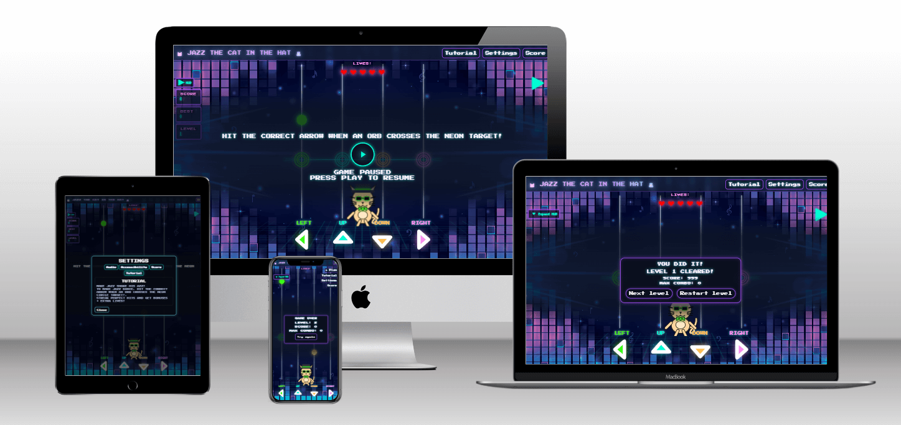

* Mockup overview *

# Jazz the Cat in the Hat

*A neon-arcade rhythm game built **for you** — quick to learn, satisfying to master, and friendly to play on any device.*

**Live Site:** <https://gooldenapple.github.io/Jazz-the-Cat-in-the-Hat/>  
**Repository:** <https://github.com/GooldenApple/Jazz-the-Cat-in-the-Hat>

---

## Contents

- [Project Story](#project-story)
- [What the Game Is](#what-the-game-is)
- [Audience & Learning Goals](#audience--learning-goals)
- [User Experience (UX)](#user-experience-ux)
  - [User Stories](#user-stories)
  - [User Story Testing (Traceability)](#user-story-testing-traceability)
- [Core Features](#core-features)
- [Design](#design)
- [Accessibility](#accessibility)
- [Tech Overview](#tech-overview)
- [How to Play](#how-to-play)
- [Testing](#testing)
- [Performance Notes](#performance-notes)
- [Deployment](#deployment)
- [Roadmap](#roadmap)
- [Credits](#credits)
- [Acknowledgements](#acknowledgements)
- [Screenshots & Wireframes](#screenshots--wireframes)

---

## Project Story

This project grew at the kitchen table with two very honest testers: my kids. My son especially shaped the early levels (“make it easier at the start!”). **Jazz the Cat in the Hat** is a tiny arcade built for small hands and short attention spans: bright visuals, simple rules, and quick feedback. Comfort was core from day one — motion can be reduced, flashes turned off, and both **keyboard** and **touch** work naturally.

---

## What the Game Is

A **four‑lane rhythm game**. Tap/press the matching arrow as a neon orb hits the judge line. Build a combo, reach the end of the song, and clear the level. Early levels are gentle, then difficulty ramps in small, safe steps.

---

## Audience & Learning Goals

- **Audience:** children and families, casual players.  
- **Learning goals:** timing, focus, rhythm, patience, and simple goal setting.  
- **Design values:** safe, readable, accessible, and fun in short sessions.

---

## User Experience (UX)

## User Stories


## User Story Testing (Traceability)

| Story ID | Key Checks | How Verified | Status |
|---|---|---|---|
| 1 — Young Player | Big arrows; L1 practice; countdown; calm modes; mute | Manual mobile test (360–480px); visual check of L1 density; Settings toggles; audio mute; validator/Lighthouse a11y pass | ✅ |
| 2 — Teen Rhythm Fan | Difficulty ramp; timing windows; combo/BEST; input parity | Playthrough L1–3 (solo), L4–7 (occasional doubles); check HUD for combo/BEST persistence; keyboard vs touch parity | ✅ |
| 3 — Adult Casual | One-tap Play/Pause; remembered volume/HUD; fast load | Overlay flow tested; localStorage keys verified; Lighthouse perf on mobile; no extra dialogs | ✅ |
| 4 — Parent/Guardian | Safe visuals; calm options; clear overlays | “Reduce motion/No flash” visibly dampen effects; overlays show “Paused/Play/Cleared/Game Over” | ✅ |
| 5 — Teacher/Therapist | Short runs; instant Restart; minimal reading | Results/Game Over overlays expose Restart; tutorial tab is short; countdown adjustable | ✅ |
| 6 — Accessibility-First | Reduce motion; No flash; high contrast; spacing | Toggle checks; contrast for HUD labels; button spacing and focus styles | ✅ |
| 7 — Mobile-First | Optimized background; minimal blocking; stable layout | AVIF/WebP/PNG pipeline; CSS order; CLS observed ~0; Lighthouse mobile pass | ✅ |
| 8 — Score Hunter | Quick retry; consistent windows; 0s countdown option | Retry flow; stable judgment feel between runs; Settings→countdown=0 tested | ✅ |
| 9 — Visitor | 5-sec explanation; clear icons; Tutorial tab | Overlay copy and icons visible; Tutorial pane succinct | ✅ |
| 10 — Maintainer | Clean modules; lifecycle; persistence; docs | No duplicate listeners; `song:*` events fire; localStorage keys present; README testing notes | ✅ |

> **tested:** Manual device testing by kids and adults (Chrome DevTools responsive, real phone), W3C HTML/CSS validators, Lighthouse (mobile & desktop), WebAIM contrast checks, in‑app Settings/overlay behavior, and console sanity tests (see Testing).


---

## Core Features

### Pick-up-and-play
- **One song = one level.** Short, satisfying runs perfect for quick breaks.
- **Overlay Play/Pause** with big CTA and clear labels; **countdown** is configurable (0 = instant start).
- **Keyboard** (`← ↑ ↓ →`) **or touch** (large buttons) with consistent feel.

### Clear judging & scoring
- Timing windows: **Perfect / Great / Good / Miss** with crisp feedback at the judge line.
- **Combo** and **Best** score saved locally so you always have a PB to chase.
- Damage is **tolerant**: learning stays fun; only repeated misses chip hearts.

### Hearts & forgiveness
- **Level 1** is a **practice level**: slow notes, one at a time, **no health loss**.
- From **Level 2+**, misses accumulate into small heart damage; when hearts reach zero → **Game Over** (one-tap **Retry**).

### Bonus Mode (celebrate the streak)
- Unlocks during a **clean streak**, usually **after the halfway point** of the song.
- **Levels 1–5:** Bonus gives **extra points** per hit (feel-good momentum).
- **Level 4+ (higher difficulties):** Bonus can sometimes grant **extra life**.
- UI cues are subtle and respect **Reduce Motion** / **No Flash** settings.

### Level progression (gentle → legit)
- **Lv 1–3:** One note at a time, generous spacing, slow travel.
- **Lv 4–6:** Occasional pairs (readable, slightly spicier).
- **Lv 7–10:** Denser patterns, more movement, satisfying streaks to maintain.
- **Lv 11–13:** Boss-vibe but fair; learnable and rewarding to clear.

### Comfort & accessibility
- **Reduce Motion**: turns off non-essential animations (dancer, rail ticks).
- **No Flash**: disables bright flashes/glow (including heart glow).
- Large tap targets, clear focus states, readable HUD labels.

### Panels & flows
- **Results** (clear) → Next / Restart.
- **Game Over** (fail) → Retry.
- **Pause** overlay always within reach (overlay CTA or navbar).

### Persistence
- Saves **Best score**, **volume/mute**, **HUD collapsed**, **Reduce Motion**, **No Flash**, and **countdown** to `localStorage`.

### Controls
- **Keyboard:** `← ↑ ↓ →`
- **Touch & click:** four large on‑screen arrows.

### Overlays & Panels
- **Play/Pause overlay** with big CTA and live label.
- **Results panel** (clear): score + max combo; **Next/Restart**.
- **Game Over panel** (fail): **Retry**.
- **Settings panel**: Audio, Accessibility, Score, Tutorial.

## How to Play

1. **Press Play.** A short 3-2-1 countdown appears (or set **0s** for instant start).
2. **Hit the beat.** When an orb reaches the neon target, press/tap the matching arrow (`← ↑ ↓ →` or the big on-screen buttons).
3. **Build your streak.** Keep timing clean to grow your **combo** and push your **Best**.
4. **Clear the song.** Reach the end to complete the level — then pick **Next** or **Retry**.

### Pro tips
- **Instant restarts:** Set **countdown = 0** in Settings for quick grind sessions.
- **Bonus Mode:** Keep a **clean streak**; after halfway, Bonus may kick in:
  - **Lv 1–5:** extra points per hit.
  - **Lv 4+ (harder):** occasional **extra life** during Bonus.
- **Practice first:** **Level 1** has no health loss; perfect for younger players.
- **Comfort controls:** Toggle **Reduce Motion** and **No Flash** any time; settings persist between visits.
- **Pause anywhere:** Use the overlay CTA or navbar **Play/Pause** — you won’t lose context.

### Controls
- **Keyboard:** `←` `↑` `↓` `→`
- **Touch:** Four large on-screen arrows aligned to the rails for better muscle memory.


---

## Design

### Visual Language
- Neon arcade palette over a deep space‑blue background.  
- Pixel‑arcade type for playful clarity (Press Start 2P + VT323).  
- Friendly feedback; no harsh error walls.


*Working palette for rails/HUD and backgrounds.*


### Layout & Responsiveness
- **Mobile‑first CSS**; rails and controls share the same width model.  
- **Stable stage:** `body { display:block }`, `main.game { min-block-size: calc(100svh - 4rem) }` to avoid vertical gaps.  
- **Quick Play/Pause** icon hides under open navbar; overlay icon reflects state.

---

## Accessibility
- **Reduce Motion:** disables dancer movement and rail tick animations.
- **No Flash:** disables rail flash and heart glow (also applied to SVG hearts).
- Clear focus states and large click targets for the primary controls.

---

## Tech Overview

- **Stack:** HTML5, CSS3, vanilla **ES modules** (no frameworks).  
- **Core modules:** `game.js`, `ui.js`, `input.js`, `scoring.js`, `songPlayer.js`, `difficulty.js`, `songRegistry.js`.  
- **Assets:** lightweight backgrounds (AVIF/WebP/PNG ladder), custom SVG cat.  
- **Storage:** Best score persisted with `localStorage`.  
- **Events used:** `ui:requestStartRun`, `ui:requestPause`, `ui:nextLevel`, `ui:restartLevel`, `ui:retryLevel`, `song:ready|started|ended|error`, `game:livesDepleted`.  
- **CSS:** mobile‑first; Bootstrap used **only** for the navbar.

---

## How to Play

1. Press **Play**.  
2. When an orb hits the neon target, press/tap the **matching arrow**.  
3. Keep the **combo** going to beat your **best score**.  
4. Clear the song to finish the level — or tap **Retry**.

**Tip:** Set countdown to **0** for instant start.

---

## Testing

## Testing strategy (overview)
Testing for this project - a mix of manual UX checks, HTML/CSS validation, Lighthouse audits, and targeted developer-console sanity tests. Because this is an interactive game (timing-sensitive, audio-driven), I added focused in-browser console tests for lifecycle events (overlay, countdown, song start/stop), HUD rendering (hearts/score), and input judging. Automated unit tests are planned (see “Future testing”).
And also a lot of playing!

---

## How to run the tests (quick start)
1. Open the game in Chrome.
2. Open **DevTools → Console**.
3. Optionally set `localStorage.setItem('countdownSec','0')` and hard refresh to skip countdown.
4. Run the code snippets under **Developer console sanity tests** below to verify flows.
5. Use the **Manual test matrix** as a checklist across breakpoints (mobile/tablet/desktop).

---

## Tools & methods
- **Browsers:** Chrome (desktop) + Chrome DevTools device emulation for common mobile/tablet sizes.
- **Validation:** W3C HTML Validator, W3C CSS Validator (both pass).
- **Audits:** Lighthouse (Performance/Best Practices/Accessibility). Remaining items are noted under “Known issues”.
- **Accessibility toggles:** `Reduce Motion` and `No Flash` modes verified visually and via DOM state.
- **Developer console tests:** Quick commands to verify core game flows without manual play.

---

## Manual test matrix

| Area | Scenario | Expected | Result |
|---|---|---|---|
| Overlay (Play) | First load → Play button visible | Overlay visible, label “Play”, icon set to play | Pass |
| Countdown | Default countdown (3s) | Label shows 3→2→1→GO, then game starts | Pass |
| Countdown = 0 | Settings set to 0 | No countdown, game starts immediately | Pass |
| Pause | Press Play while running | Game pauses, `data-paused="true"`, Pause panel shown | Pass |
| End of song (clear) | Survive to end | Results panel shown, Next Level available | Pass |
| End of song (fail) | Lose all lives | Game Over panel shown, Retry available | Pass |
| HUD hearts | On load | Hearts render in `#lives` | Pass |
| HUD hearts | On input miss (damage) | Heart update reflects damage | Pass |
| Navbar | Toggle open/close on mobile | Body `data-nav-open` syncs, Quick Play/Pause hides under open navbar | Pass |
| Rotate overlay | Rotate device to portrait/landscape | Rotate overlay appears/disappears appropriately | Pass |
| Settings: Reduce Motion | Toggle on | Animations stop: dancer moves/rail ticks disabled | Pass |
| Settings: No Flash | Toggle on | Rail flash and heart glow disabled | Pass |
| Local storage | Reload after changing settings | Settings persist across reload | Pass |
| 404 Page | Visit a non-existent URL (e.g. `/this-page-does-not-exist`) | Custom 404 page displays with “Back to Home” button and clickable homepage URL | Pass |

---

## Developer console sanity tests

> Use these to quickly verify critical flows after changes/deploys.

### Overlay & state flags
```js
// Overlay should exist and be visible on boot
!!document.getElementById('overlay');              // -> true

// Game paused flag while overlay is up
document.body.hasAttribute('data-paused');         // -> true (before start)
```

### HUD render (hearts)
```js
// Hearts present
document.querySelectorAll('#lives .svg-heart').length >= 1;  // -> true
```

### Notes present / cleared
```js
// Count active notes on rails
document.querySelectorAll('.rail .note').length;   // number, varies

// Clear notes (dev helper exposed via scoring.js)
window.clearAllNotes?.();                          // clears visuals, no error
```

### Input helpers (from `test.js`)
```js
// Fire moves to test judging without UI
window.doLeftMove?.();
window.doRightMove?.();
window.doUpMove?.();
window.doDownMove?.();

// Try judge helper (if present)
window.tryJudge?.(performance.now() + 200);        // example call
```

### Lifecycle events
```js
window.addEventListener('song:ready',   (e)=>console.log('ready', e.detail));
window.addEventListener('song:started', (e)=>console.log('started', e.detail));
window.addEventListener('song:ended',   (e)=>console.log('ended', e.detail));
window.addEventListener('song:error',   (e)=>console.error('error', e.detail));
```

### Countdown = 0 (skip test)
```js
localStorage.setItem('countdownSec','0');  // allow immediate start
location.reload();                         // hard refresh, then press Play
```

### Menu label sync
```js
// Play/Pause label in navbar should update as state changes
document.querySelector('#menuPlayToggle')?.textContent.trim();
```

---

## Regression tests (recent fixes)

1) **Broken overlay & missing hearts after JS cleanup**  
**Root cause:** `game.js` imported `setPlayTip`, `setOverlayIcon`, `initTopbarAutoHeight` that were not exported from `ui.js`, causing module load to fail.  
**Fix:** Export those three from `ui.js`.  
**Verify:**  
- Console has **no** “does not provide an export named …” errors.  
- On boot: overlay visible, hearts rendered.  
- Press Play → countdown runs and game starts.

2) **Countdown “0 seconds” ignored**  
**Root cause:** `countdownSec || 3` treated `0` as falsy.  
**Fix:** Nullish-safe parsing and propagation; `runOverlayCountdown(0)` starts immediately.  
**Verify:**  
- `localStorage.setItem('countdownSec','0')` → reload → Play starts game with no countdown.

3) **Layout gap on stage**  
**Root cause:** `body { display: grid; }` created an extra row/gap.  
**Fix:** Keep `body { display:block; }`; ensure `main.game { min-block-size: calc(100svh - 4rem); }`.  
**Verify:**  
- No vertical “gap” between rails and controls across breakpoints.

4) **Accessibility toggles**  
**Reduce Motion:** dancer/rail animations stop.  
**No Flash:** rail flash and heart glow disabled (explicit override for `.svg-heart`).  
**Verify:** Toggle both settings and observe changes; confirm DOM flags.

5) **404 Page**
Tested by visiting a non-existent URL (e.g. `/banan`) to confirm the custom `404.html` displays with a “Back to Home” button and a visible, clickable homepage URL.

---

## Validation

- **HTML:** W3C validator – no blocking errors.  
- **CSS:** W3C validator – passes.  
- **Lighthouse:** No critical issues; minor warnings may remain (e.g., “preload not used soon” for background/font under certain loads). These are non-blocking and tracked under “Known issues”.

---

## Known issues / non-blocking

- **Preload warnings:** In some sessions Lighthouse/DevTools may report “preload not used soon” for background image or fonts. This does not affect gameplay; future tuning may switch to `fetchpriority` or remove preloads that do not show early benefit.

---

## Future testing

- **Unit tests (Jest):**  
  - `scoring.js`: combo, multipliers, lives decrement, bonus mode thresholds.  
  - `difficulty.js`: spacing/anti-sim rules per level (“one note at a time” in L1–3).  

- **Integration tests:**  
  - `songPlayer.js` scheduling: spawn time alignment to judge line (± tolerance windows for Perfect/Great/Good).  
  - Lifecycle events order: `song:ready` → `song:started` → `song:ended(reason)`.

- **E2E (Playwright/Cypress):**  
  - Overlay flows (Play/Pause/Results/Game Over).  
  - Responsive layout checkpoints (mobile/tablet/desktop) with visual diffs.  

- **Automated console harness:**  
  - Scripted runs that simulate sequences of hits/misses across lanes, log timing deltas, and assert final score/remaining lives. (A first draft exists via the `window.*` helpers; to be formalized into a repeatable suite.)

---

## Test log (spot checks)

- Overlay boot & countdown (3→2→1→GO) ✅  
- Countdown=0 immediate start ✅  
- Pause and resume via overlay and navbar menu ✅  
- HUD hearts render/update ✅  
- Results vs Game Over routing on `song:ended(reason)` ✅  
- Reduce Motion / No Flash behavior ✅  
- Navbar collapse sync + Quick Play/Pause visibility ✅  
- Note spawn/clear sanity checks via console helpers ✅

---

## Performance Notes

- Backgrounds provided in modern formats with fallbacks; explicit sizing to reduce **CLS**.  
- Minimal JS; no large frameworks.  
- Preconnects/preloads used carefully; minor “preload not used soon” warnings may appear but are non‑blocking.


*Typical Lighthouse run (values vary by device/connection).*

---

## Deployment

Hosted on **GitHub Pages**.  
- Push to `main`.  
- Ensure `index.html` is at the site root.  
- In Pages settings, point to the correct branch/folder.  
- Hard refresh after deploy (**Ctrl/Cmd+Shift+R**).

Live: <https://gooldenapple.github.io/Jazz-the-Cat-in-the-Hat/>

### 404 Page
A custom `404.html` is included for GitHub Pages to handle broken links with a clear return path to the homepage (Back to Home) and a visible, clickable homepage URL.


---

## Future improvments
- add sad face to Jazz the Cat when game over and confetti rain when cleared level.
- make the orbs/notes be fully controled by beat.
- make the game never ending. 
- make Jazz dance moves better and more fun. 
- make Jazz the Cat more fluffy and groovy.
- add break points to start from when "game over".
- organize settings panels better.
## Roadmap

- Tune levels so **Lv 1–3** strictly guarantee one orb at a time.  
- **Bonus mode:** after a safe streak → **+points** (Lv 1–5) and chance for **extra life** (Lv 4+).  
- **Automatic timing harness** to simulate hits/misses per chart.  
- Polished SFX for hit/win/game‑over with volume control.  
- Optional **Endless mode** after campaign.

---

## Credits

Sound Effect by <a href="https://pixabay.com/users/floraphonic-38928062/?utm_source=link-attribution&utm_medium=referral&utm_campaign=music&utm_content=207131">floraphonic</a> from <a href="https://pixabay.com//?utm_source=link-attribution&utm_medium=referral&utm_campaign=music&utm_content=207131">Pixabay</a>

Sound Effect by <a href="https://pixabay.com/users/jesuschristisgod-44370300/?utm_source=link-attribution&utm_medium=referral&utm_campaign=music&utm_content=299607">I Love Jesus Christ</a> from <a href="https://pixabay.com//?utm_source=link-attribution&utm_medium=referral&utm_campaign=music&utm_content=299607">Pixabay</a>

https://pixabay.com/sound-effects/search/yay/

### Music — Kevin MacLeod (Incompetech), CC BY 3.0/4.0
C‑Funk • Style Funk • Funkorama • Flutey Funk • Funk Game Loop • Aces High • Protofunk • Smooth Move • Funky Chunk • Celebration • Your Call • Enter the Party • Fork and Spoon

### Fonts
Press Start 2P & VT323 — Google Fonts

### Frameworks & Libraries
Bootstrap 5 (navbar only)

### Icons / Graphics
Custom SVG character and UI graphics created for this project.

> Replace with exact attributions and links as required by your course rubric.

---

## Acknowledgements

- Code Institute guidance and materials.  
- Playtesting from friends & family.  
- Thanks to Kevin MacLeod (Incompetech) for generous CC‑licensed music.

---

## Screenshots & Wireframes

> Place additional screenshots in `assets/images/screenshots/` and link them below once captured.

- Wireframe overview: `assets/images/wireframe/colors.avif`  
- Palette: assets/images/wireframe/colors.avif  
- Lighthouse example: assets/images/lighthouse/Skärmbild 2025-11-09 024326.avif

## mockup
https://techsini.com/multi-mockup/