# Jazz the Cat in the Hat

*A neon-arcade reaction game built **for you** — quick to learn and satisfying to master*

  
*Mockup overview*

**Live Site:** <https://gooldenapple.github.io/Jazz-the-Cat-in-the-Hat/>  
**Repository:** <https://github.com/GooldenApple/Jazz-the-Cat-in-the-Hat>

<br>

---

## Table of Contents
- [Project Overview](#project-overview)
- [What the Game Is](#what-the-game-is)
- [How to Play](#how-to-play)
- [UX](#ux)
  - [Target Audience](#target-audience)
  - [User Stories](#user-stories)
- [Features](#features)
  - [Core Gameplay](#core-gameplay)
  - [Bonus Mode](#bonus-mode)
  - [Accessibility Features](#accessibility-features)
- [Design](#design)
  - [Wireframes](#wireframes)
  - [Colour Scheme](#colour-scheme)
  - [Typography](#typography)
- [Technologies Used](#technologies-used)
- [Testing](#testing)
- [Deployment & Local Development](#deployment--local-development)
  - [GitHub Pages](#deployment-github-pages)
  - [404 Page](#404-page)
  - [Local Development](#local-development)
  - [How to Fork](#how-to-fork)
  - [How to Clone](#how-to-clone)
- [Future Improvements](#future-improvements)
- [Appendix / Process & Artifacts](#appendix--process--artifacts)
- [Credits](#credits)
- [Acknowledgements](#acknowledgements)


<br>

---

## Project Overview

This project grew at the kitchen table with two very honest testers: my kids. My son especially shaped the early levels: “make it easier at the start, mom!”.  
**Jazz the Cat in the Hat** was built to feel playful, quick, and beginner-friendly — something you can pick up for a few minutes, smile, and try again.

The focus has been on a warm, family-friendly vibe with clear feedback, simple progression, and comfort options that help more people enjoy the game.

<br>

---

## What the Game Is

**Jazz the Cat in the Hat** is a neon-arcade reaction game designed to be easy to pick up and satisfying to master!

Orbs fall down four lanes, and your job is to hit the matching direction at the right moment as the orb crosses the neon target. Timing is graded as **Perfect**, **Great**, or **Good**, and consistent hits build streaks to trigger **Bonus Mode**.  
Reach the end of the song to clear the level. Early levels are gentle and forgiving, then difficulty ramps in small, safe steps.

<br>

---

## How to Play

Once you know what the game is, getting started is very simple:

1. **Press Play**  
   When the page loads, a clear Play overlay is shown. Press **Play** to begin.  
   A short countdown (**0s / 3s / 5s**, depending on your Settings) gives you a moment to get ready before the level starts.

2. **Match the arrow to the orb**  
   As orbs fall down the four lanes and reach the neon target line, press or tap the matching arrow:  
   - **Keyboard:** ← ↑ ↓ →  
   - **Touch/Click:** the large on-screen arrow buttons aligned with the lanes  

3. **Watch your timing and build a streak**  
   Each hit is graded as **Perfect**, **Great**, **Good**, or **Miss**, with feedback shown near the target line.  
   Clean timing builds your **combo** and helps push your **score** and **best score** higher.

4. **Clear or retry the level**  
   Reach the end of the song to clear the level.  
   - On success, the **Results** panel lets you choose **Next Level** or **Replay**.  
   - If you lose all lives (from **Level 2+**), the **Game Over** panel offers a quick **Retry** back into the action.

### Tips for Players

- Set the countdown to **0 seconds** in the Settings menu for instant restarts during practice or score grinding.  
- **Level 1** is a safe practice level: misses do **not** reduce lives, so younger players can learn without pressure.  
- Good streaks can activate **Bonus Mode** for extra points, and from **Level 4+** sometimes an **extra life**.  
- Accessibility options (**Reduce Motion**, **No Flash**) make the game more comfortable for sensitive players.  
- You can pause at any time using the main overlay or the **quick Play/Pause** button.

<br>

---


## UX

### Target Audience

- **Children and younger players** who benefit from simple controls, clear visuals, quick feedback, and a gentle learning curve.  
- **Teens and adults** who enjoy fast-paced reaction games and score-chasing with smooth progression.  
- **Mobile/tablet players** who prefer touch controls.  
- **Desktop players** who prefer physical keys and larger screens.

### Initial Discussion

The UX goal for this project was to remove friction and keep the player in a natural flow.  
Because the game is timing-based and fast, the interface is designed to be readable at a glance, with clear feedback and simple choices on every screen.

The overall experience aims to feel friendly and “safe to try”:  
quick restarts, predictable **Play/Pause** behaviour, and comfort settings that let players adjust motion, flash intensity and audio without leaving the game.

### UX Decisions

- The game is built **mobile-first**, with tap-friendly controls and a layout that adapts cleanly across common screen sizes.  
- The HUD and timing feedback are intentionally **large and easy to scan**, so important information remains readable during fast gameplay.  
- Play/Pause flow is consistent: a clear **Play** call-to-action, a short **countdown**, and a predictable resume experience.  
- Inputs are flexible by design—**touch**, **keyboard**, and **mouse** are all supported so players can use what feels natural.  
- Comfort options are treated as real features: **Reduce Motion**, **No Flash**, and **Volume/Mute** help more players enjoy the game.  
- Difficulty ramps in small steps so players build confidence instead of hitting sudden spikes.

### Key Information for the Game

- Clear **Play/Pause** flow with an optional **countdown**  
- Multiple control options: **keyboard**, **mouse**, **touch**  
- Simple timing feedback: **Perfect / Great / Good / Miss**  
- HUD showing **score**, **combo**, **level**, and **lives**  
- **Bonus Mode** rewards streaks with extra points, and from **Level 4+** extra-life rewards  
- Accessibility settings: **Reduce Motion**, **No Flash**, **Volume**, **Mute**

<br>


---

### User Stories

#### Child Player / first-time player
**User Story:**  
As a child player, I want the game to be easy to start and understand, so I can play right away without needing to read lots of instructions.

**Acceptance Criteria:**  
- The **Play** button is clearly visible when the site loads.  
- A short **countdown** runs before the game starts, so I have time to get ready.  
- Controls work with **touch** on mobile as well as **keyboard** on desktop.  
- Feedback is clear and immediate, so I know how I did.  
- The first level feels safe and beginner-friendly, **Level 1** does not reduce lives on misses.

**Tasks:**  
- Design a clear overlay with a visible **Play** call-to-action.  
- Implement a countdown before gameplay begins.  
- Ensure touch controls are responsive and easy to tap.  
- Display timing feedback near the target area.  
- Configure **Level 1** as a warm-up level with no life loss on misses.

#### Player - Mobile
**User Story:**  
As a mobile player, I want touch controls that are responsive, so I can play comfortably on a phone.

**Acceptance Criteria:**
- Touch buttons respond immediately.
- No accidental double inputs occur from taps.
- Controls remain aligned across screen sizes.

**Tasks:**
- Implement touch input handlers for arrow buttons.
- Add basic protection against ghost clicks.
- Test controls at 320px and 375px widths.

#### Player - Desktop
**User Story:**  
As a desktop player, I want keyboard controls, so I can play with precision.

**Acceptance Criteria:**
- Arrow keys trigger the matching lane.
- Input feels consistent during gameplay.
- Pause/Resume works during play.

**Tasks:**
- Add keyboard listeners for lane inputs.
- Support Play/Pause flow during gameplay.
- Verify input behaviour through manual testing.

#### Player - Progression
**User Story:**  
As a player, I want early levels to feel forgiving, so I can improve gradually.

**Acceptance Criteria:**
- **Level 1** does not reduce lives on misses.
- Difficulty increases in small steps from **Level 2** onwards.
- The player can replay or continue after clearing a level.

**Tasks:**
- Configure **Level 1** rules.
- Configure **Level 2+** miss rules.
- Add Results overlay with Next/Replay options.

#### Player - Rewards
**User Story:**  
As a player, I want a reward mechanic, so streaks feel exciting.

**Acceptance Criteria:**
- **Bonus Mode** activates at a streak threshold.
- Bonus hits grant **+10** extra points.
- **Bonus Mode** ends on a miss.
- Extra lives can be earned from **Level 4+**.

**Tasks:**
- Implement **Bonus Mode** activation/ending logic.
- Show Bonus banner and bonus feedback text.
- Add extra-life award logic from **Level 4+**.

#### Player - Accessibility
**User Story:**  
As a sensitive player, I want Reduce Motion and No Flash options, so I can play comfortably.

**Acceptance Criteria:**
- Reduce Motion reduces or disables key animations.
- No Flash disables intense glow/flash effects.
- Settings are available from the UI.

**Tasks:**
- Add settings toggles and persist choices if applicable.
- Apply CSS/JS hooks for reduce-motion and no-flash.
- Add screenshots demonstrating the settings.


_Traceability:_ These user stories are verified in **[TESTING.md – User Story Testing](TESTING.md#user-story-testing---traceability)**.


<br>

---

## Features

### Core Gameplay

- Play/Pause overlay with countdown  
- Four lanes with falling orbs  
- Timing feedback: **Perfect / Great / Good / Miss**  
- HUD showing score, best score, level and lives  
- Smooth level flow: Play → Countdown → Run → Results/Game Over → Retry/Next

<details>
  <summary><strong>Show screenshots: Core Gameplay</strong></summary>

  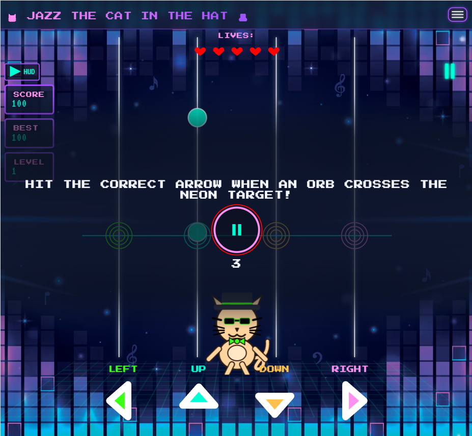  
  *Countdown (3 seconds).*

  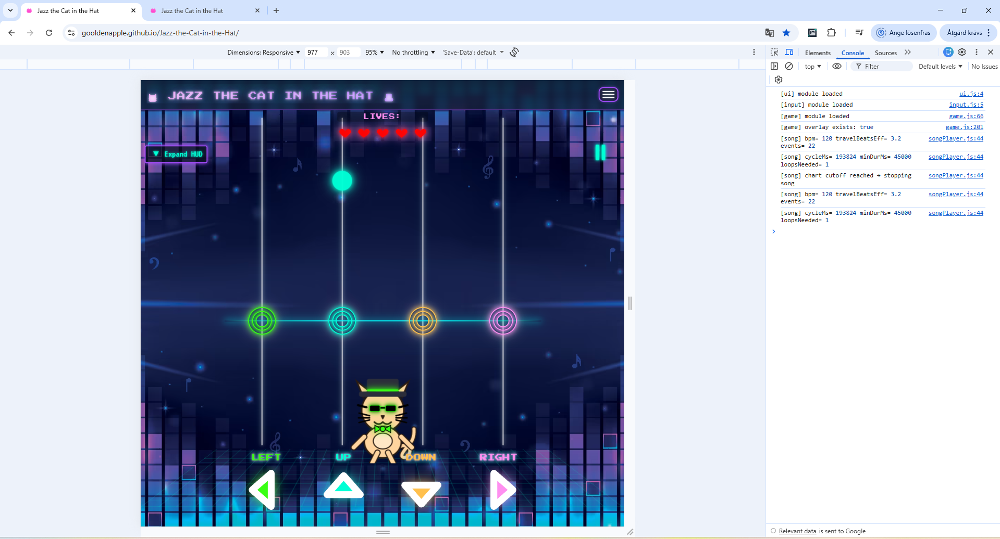  
  *Gameplay started.*

  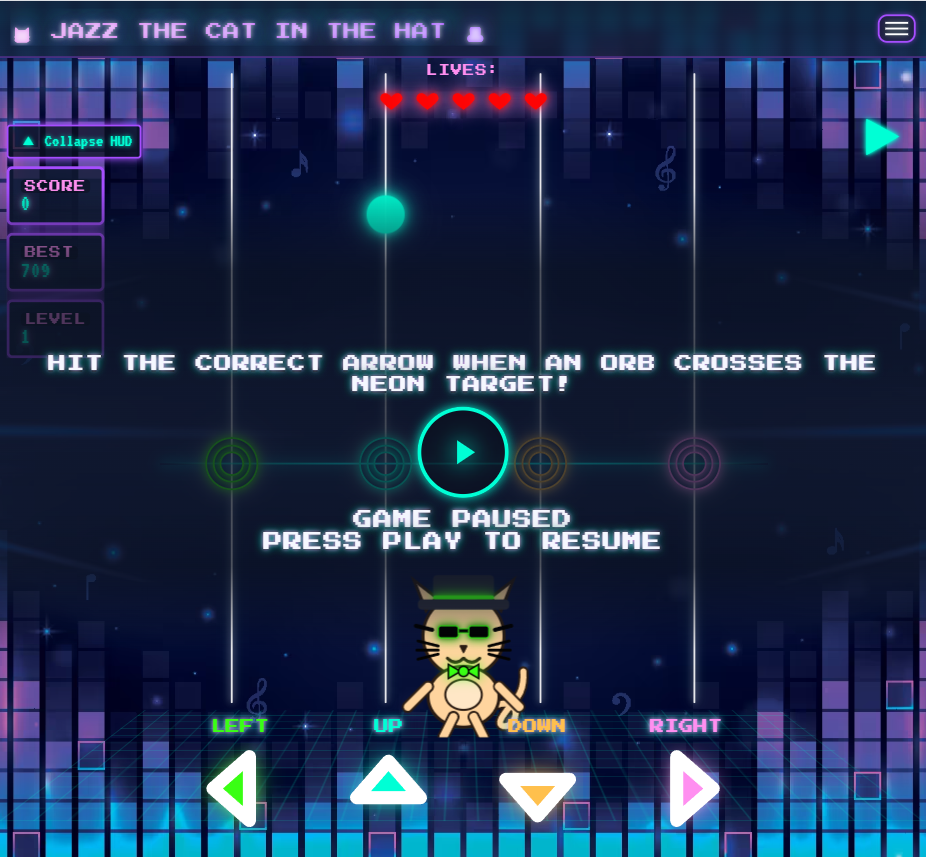  
  *Pause overlay.*

  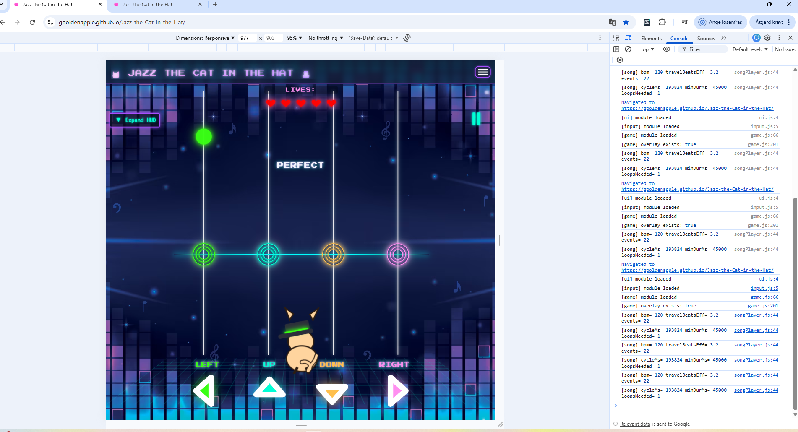  
  *Timing feedback (Perfect / Great / Good).*

  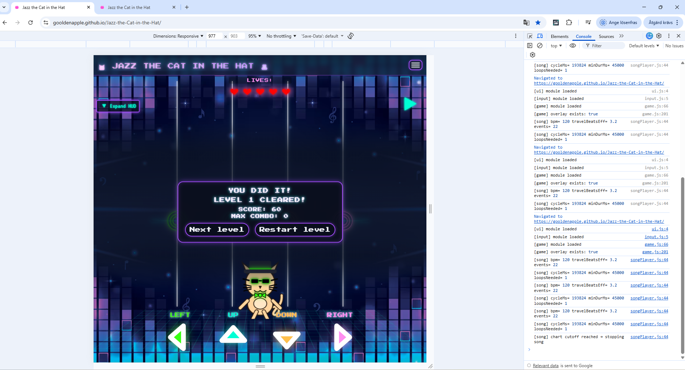  
  *Results overlay (Level Clear).*

  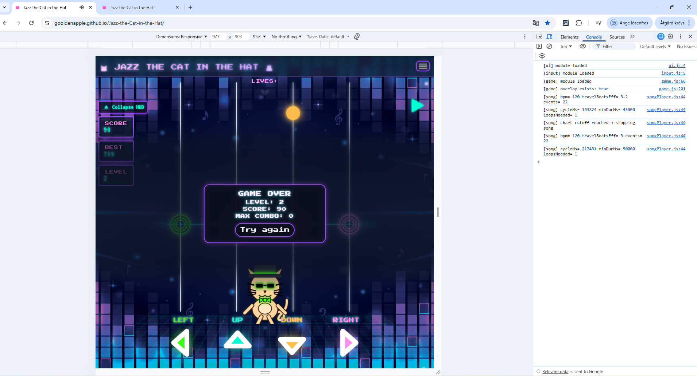  
  *Game Over overlay.*

</details>

<br>

---


### Bonus Mode – How It Works

When you build up a strong streak, you trigger **Bonus Mode** — a reward phase that makes every hit feel extra satisfying.

- **How to trigger it:** Reach a hit streak threshold without missing.  
- **What it gives you:** Every successful hit during Bonus Mode grants **+10 extra points** on top of normal **Perfect / Great / Good** scoring.  
- **How it ends:** Bonus Mode ends immediately when you make a **Miss**.  
- **Extra rewards:** From **Level 4+**, Bonus Mode can also award **extra lives** when you reach specific bonus goals.

<details>
  <summary><strong>Show screenshots: Bonus Mode</strong></summary>

  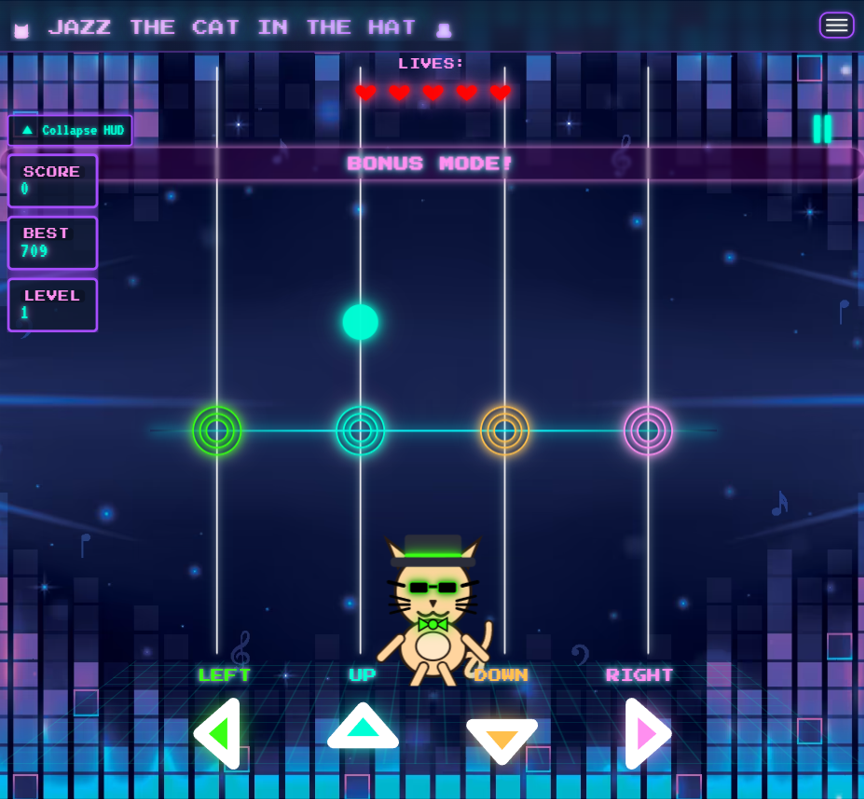  
  *Bonus Mode activated.*

  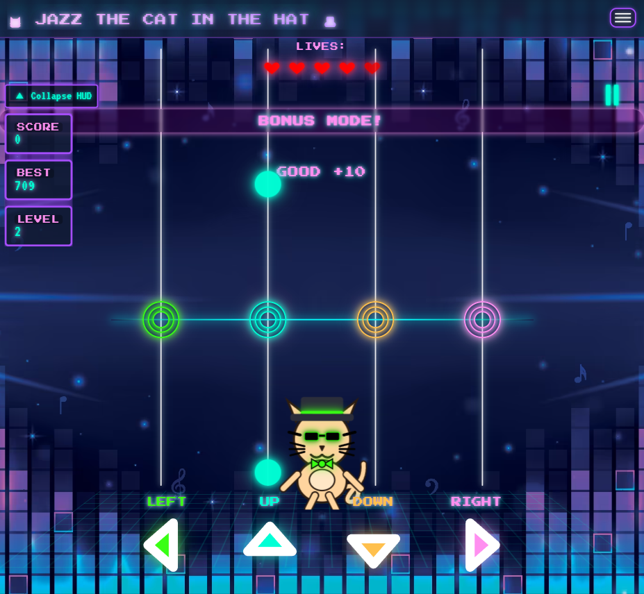  
  *Bonus feedback — GOOD +10.*

  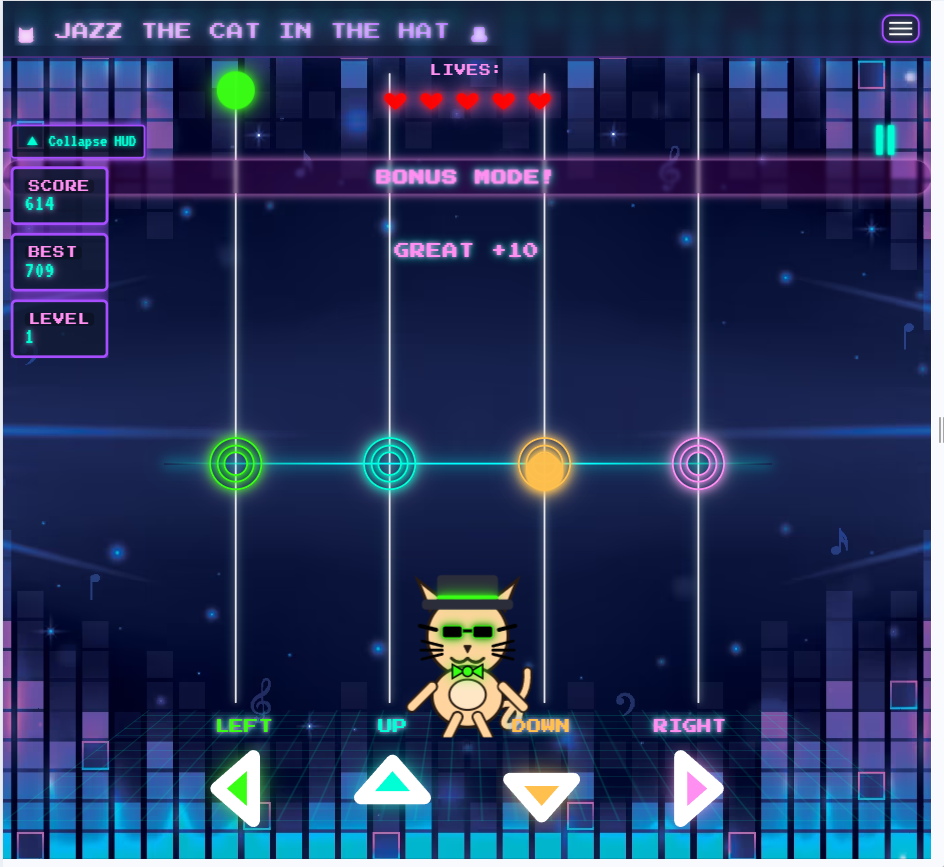  
  *Bonus feedback — GREAT +10.*

  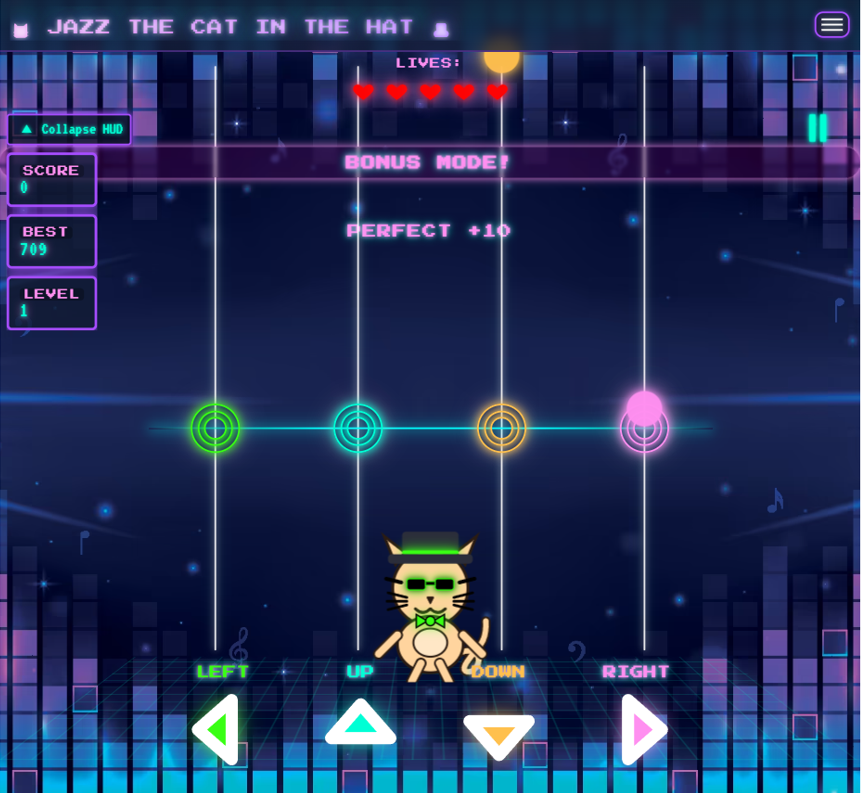  
  *Bonus feedback — PERFECT +10.*

  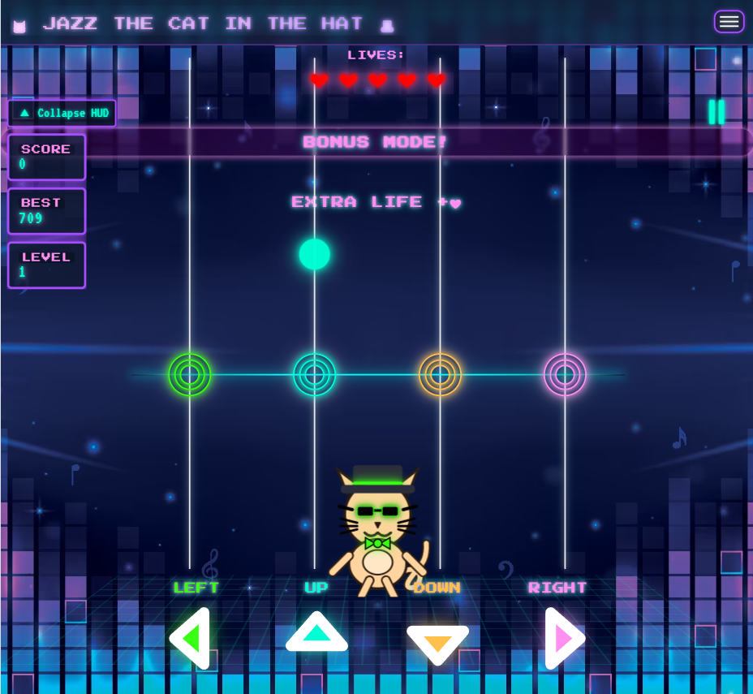  
  *Bonus Mode awarding an extra life (Level 4+).*

  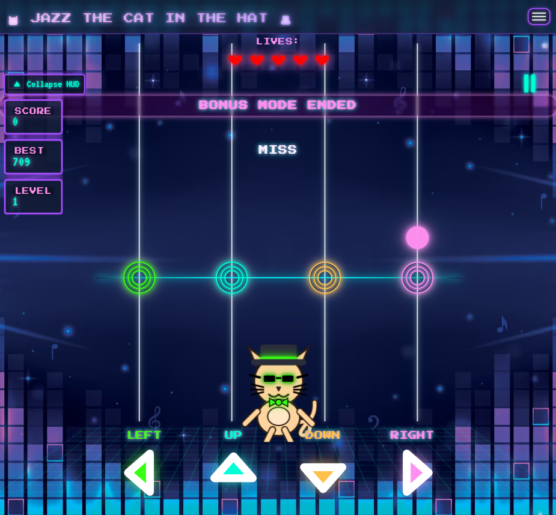  
  *Bonus Mode ended after a miss.*

</details>

<br>

---


### Levels

**Level 1** is designed as a calm introduction and a safe practice space.  
To help new players learn timing and controls without pressure, **Level 1 does not reduce lives** when you miss.  
This makes it easier to focus on reaction, accuracy, and building confidence before the challenge increases in later levels.

<details>
  <summary><strong>Show screenshot: Level 1 (no life loss)</strong></summary>

  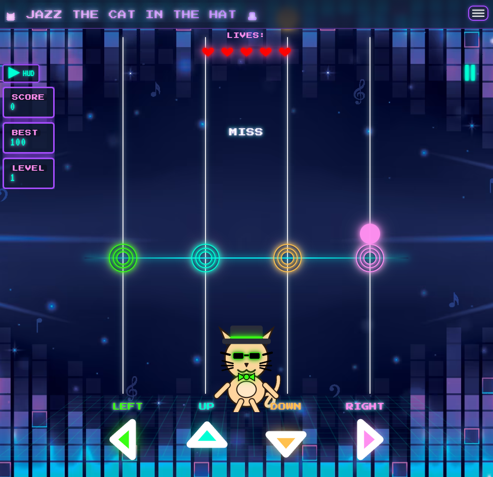  
  *Level 1 — misses do not reduce lives (verified in MT17).*

</details>

<br>

From **Level 2 onwards**, misses become punishing and lives can be lost.  
This introduces real challenge while still keeping the early progression friendly and gradual.

<details>
  <summary><strong>Show screenshot: Losing lives on higher levels</strong></summary>

  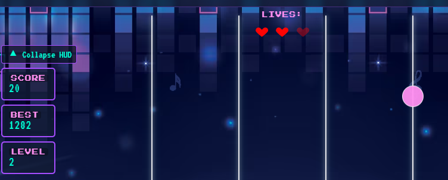  
  *Life loss on Level 2+.*

</details>

<br>

From **Level 4 onwards**, the game introduces a new reward: **extra lives**.  
When you perform well during **Bonus Mode** and reach the bonus goal, you can earn an **additional life**, giving you a small safety net for longer and more challenging runs.

This reward is intentionally locked until **Level 4** so players can first learn the core rhythm and timing before higher-stakes mechanics come into play.

<details>
  <summary><strong>Show screenshot: Winning lives on higher levels</strong></summary>

  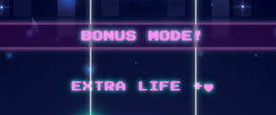  
  *Extra life awarded during Bonus Mode on higher levels.*

</details>

<br>

---

### Win / Lose

- **Level Clear:** Reach the end of the song to clear the level. You can then **Replay** the level or move to the **Next Level**.  
- **Game Over:** If you lose all lives from **Level 2+**, you must start again from **Level 1**.

<details>
  <summary><strong>Show screenshot: Win</strong></summary>

  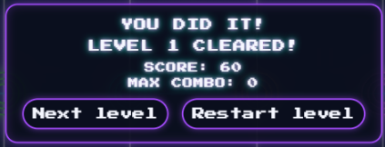  
  *Win overlay.*

</details>

<details>
  <summary><strong>Show screenshot: Game Over</strong></summary>

  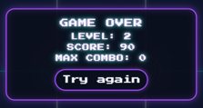  
  *Game Over overlay.*

</details>

<br>

---

### Controls

Play using **keyboard**, **mouse**, or **touch**.  
Hit the matching direction for the lane as the orb reaches the neon target line.

<details>
  <summary><strong>Show screenshots: Arrow controls</strong></summary>

  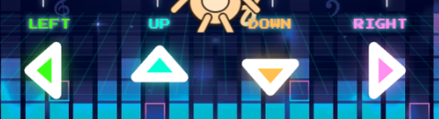  
  *On-screen arrow controls aligned with the four lanes.*

</details>

<br>

---


#### Tutorial

The game includes two layers of guidance to help new players:

- A short message on the **Play** and **Pause** overlays  
  (“Hit the correct arrow when an orb crosses the neon target!”)  
  so players instantly understand the core mechanic.

- A full **Tutorial panel** in the Settings menu  
  that explains timing grades, streaks, **Bonus Mode**, extra lives,  
  and the difference between **Level 1** and higher levels.

<details>
  <summary><strong>Show screenshot: Pause overlay</strong></summary>

  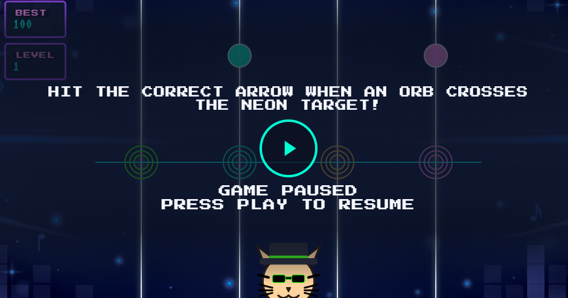  
  *Paused overlay.*

</details>

<details>
  <summary><strong>Show screenshot: Tutorial panel</strong></summary>

  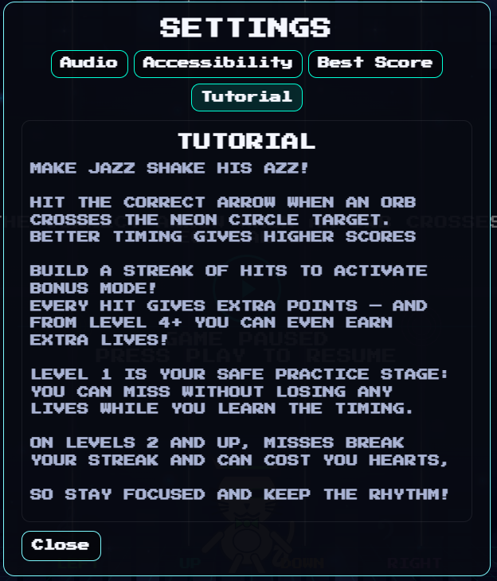  
  *Tutorial panel.*

</details>

<br>

---


### Overlays - Play, Pause, Countdown

The game uses clear overlays to guide the player’s flow:

- **Play overlay:** shows tutorial text and the Play button  
- **Countdown overlay:** appears before gameplay starts (0s / 3s / 5s)  
- **Pause overlay:** lets players safely stop the action mid-run  

<details>
  <summary><strong>Show screenshots</strong></summary>

  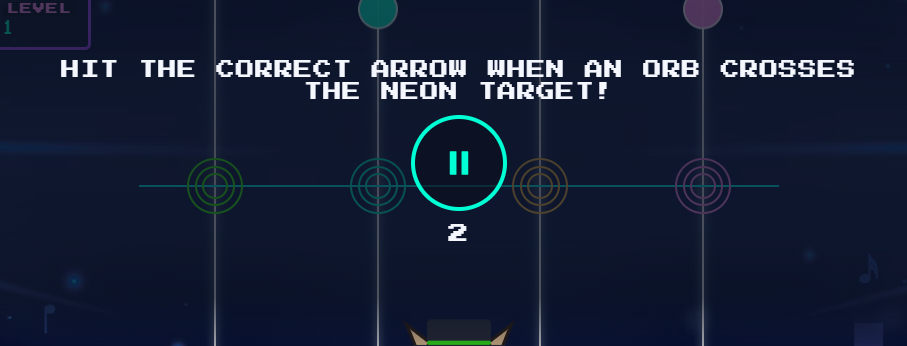  
  *Countdown overlay.*

  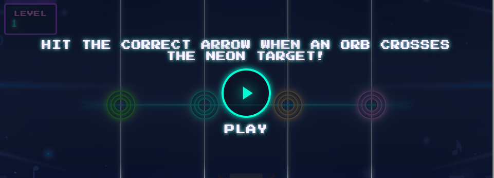  
  *Play overlay.*

    
  *Paused overlay.*

</details>

<br>

---


### Quick Play/Pause Button

A dedicated floating Play/Pause button lets players quickly stop or resume the game  
without needing to open the menu.  
It is always visible during gameplay and automatically hides when the navigation menu is open.

<details>
  <summary><strong>Show screenshot</strong></summary>

  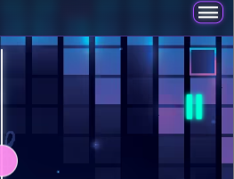  
  *Quick Play/Pause button during gameplay.*

</details>

<br>

---

### HUD (Heads-Up Display)

The HUD displays the player's essential stats:
- Current score  
- Best score  
- Level  
- Lives  

Players can collapse or expand the HUD at any time during gameplay,  
and the layout automatically adapts to small screens and mobile devices.

<details>
  <summary><strong>Show screenshot</strong></summary>

  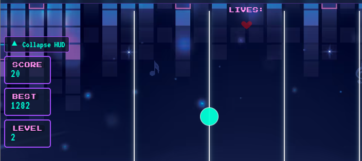  
  *HUD panel showing score, best score, level, and lives.*

</details>

<br>

---

### Feedback Box & Messages

To keep the game readable and rewarding, all important feedback is grouped in a clear feedback box near the target area.  
This box displays:

- Timing grades: **Perfect / Great / Good / Miss**  
- Bonus Mode messages (e.g. `GOOD +10`, `PERFECT +10`)  
- End-of-streak or Bonus Mode ending messages  

The feedback box is designed to be:

- **Large and high-contrast**, so players can quickly understand how they performed  
- **Always in the same place**, so players instinctively know where to look  
- **Consistent across all levels**, reinforcing rhythm and flow

<details>
  <summary><strong>Show screenshot: Feedback box</strong></summary>

  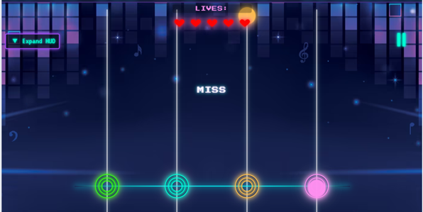  
  *Feedback box showing a Miss during gameplay.*

</details>

<br>

---

### Settings Menu

The game includes a full settings system accessible from the navigation menu:

- **Audio**: master volume slider and a dedicated **Mute** toggle  
- **Countdown**: choose between **0s**, **3s** or **5s** before each run  
- **Accessibility**: **Reduce Motion** and **No Flash** comfort options  
- **Best Score**: view or reset your high score and stored game data  
- **Tutorial**: a full written guide to gameplay, timing grades, Bonus Mode and lives  

Settings are applied immediately and saved automatically, so your preferences (audio, countdown and accessibility) persist between visits.  
Each panel is fully responsive and can be safely opened at any time while the game is paused.

<br>

---

### Accessibility Features

Comfort and accessibility were core goals from day one.  
Players can adjust several features that reduce visual intensity and make the game more comfortable:

- **Reduce Motion** — lowers or disables key animations for players sensitive to movement  
- **No Flash** — removes intense glow and flash effects from feedback and lane highlights  
- **Audio Controls** — adjust master volume or mute the game entirely  
- **Adjustable Countdown** — choose 0s / 3s / 5s to reduce reaction stress or speed up retries  

All settings are applied instantly and saved automatically, so your chosen comfort options persist between sessions.

<details>
  <summary><strong>Show screenshots: Accessibility Features</strong></summary>

  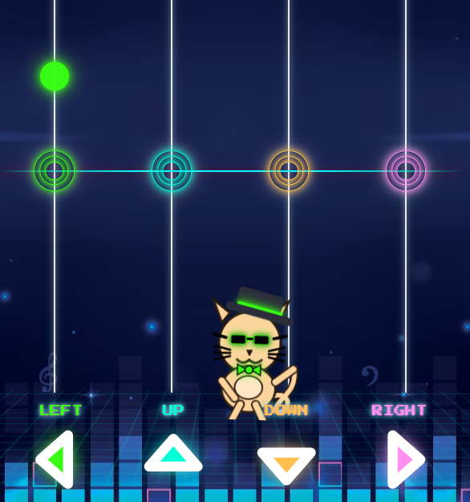  
  *Gameplay with default visuals before enabling Reduce Motion / No Flash.*

  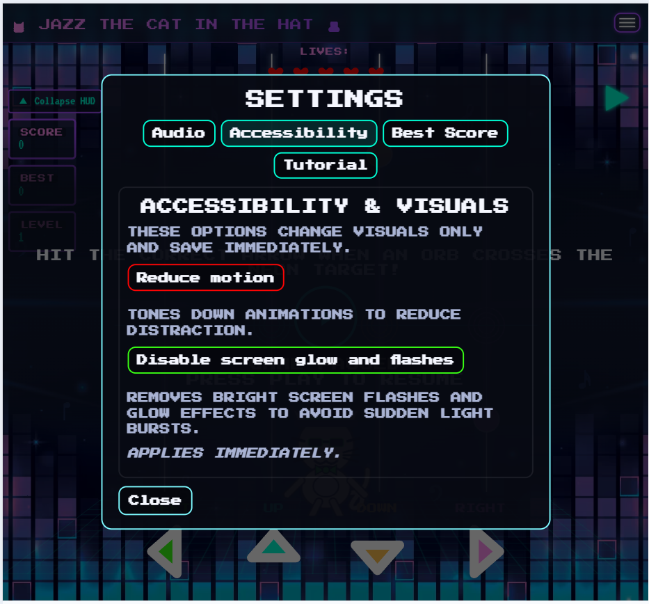  
  *Accessibility options: Reduce Motion and Disable Flash.*

  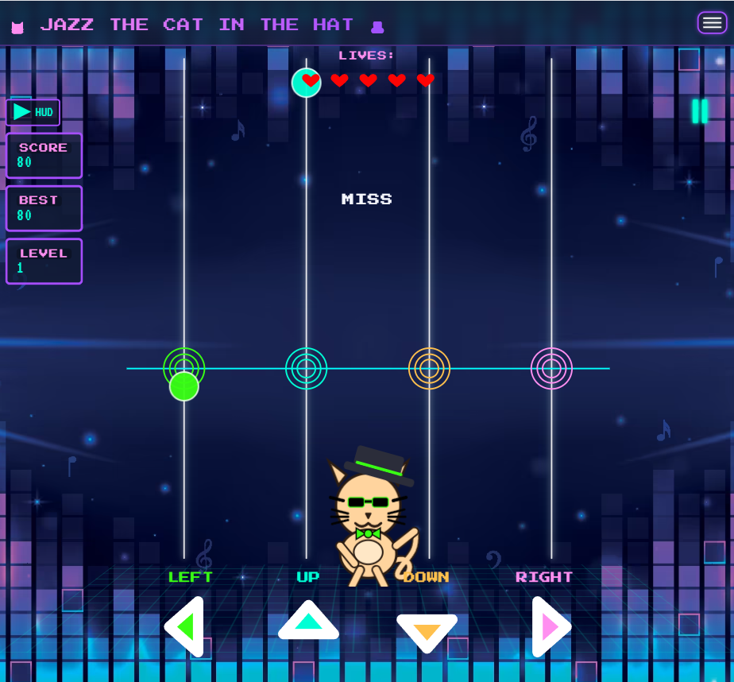  
  *Gameplay with Reduce Motion and No Flash enabled.*

  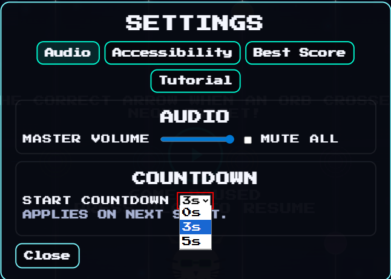  
  *Countdown length and audio controls.*

</details>

<br>

---


### Best Score & Reset Game Data Panel

The game keeps track of your **best score**, allowing players to compete against themselves and aim for higher streaks over time.  
All stored data uses the browser’s localStorage and stays on the device only.

In the settings menu, players can:

- View their **current best score**  
- Reset the high score without affecting anything else  
- Reset *all* stored game data (best score, audio settings, countdown preference, accessibility options)

This makes it easy to return the game to its original state at any time.

<details>
  <summary><strong>Show screenshot</strong></summary>

  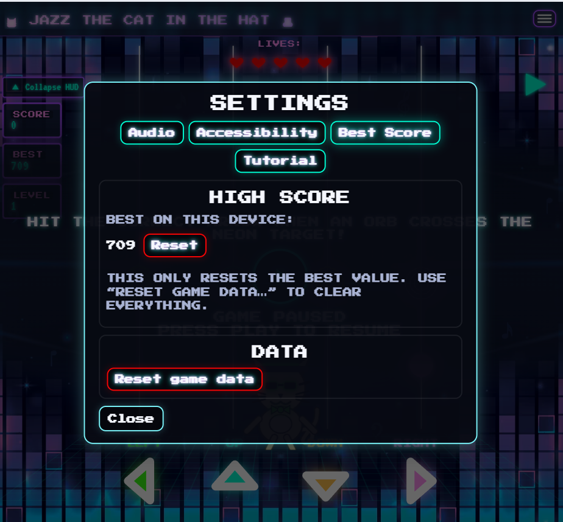  
  *Reset score and game data panel.*

</details>

<br>

---

## Design

The visual design of **Jazz the Cat in the Hat** is inspired by classic neon-arcade games, with bold glow, high contrast, and playful “stage” lighting.  
The goal is to make the gameplay elements stand out instantly — lanes, target line, timing feedback, and score — while still keeping the world fun and full of personality.

- A deep, dark background makes neon colours pop.  
- The four lanes form a clear “rhythm runway” so players always know where to focus.  
- Feedback (Perfect/Great/Good/Miss) is large and bright near the target for fast readability.  
- Jazz the Cat is intentionally expressive and central to the visual theme.  

<br>

---

### Wireframes

Early wireframes were created to plan the core layout: HUD at the top, rails and judge line in the centre, and controls anchored at the bottom.  
The priority was ensuring players can always see both the target area and the controls — even on small mobile screens.

<details>
  <summary>Show screenshot: wireframe</summary>

    
  *Wireframes.*

</details>

<br>

---

### Colour Scheme

The colour palette uses bright neon tones (pink, purple, cyan) on a dark background.  
This supports high contrast, good readability, and a strong arcade atmosphere.

<details>
  <summary>Show screenshot: color scheme</summary>

    
  *Color scheme.*

</details>

<br>

---

### Typography

Typography was selected to reinforce a retro arcade feel while staying readable during fast gameplay:

- **Press Start 2P** — used for HUD labels and UI elements  
- **VT323** — used for score text and fast-changing numbers  
- Subtle neon text glow supports the theme without reducing readability  

<br>

---

### Layout

The layout ensures players never need to search for information during gameplay:

- HUD is separated and readable  
- Target line and lanes are visually dominant  
- Overlays (Play, Pause, Results, Game Over) are bold, centered and easy to understand instantly  

<br>

---


## Technologies Used

### Languages & Core Stack
- **HTML5** – structure for UI, overlays, HUD, controls and game layout  
- **CSS3** – mobile-first styling, neon arcade visuals, animations, accessibility modes  
- **JavaScript (ES modules)** – all gameplay logic, input handling, scoring, events, audio and UI behaviour  

<br>

---

### JavaScript Module Architecture
The game uses a clean, modular ES-module structure. Each file has a single responsibility:

- **game.js** — main lifecycle controller (countdown, start/stop, pause, level flow)  
- **ui.js** — overlays, HUD updates, feedback messages, settings panels, quick Play/Pause  
- **input.js** — keyboard, mouse and touch handlers  
- **scoring.js** — scoring system, combo tracking, bonus mode, life handling and best score persistence  
- **songPlayer.js** — loads audio, fetches chart JSON, schedules notes and synchronises spawns to the music  
- **difficulty.js** — level configurations (travelBeats, spacing, anti-simultaneous rules, bonus thresholds)  
- **songRegistry.js** — playlist of available songs with references to their audio + chart files  
- **test.js** — developer helpers for console sanity checks (movement triggers, judge tests, clearAllNotes)

This architecture keeps gameplay, UI, audio, scoring and difficulty logic separated and easy to maintain.

<br>

---

### Event-Driven System
Modules communicate using a lightweight custom event protocol:

- **ui:requestStartRun**  
- **ui:requestPause**  
- **ui:nextLevel**  
- **ui:restartLevel**  
- **ui:retryLevel**  
- **song:ready**  
- **song:started**  
- **song:ended** *(with reason)*  
- **song:error**  
- **game:livesDepleted**  
- **bonus:lifeAwarded**

This prevents duplicated listeners, keeps the lifecycle predictable and makes debugging much easier.

<br>

---

### Data Persistence - localStorage
The game uses the browser’s built-in `localStorage` to remember comfort settings and progress:

- Best score  
- Volume and mute state  
- Countdown preference  
- Accessibility: **Reduce Motion** + **No Flash**  
- HUD layout mode (expanded or inline)

These settings persist between visits with no backend required.

<br>

---

### Chart-Driven Gameplay - JSON
Each level uses a dedicated **JSON chart** stored in  
`assets/charts/`.

A chart includes:
- **bpm** (tempo)  
- **offsetMs** (sync correction)  
- **travelBeats** (fall speed)  
- **notes** (time + lane)  

`songPlayer.js` fetches the JSON chart, parses it, and schedules notes so they reach the judge line exactly on time with the audio.

This system makes levels consistent, editable and fully timing-driven.

<br>

---

### Audio & Assets
- Music loaded through `<audio>` elements controlled in JavaScript  
- Volume and mute reflect stored settings on startup  
- Background image provided in **AVIF**, with **WebP** and **PNG** fallbacks  
- Custom-drawn SVG assets:
  - Jazz the Cat (front + back pose)
  - Hearts (HUD)
  - Arrows / lane icons
  - UI graphics and bonus effects

All assets are optimised for performance.

<br>

---

### CSS, Layout & Accessibility
- **Mobile-first CSS** with consistent breakpoints  
- Shared width model for rails and on-screen controls  
- Stable stage layout using:  
  `main.game { min-block-size: calc(100svh - 4rem); }`  
- Accessibility features:
  - **Reduce Motion** disables key animations  
  - **No Flash** removes glow/flash effects  
  - Large tap targets and clear focus states  

<br>

---

### Frameworks & Libraries
- **Bootstrap 5** — used only for the responsive navigation bar  
- No external JS frameworks (vanilla ES modules only)

<br>

---

### Version Control & Deployment
- **Git** for version control  
- **GitHub** for repository hosting  
- **GitHub Pages** for live deployment  
- Custom `404.html` for broken link handling

<br>

---


## Testing

A full detailed testing report including HTML, CSS and JavaScript validation, responsiveness checks, and manual testing is available in a separate document:

➡️ [View full Testing report](TESTING.md)

<br>

---


## Deployment & Local Development

### Deployment - GitHub Pages

This site is deployed using **GitHub Pages**.

**Live site:** <https://gooldenapple.github.io/Jazz-the-Cat-in-the-Hat/>

**Steps to deploy:**
1. Log in (or sign up) to **GitHub**.  
2. Open the repository: **gooldenapple/Jazz-the-Cat-in-the-Hat**.  
3. Go to **Settings → Pages**.  
4. Under **Build and deployment**, set:  
   - **Source:** `Deploy from a branch`  
   - **Branch:** `main`  
   - **Folder:** `/ (root)`  
5. Click **Save**. GitHub Pages will build and publish the site.  
6. When the deployment banner shows success (or in **Actions/Pages**), visit the **Live site** URL.  

Any commit pushed to `main` triggers an automatic redeploy.

<br>

---

### 404 Page

A custom `404.html` is included for GitHub Pages to handle broken links with a clear return path to the homepage (Back to Home) and a visible, clickable homepage URL.

<details>
  <summary><strong>Screenshot: 404 page</strong></summary>

  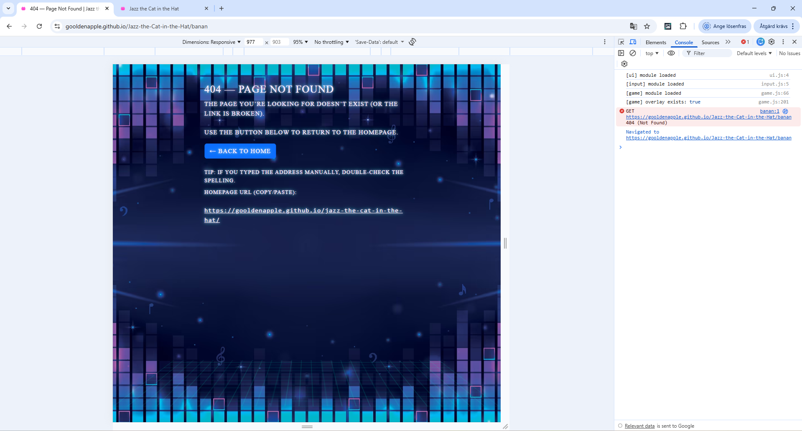  
  *404 page.*

</details>

<br>

---

### Local Development

To run this project locally:

1. **Clone the repository**
   ```bash
   git clone https://github.com/gooldenapple/Jazz-the-Cat-in-the-Hat.git
   ```


2. **Navigate into the project folder**
   ```bash
   cd Jazz-the-Cat-in-the-Hat
   ```
3. **Open the site in a browser**
   - Double-click `index.html`, **or**
   - Use a local server (recommended):
     - VS Code: install the *Live Server* extension and click **Go Live**.

This project is an HTML/CSS/JavaScript game — no build steps or extra dependencies are required.
Third-party libraries (Bootstrap, Font Awesome) are loaded via CDN.

<br>

---

### How to Fork

1. Log in (or sign up) to **GitHub**.
2. Go to the original repository: <https://github.com/gooldenapple/Jazz-the-Cat-in-the-Hat>.
3. Click **Fork** (top-right) to create a copy under your GitHub account.

<br>

---

### How to Clone

Clone the project to your local machine. You can clone your fork (recommended if you plan to push changes) or the original repository (read-only).

**Clone your fork (recommended):**

1. On your fork’s page (`<your-username>/Jazz-the-Cat-in-the-Hat`), click **Code**, choose **HTTPS** or **SSH** (or **GitHub CLI**), and copy the clone URL.
2. In your terminal, navigate to the folder where you want the project, then run:
```bash
git clone https://github.com/<your-username>/Jazz-the-Cat-in-the-Hat.git
cd Jazz-the-Cat-in-the-Hat
```
**or clone the original (read-only):**
```bash
git clone https://github.com/gooldenapple/Jazz-the-Cat-in-the-Hat.git
cd Jazz-the-Cat-in-the-Hat
```

<br>

---

## Future Improvements

There are several ideas that could further improve **Jazz the Cat in the Hat** in future iterations, beyond the current assessment scope:

- **More playful game feedback**
  - Add a sad face or “defeated” pose for Jazz the Cat on Game Over.
  - Add a celebratory animation or confetti effect when a level is cleared.
  - Enhance the bonus banner with extra micro-animations or colour shifts when Bonus Mode is active.

- **Expanded gameplay modes**
  - Extend progression into an effectively endless sequence of levels, where songs and patterns can loop but difficulty continues to scale so the game never truly “runs out” of new levels.
  - Add optional checkpoints or a “resume from level X” option to support longer play sessions.
  - Experiment with alternative difficulty presets aimed at very young children or more advanced rhythm-game players.
  - Move towards a fully beat-driven system where every orb pattern, difficulty ramp and bonus trigger is tightly synchronised to the underlying music charts, so the whole game feels even more “locked in” to the beat.
  - Make Bonus Mode more playful by occasionally switching into a short mini-game (for example, a mode where Jazz has to catch falling orbs in the hat instead of the usual lane hits).

- **Richer character animation**
  - Make Jazz the Cat fluffier and more expressive while keeping his current design and personality intact.
  - Add more expressive dance moves for Jazz the Cat that react to combo streaks or Bonus Mode.
  - Introduce small idle animations when the player is on the pause screen or waiting on the overlay.
  - Make the transitions between moves smoother and more varied to feel even more “groovy”.

- **Progression & rewards**
  - Add simple badges or icons for milestones such as “First Clear”, “No Miss Run”, or “Bonus Master”.
  - Add a small progress meter that shows how close the player is to triggering Bonus Mode or earning an extra life during Bonus Mode.
  - Allow players to view a small “stats” panel with their best score, highest level reached, and favourite song.
  - Add a “Best Players” leaderboard that shows the top 10 high scores, so friends and family can compete and compare their best runs.

- **Settings and accessibility polish**
  - Further organise settings into clearer groups (Audio, Accessibility, Gameplay) with short helper text under each option.
  - Add an optional “high contrast” visual mode for players who prefer a less neon-heavy palette.
  - Offer a “beginner HUD” mode with extra hints (for example, subtle arrows near the rails on Level 1).
  - Add an optional guided “first run” tutorial that highlights key areas of the screen (rails, HUD, controls, settings, bonus banner) with small arrows and short text, and asks the player whether they want the guided tour or prefer to jump straight into playing.

- **Responsiveness & Layout**
  - Fine-tune the layout for unusual aspect ratios, so that the rails and on-screen controls always stay fully visible and centred even on extreme viewport sizes (inspired by the DevTools emulation edge cases).
  - Adjust spacing between HUD, stage and controls on very short screens so that players never lose access to the controls area, even when the available vertical height is limited.

These improvements outline a clear path for how the game could grow and become even more engaging, accessible and replayable in future updates.

<br>

---

## Appendix / Process & Artifacts

### Project Management

This project was planned with ChatGPT, using:

- Shared to-do lists in the chat (features, bugs, testing tasks) that were revisited and checked off over time.

<details>
<summary>Example task overview</summary>

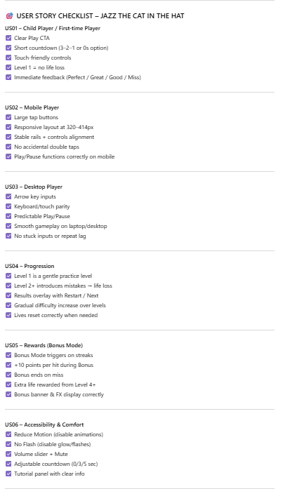  
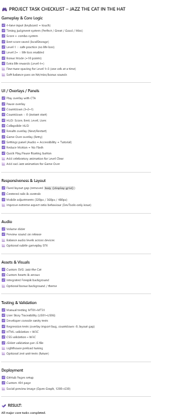

*User stories and manually tracked tasks helped keep gameplay, UI, accessibility and testing work structured.*
</details>

<br>

---

### Process learnings

- Keeping the scope **small but deep** (one game, many polished details) made it easier to iterate without constant rewrites.  
- Breaking work into **short, focused task lists** reduced overwhelm and made it easier to see progress.  
- Regular **Lighthouse, validation and manual playtesting** runs caught layout and accessibility issues early.  
- Saving “baseline” versions before bigger changes made it easier to back out of ideas that did not feel right in practice.  
- Combining **children’s playtesting** with adult feedback helped balance fun, clarity and difficulty.

<br>

---


## Credits

### Music (Kevin MacLeod — Incompetech)

All music tracks are composed by **Kevin MacLeod** and licensed under **CC BY 3.0** or **CC BY 4.0**.  
Official website: https://incompetech.com

Tracks used in this project:
- Balloon Game  
- Itty Bitty 8-Bit
- C-Funk  
- Style Funk  
- Funkorama  
- Flutey Funk  
- Funk Game Loop  
- Aces High  
- Protofunk  
- Smooth Move  
- Funky Chunk  
- Celebration  
- Your Call  
- Enter the Party  
- Fork and Spoon  

Each track includes credit in accordance with the Creative Commons license.

<br>

---

### Sound Effects

Sound effects used in this project are sourced from [Pixabay](https://pixabay.com/sound-effects/) under the Pixabay License, including:

- UI volume preview chime — by [skyscraper_seven](https://pixabay.com/users/skyscraper_seven-43500092/?utm_source=link-attribution&utm_medium=referral&utm_campaign=music&utm_content=203601)  
- Additional effects by [floraphonic](https://pixabay.com/users/floraphonic-38928062/)  
- Additional effects by [I Love Jesus Christ](https://pixabay.com/users/jesuschristisgod-44370300/)  

<br>

---

### Graphics & Visual Assets

- **Jazz the Cat** — custom SVG artwork created specifically for this project.  
  The character’s SVG artwork and overall visual style were created by me (the developer), with support from ChatGPT as a design assistant.  

- **Hearts**, **arrows**, and UI icons — custom SVG graphics designed to match the neon arcade theme.  

- **Background image** — “Gradient karaoke / disco background” vector from **Freepik**.  
  Used under Freepik’s license:  
  https://www.freepik.com/free-vector/gradient-karaoke-background_87160850.htm

<br>

---

### Mockups

Responsive mockups were created to preview how the game looks on mobile, tablet and desktop screens.  
These were generated using the **TechSini Multi Device Mockup Generator**.

<details>
<summary>Show mockup</summary>


</details>

<br>

---

### Fonts

- **Press Start 2P** — Google Fonts (Open Font License)  
- **VT323** — Google Fonts (Open Font License)

<br>

---

### Frameworks & Libraries

- **Bootstrap 5** — used only for the responsive navigation bar  
  https://getbootstrap.com

<br>

---

### Tools & Services

- **GitHub** — repository hosting  
- **GitHub Pages** — deployment  
- **Chrome DevTools** — debugging, responsive previews and performance checks  
- **W3C HTML & CSS Validators** — markup and stylesheet validation  
- **JSHint** — JavaScript validation  
- **Lighthouse** — performance and accessibility audits  
- **Balsamiq** — early wireframes for layout and flow    
- **TinyPNG** / **Squoosh** — image compression and AVIF/WebP optimisation  
- **TechSini Multi Device Mockup Generator** — mockup creation  
- **ChatGPT (OpenAI)** — creative and technical assistant for planning, debugging, SVG design and documentation  
- **GIMP** — additional image editing and export  
- **W3Schools** — reference and learning material  
  https://www.w3schools.com

<br>

---

## Acknowledgements

A heartfelt thank you to everyone who helped shape this project:

- **Code Institute**, for the structure and learning foundation that made this possible.
- **Tindy, Cohort Learning Facilitator** — for taking the time to check in, support me, and remind me that I’m not doing this journey alone.
- **Kevin MacLeod**, whose CC-licensed music added personality and rhythm to every level.  
- **Freepik artists**, for the vibrant background artwork that fits the neon-arcade theme.  
- **My children**, whose reactions, joy and honesty guided many design decisions.  
- **Friends and family**, for testing, cheering and giving feedback during the entire journey.  
- **ChatGPT (OpenAI)**, my technical and creative development assistant throughout development and polish.

<br>

---

