# Testing

This document contains the full testing report for **Jazz the Cat in the Hat**.  
It covers user story testing, manual testing, HTML/CSS validation, JavaScript validation (JSHint), responsiveness checks, browser compatibility, and known limitations.

Testing was carried out continuously during development using manual play sessions, Chrome DevTools, validation tools, and focused regression checks after bug fixes.

---

## Testing Strategy (Overview)

Testing for this project combined:

- Manual UX checks by playing levels and then using short pauses between runs to inspect overlays, HUD behaviour and settings.
- HTML/CSS validation using W3C tools.
- JavaScript validation with JSHint.
- Lighthouse audits for performance, best practices and accessibility.
- Targeted console sanity tests for lifecycle events and scoring.
- Regression checks after fixing critical bugs.

Because this is an interactive, timing-sensitive rhythm game, a large part of the testing also came from simply playing it a lot.

---

## How to Run the Tests (Quick Start)

1. Open the live game in **Chrome**.
2. Open **DevTools → Console**.
3. (Optional) Set a shorter countdown while testing:

       localStorage.setItem('countdownSec', '0');
       location.reload();

4. Use the **Manual Testing** table as a checklist while playing on different breakpoints (mobile / tablet / desktop).
5. Use the **Developer console sanity tests** (section below) to quickly verify critical flows after changes or new deployments.
6. Run HTML, CSS and JS files through their respective validators if structural changes are made.

---

## Tools & Methods

- **Browsers:**
  - Chrome (desktop)
  - Edge
  - Firefox
  - Safari (macOS / iOS)
  - Android mobile
  - iPhone  

- **Validation:**
  - W3C HTML Validator
  - W3C CSS Validator
  - JSHint for JavaScript (browser version)

- **Audits:**
  - Lighthouse (Performance, Best Practices, Accessibility).  
    Remaining minor items (for example preload hints) are documented under *Known Limitations*.

- **Accessibility toggles:**
  - `Reduce Motion` and `No Flash` modes were verified visually and by checking DOM state flags on `<body>`.

- **Developer console tests:**
  - Small helper snippets (section “Developer Console Sanity Tests”) were used to verify:
    - Overlay and countdown behaviour
    - State flags such as `data-paused`
    - HUD hearts rendering and updates
    - Note spawn/clear behaviour
    - Lifecycle events from `songPlayer.js`

---

## User Story Testing (Traceability)

Each user story from the README has been linked to one or more concrete tests.  
The table below summarises how each story was verified, with references to manual test IDs and evidence.

*The full user stories are described in the main README under **UX → User Stories**.  
The table below shows how each story was verified through testing.*

| Story | Acceptance Criteria (summary) | How Verified | Evidence | Status |
|------|-------------------------------|--------------|----------|--------|
| Child Player / first-time player | Play visible, countdown, touch + keyboard, clear feedback, Level 1 no life loss | Manual play test on mobile + desktop; verify countdown and feedback; confirm Level 1 rule | Screenshots: countdown + gameplay feedback + Level 1; Manual Testing rows | Pass |
| Player (Mobile) | Responsive touch, no double taps, alignment across sizes | Manual test on 320px & 375px + real device/DevTools; rapid tap test; visual check | Screenshots: 320/375; Manual Testing rows | Pass |
| Player (Desktop) | Arrow keys match lanes, consistent input, pause/resume | Manual test on desktop; press keys during play; pause/resume mid-run | Manual Testing rows | Pass |
| Player (Progression) | Level 1 safe, Level 2+ increases challenge, results overlay replay/next | Manual play test across Level 1–4; confirm results panel options | Screenshots: results panel | Pass |
| Player (Rewards) | Bonus triggers, +10 per hit, ends on miss, extra life on Level 4+ | Manual test: trigger bonus, capture +10 feedback, force miss to end, verify extra life | Screenshots: bonus +10, bonus ended, extra life | Pass |
| Player (Accessibility) | Reduce Motion works, No Flash works, settings accessible | Toggle settings during play; compare before/after visuals | Screenshots: settings toggles + before/after | Pass |

### Evidence Screenshots – User Stories

Most of the visual evidence for core flows is grouped below in collapsible sections per user story.

<strong>US01 — Child Player / first-time player</strong>

  
*Pause overlay.*

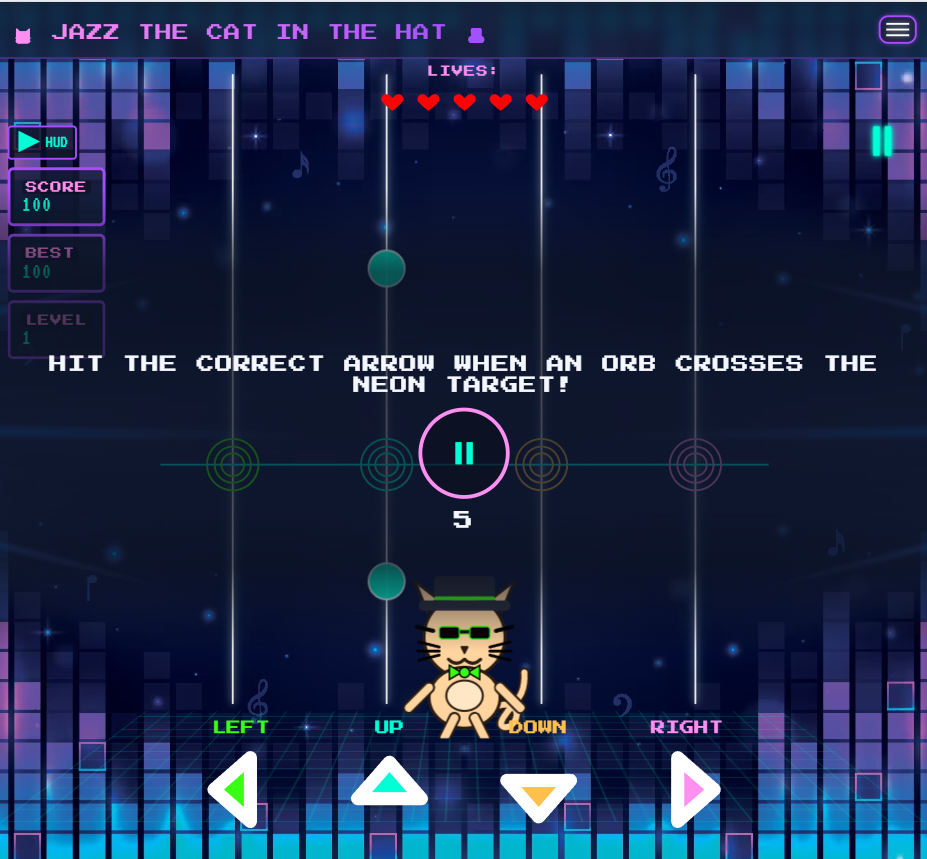  
*Countdown shown before gameplay begins, giving the player time to prepare.*

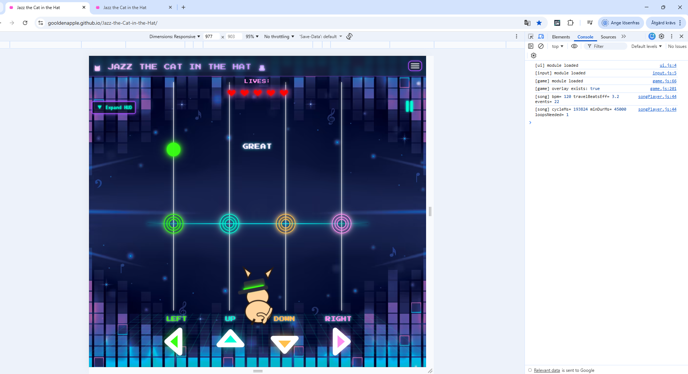  
*Timing feedback displayed clearly near the target area after a successful hit.*

  
*Level 1 keeps all hearts even after misses, confirming the beginner-friendly rules.*

---

<strong>US02 — Player (Mobile)</strong>

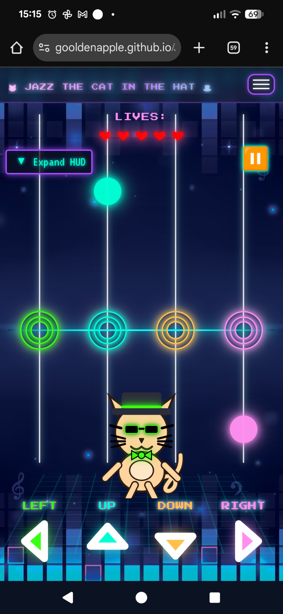  
*On-screen touch controls used on mobile devices, aligned and fully responsive.*

---

<strong>US03 — Player (Desktop)</strong>

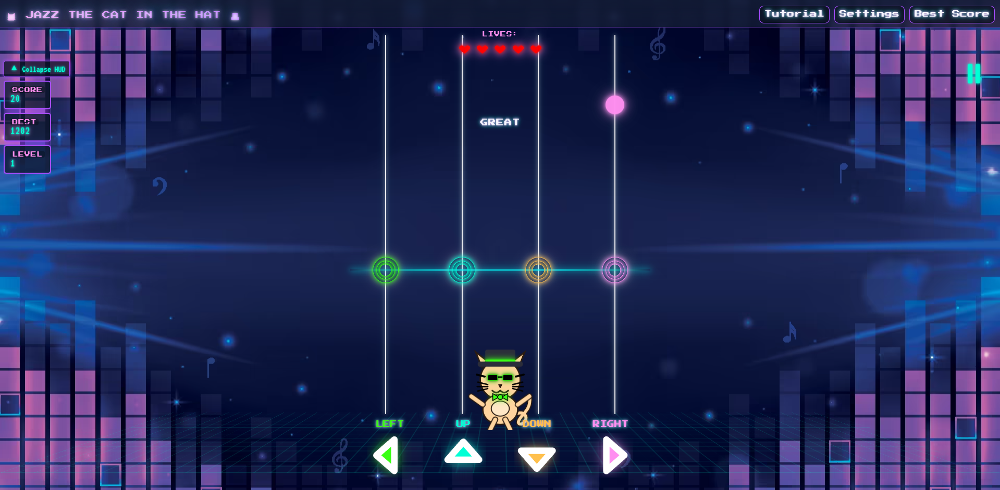  
*Gameplay started on desktop, confirming keyboard input responsiveness.*

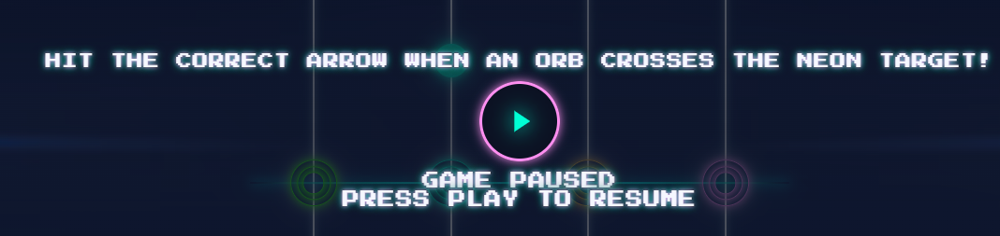  
*Pause overlay displayed correctly after pressing the pause control.*

---

<strong>US04 — Player (Progression)</strong>

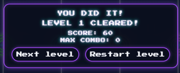  
*Results overlay shown after clearing a level, offering replay/next options.*

  
*Game Over overlay displayed after losing all lives from Level 2 and onwards.*

---

<strong>US05 — Player (Rewards)</strong>

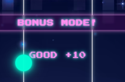  
*Bonus Mode active, awarding +10 extra points for each successful hit.*

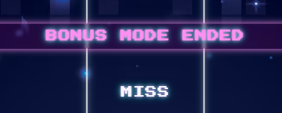  
*Bonus Mode ends immediately after a miss, confirming correct behaviour.*

  
*Extra life rewarded during Bonus Mode on higher levels.*

---

<strong>US06 — Player (Accessibility)</strong>

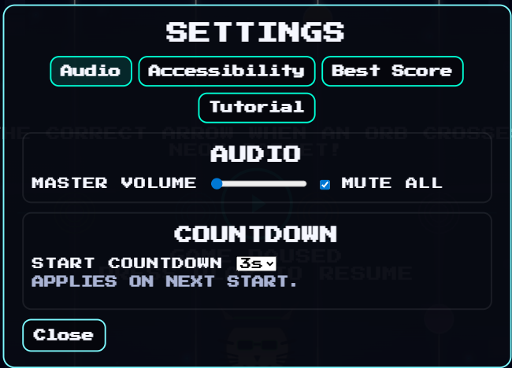  
*Audio settings panel.*

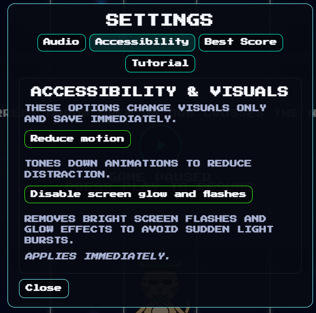  
*Accessibility settings panel.*

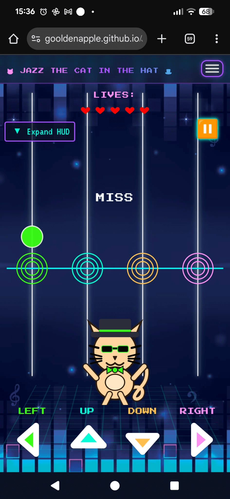  
*No Flash and Reduce Motion enabled.*

---

## Manual Testing

The game was manually tested using an Expected vs Actual approach. Each test case has a unique ID (MTxx) to make it easy to reference from other sections.

> MT = Manual Test case ID.

| ID | Related Story | Feature | Steps | Expected Result | Result |
|----|--------------|---------|-------|-----------------|--------|
| MT01 | Child Player | Play (Overlay) | Click **Play** on the overlay | Overlay visible, label “Play”, icon shows play; countdown starts | Pass |
| MT02 | Child Player | Countdown | Start game with default settings | Label shows 3 → 2 → 1 → GO, then song starts | Pass |
| MT03 | Child Player | Countdown = 0 | Set countdown to 0 in settings and start game | No countdown, game starts immediately | Pass |
| MT04 | Child Player | Pause | Click **Pause** during gameplay | Gameplay pauses, `data-paused="true"`, pause overlay is visible | Pass |
| MT05 | Child Player | Resume | Click **Play** while paused | Gameplay resumes from the same state | Pass |
| MT06 | Child Player | Quick Play/Pause | Use the quick button in the HUD | Toggles Play/Pause correctly | Pass |
| MT07 | Child Player | Menu Play/Pause | Use Play/Pause in the navbar menu | Toggles Play/Pause correctly and menu label stays in sync | Pass |
| MT08 | Player (Desktop) | Keyboard controls | Press arrow keys during gameplay | Matching lane input is registered | Pass |
| MT09 | Player (Mobile) | Touch controls | Tap on-screen arrow buttons | Matching lane input is registered | Pass |
| MT10 | Player (Mobile) | Touch responsiveness | Rapid tap arrow buttons | Inputs respond immediately and remain playable | Pass |
| MT11 | Player (Mobile) | Ghost click protection | Tap once repeatedly in the same lane | No accidental double inputs occur from a single tap | Pass |
| MT12 | Player (Mobile) | Alignment across sizes | Test at 320px and 375px widths | Controls remain aligned across screen sizes | Pass |
| MT13 | Accessibility | Settings open/close | Open settings from menu and close it | Panel opens and closes without breaking gameplay | Pass |
| MT14 | Accessibility | Volume slider | Move the slider while playing | Audio volume changes smoothly | Pass |
| MT15 | Accessibility | Mute toggle | Enable **Mute** | Audio is muted | Pass |
| MT16 | Accessibility | Reduce Motion | Enable **Reduce Motion** | Key animations (dancer moves/rail ticks) are reduced or disabled | Pass |
| MT17 | Accessibility | No Flash | Enable **No Flash** | Rail flash and heart glow are disabled | Pass |
| MT18 | Child Player | Countdown setting persisted | Change countdown option and reload | Countdown matches the selected value after reload | Pass |
| MT19 | Progression | Level 1 safety | Play Level 1 and intentionally miss | Level 1 does not reduce lives on misses | Pass |
| MT20 | Progression | Level 2+ lives | Play Level 2+ and miss | Lives reduce according to miss rules | Pass |
| MT21 | Rewards | Bonus Mode trigger | Reach the streak threshold | Bonus Mode activates and banner is shown | Pass |
| MT22 | Rewards | Bonus scoring | Hit notes during Bonus Mode | Feedback shows `+10` extra points per hit | Pass |
| MT23 | Rewards | Bonus Mode end | Miss once during Bonus Mode | Bonus Mode ends immediately and “bonus ended” feedback appears | Pass |
| MT24 | Rewards | Extra life (Level 4+) | Reach bonus goal during Bonus Mode | Extra life is awarded | Pass |
| MT25 | Progression | Results overlay | Finish a level with lives remaining | Results overlay appears with replay/next options | Pass |
| MT26 | Progression | Game Over overlay | Lose all lives (Level 2+) | Game Over overlay appears with retry option | Pass |
| MT27 | Layout | Rotate overlay | Rotate device to a landscape layout on small screens | Rotate overlay appears, suggesting portrait; disappears again when rotated back | Pass |
| MT28 | Layout | HUD hearts on load | Load the game | Hearts render in `#lives` | Pass |
| MT29 | Layout | HUD hearts on damage | Play and take a hit | Hearts update to reflect damage | Pass |
| MT30 | Navigation | Navbar behaviour | Toggle navbar open/close on mobile | `data-nav-open` syncs and Quick Play/Pause hides under open navbar | Pass |
| MT31 | Visitor | 404 page | Visit a non-existent URL (for example `/this-page-does-not-exist`) | Custom 404 page displays with “Back to Home” and clickable homepage URL | Pass |

### Evidence Screenshots

Most of the visual evidence for manual testing overlaps with the User Story evidence in the section above.  
Any extra screenshots used for manual spot checks (for example rotate overlay or 404 page) are referenced where relevant in this document.

---

## Developer Console Sanity Tests

These snippets can be run in the browser console to quickly verify critical flows after code changes or new deployments.

### Overlay & State Flags

    // Overlay should exist on boot
    !!document.getElementById('overlay');  // -> true

    // Game is paused while overlay is up
    document.body.hasAttribute('data-paused');  // -> true before first start

### HUD Render (Hearts)

    // Hearts present in HUD
    document.querySelectorAll('#lives .svg-heart').length >= 1;  // -> true

### Notes Present / Cleared

    // Count active notes on rails
    document.querySelectorAll('.rail .note').length;  // number varies

    // Clear notes (dev helper exposed via scoring.js)
    window.clearAllNotes?.();  // clears visuals, no error

### Input Helpers (from `test.js`)

    // Fire moves to test judging without clicking buttons
    window.doLeftMove?.();
    window.doRightMove?.();
    window.doUpMove?.();
    window.doDownMove?.();

    // Try judge helper (if present)
    window.tryJudge?.(performance.now() + 200);  // example call

### Lifecycle Events

    window.addEventListener('song:ready',   (e) => console.log('ready', e.detail));
    window.addEventListener('song:started', (e) => console.log('started', e.detail));
    window.addEventListener('song:ended',   (e) => console.log('ended', e.detail));
    window.addEventListener('song:error',   (e) => console.error('error', e.detail));

### Countdown = 0 (Skip Test)

    localStorage.setItem('countdownSec', '0');  // allow immediate start
    location.reload();                          // hard refresh, then press Play

### Menu Label Sync

    // Play/Pause label in navbar should update as state changes
    document.querySelector('#menuPlayToggle')?.textContent.trim();

---

## Edge Case & Error Flow Tests

In addition to the main manual tests, a few edge cases and error flows were considered:

- **Audio fails to start (muted / blocked):**  
  - Steps: Start the game with the browser tab muted or system sound very low.  
  - Expected: Gameplay, overlays and scoring still function; only sound feedback is affected.

- **Countdown set to an unexpected value:**  
  - Steps: Manually set `localStorage.setItem('countdownSec', '999')` or a negative value and reload.  
  - Expected: The game falls back to sensible behaviour (long countdown is still allowed, but does not break play).

- **Refresh during gameplay:**  
  - Steps: Start a level and reload the page mid-run.  
  - Expected: Game state resets cleanly to the initial overlay with no console errors.

These edge cases do not reveal additional breaking issues and confirm that the game fails gracefully in non-standard situations.

---

## Regression Tests (Recent Fixes)

These are targeted regression checks for bugs that were found and fixed during development.

1. **Broken overlay & missing hearts after JS cleanup**  
   - **Root cause:** `game.js` imported `setPlayTip`, `setOverlayIcon`, `initTopbarAutoHeight` that were not exported from `ui.js`, causing the module to fail to load.  
   - **Fix:** Export those functions from `ui.js`.  
   - **Verify:**  
     - Console has no “does not provide an export named …” errors.  
     - On boot: overlay is visible and hearts are rendered.  
     - Press Play → countdown runs and the game starts correctly.

2. **Countdown “0 seconds” ignored**  
   - **Root cause:** `countdownSec || 3` treated `0` as falsy and fell back to 3 seconds.  
   - **Fix:** Parse and propagate the countdown using nullish-aware logic so `runOverlayCountdown(0)` starts immediately.  
   - **Verify:**  
     - `localStorage.setItem('countdownSec','0')` → reload → pressing Play starts the game with no countdown.

3. **Layout gap on stage**  
   - **Root cause:** `body { display: grid; }` created an extra row/gap between sections.  
   - **Fix:** Use `body { display:block; }` and ensure `main.game { min-block-size: calc(100svh - 4rem); }`.  
   - **Verify:**  
     - No visible vertical gap between rails and controls across breakpoints.

4. **Accessibility toggles (Reduce Motion / No Flash)**  
   - **Root cause:** Some animations and glow effects were not fully disabled when toggles were active.  
   - **Fix:** Extend CSS/JS hooks so dancer movement, rail ticks and heart glow are covered; also ensure hearts lose glow under No Flash.  
   - **Verify:**  
     - With Reduce Motion enabled, dancer/rail animations are reduced or removed.  
     - With No Flash enabled, rail flash and heart glow are disabled.

5. **404 Page routing**  
   - **Root cause:** Default GitHub Pages 404 was shown without a clear path back to the game.  
   - **Fix:** Add a custom `404.html` with a Back to Home button and a visible, clickable homepage URL.  
   - **Verify:**  
     - Visiting a non-existent URL (for example `/this-page-does-not-exist`) shows the custom 404 page with a working “Back to Home” link.

---
## Validation

Validation covers HTML, CSS and JavaScript.  
HTML/CSS were validated with W3C tools, and JavaScript files were validated using JSHint in the browser.

### HTML & CSS Validation

HTML and CSS were validated using the official W3C tools:

- **HTML:** W3C Markup Validation Service  
- **CSS:** W3C Jigsaw CSS Validator  

<strong>HTML validation screenshot</strong>

  
*HTML validated using W3C Validator with no breaking errors.*

<strong>CSS validation screenshot</strong>

  
*CSS validated with no critical issues; warnings relate to expected differences between browsers and vendor-specific rules.*

---

### JavaScript Validation (JSHint)

All JavaScript files were validated using **JSHint** (browser version at jshint.com).  
Each file was pasted and checked individually using the same configuration.

<strong>JSHint configuration screenshot</strong>

*Global JSHint options used for all JavaScript files (`esversion: 11`, `browser: true`, `devel: true`, `undef: true`, `unused: true`).*

  

This configuration includes :

- /* jshint esversion: 11 */
- /* jshint browser: true */
- /* jshint devel: true */
- /* jshint strict: implied */
- /* jshint unused: true */ 

ES module files use `export` / `import`, and JSHint warnings related to ES module strict mode were treated as style-only.

---

### game.js

JSHint reports several “defined but never used” variables and functions inside game.js.
These are not actual errors. They exist intentionally within the game architecture.

During development, cleanup attempts were made to remove them.
However, removing these variables caused the game to break due to:

internal module dependencies

event-driven hooks that JSHint cannot detect statically

functions used indirectly through custom events

setup functions that are intentionally defined for future levels and bonus features

Because these functions participate in the game lifecycle (through events, DOM wiring, or shared state), but are not directly invoked in the same file, JSHint marks them as “unused”.

To avoid reintroducing functional bugs, these variables have been intentionally kept.

<strong>game.js validation</strong>

  
*`game.js` passes JSHint with no errors and only intentional “defined but never used” style warnings (kept as event hooks and lifecycle helpers).*

---

**ui.js**

`ui.js` owns most of the user interface wiring for the game: overlays (Play, Pause, Results, Game Over), HUD updates, hearts, judge flashes, the quick Play/Pause button, the settings panel, and the Bootstrap navbar collapse sync. It listens for custom game events, updates DOM state (attributes, classes and labels), and keeps the visual layer in sync with the underlying game state.

Two warnings appeared during validation:

- `'bootstrap' is not defined` – because the file calls `bootstrap.Collapse(...)` from the global Bootstrap bundle loaded via CDN.
- `'playBtn' is defined but never used` – a leftover reference to the overlay play button that was no longer used after refactoring.

To resolve these:

- A `/* global bootstrap */` directive was added alongside the JSHint options so that JSHint recognises `bootstrap` as an intentional global provided by the page.
- The unused `playBtn` constant was removed from the overlay controls block in `ui.js`, as all overlay wiring now uses a locally scoped button reference inside `wirePlayButton()` instead.

After these small cleanups, `ui.js` now passes JSHint with **no errors or warnings**.

<strong>ui.js – JSHint validation</strong>

  
*`ui.js` passes JSHint with no errors or warnings using the shared configuration. The Bootstrap global is declared explicitly and an unused overlay button reference has been removed.*

---

### scoring.js

`scoring.js` is the single source of truth for game state and judging. It owns the score, lives, level, combo and max combo, partial damage, bonus mode flags and internal counters. It also contains the timing windows, grading logic for hits, miss handling, and the hooks that notify the HUD (for example via `setFeedback` and bonus/extra-life events).

`scoring.js` was validated using the shared JSHint configuration. The only initial reports were “misleading line break before '?'” style warnings on a few ternary expressions in the bonus logic (selecting bonus mode and calculating the bonus goal). These expressions were rewritten to keep the `?` and `:` on clearer lines without changing the underlying behaviour. After this small readability refactor, `scoring.js` now passes JSHint with no errors or warnings.

<strong>scoring.js validation</strong>

  
*`scoring.js` passes JSHint with no errors or warnings using the shared configuration. Previous style warnings on ternary line breaks in the bonus logic were resolved by making the expressions more readable.*

---

### input.js

input.js connects all player input (keyboard arrows, WASD/space and on-screen DDR buttons) to the move and judge logic. It also handles mobile-friendly behaviour using pointerdown for instant response, filters out “ghost clicks”, and keeps keyboard and mouse controls working alongside touch.

input.js was validated using the global JSHint configuration. After removing an unused parameter from one click listener, the only remaining report is a single, intentional style warning on the line dancer.offsetWidth;. 

This expression is deliberately used to force a layout reflow so that re-adding a move class cleanly restarts the CSS animation. Removing it breaks the animation restart behaviour, so the warning is treated as non-blocking and the line is kept by desig

<strong>input.js validation</strong>

  
*`input.js` the remaining warning on `dancer.offsetWidth;` is an intentional reflow trigger and treated as a non-blocking style warning.*

---

### difficulty.js

`difficulty.js` defines the difficulty levels and pacing rules for the game.  
It controls timing windows, travelBeats, playbackRate, maximum simultaneous notes and anti-simultaneous note rules for each level.

JSHint reported **no errors or warnings** for this file.

<strong>difficulty.js – JSHint validation</strong>

  
*`difficulty.js` passes JSHint with no errors or warnings.*

---

### songpPlayer.js

`songPlayer.js` controls the chart-driven playback system. It loads the selected song and chart, applies the current level’s difficulty (via `LEVELS`), derives timing values (`rate`, `travelBeatsEff`, `travelMs`), simplifies the chart for the level, injects random chords, and schedules all note spawns. It also handles looping to meet a minimum duration, manages cancellation during the countdown (`cancelPendingStart`), and emits the main lifecycle events: `song:ready`, `song:started`, `song:ended`, and `song:error`.

 Initial reports were limited to style-only warnings: an unused destructured value (`msPerBeatEff`) in `startSongById` and an “Unexpected use of '|'” warning from a fast-floor pattern in `_pickRandomSubset`. These were resolved by removing the unused destructured variable and replacing the bitwise floor with a clearer `Math.floor(...)` expression, without changing the underlying timing or randomisation behaviour. After these small cleanups, `songPlayer.js` now passes JSHint with **no errors or warnings**.

<strong>songPlayer.js – JSHint validation</strong>

  
*`songPlayer.js` passes JSHint with no errors or warnings using the shared configuration. Earlier style warnings were removed by simplifying destructuring and replacing a bitwise fast-floor with `Math.floor()`.*

---

### songRegistry.js

`songRegistry.js` provides a clean, read-only registry of all songs used in the game.  
Each entry is frozen with `Object.freeze()` to prevent accidental mutations during gameplay.  
The file only contains static metadata: `id`, display title, artist, and paths to the audio file and chart JSON.  
Because it has no logic or dynamic behaviour, it is one of the simplest files to validate.

During JSHint validation, the file passed with **zero errors and zero warnings**.  
There are no unused variables, no implicit expressions, and no syntax issues — the static structure aligns perfectly with the project’s JSHint configuration.

<strong>songRegistry.js – JSHint validation</strong>

  
*`songRegistry.js` passes JSHint with no errors or warnings using the shared configuration.*

---

### audio.js

`audio.js` was validated using the global JSHint configuration shown above.  
After a small refactor of the Web Audio constructor and using `strict: implied`, the file now passes JSHint with **no errors or warnings**.

A minor adjustment was made to replace the inline constructor pattern with a linter-friendly version (`AudioContextClass` + `new AudioContextClass()`), which keeps the same behaviour while removing the previous “Bad constructor” warning.

<strong>audio.js – JSHint validation</strong>

  
*`audio.js` passes JSHint with no errors or warnings using the configuration above.*

---

## Responsiveness Testing

Responsiveness was tested using Chrome DevTools device emulation at several common viewport widths and by resizing the browser window. The goal was to ensure that:

- The HUD remains readable.  
- Rails, judge line and controls stay aligned.  
- Overlays remain centred and usable across devices.  

Tested widths:

- 320px  
- 375px  
- 425px  
- 768px  
- 1024px  
- 1920px  

### Screenshots

<strong>320px – small mobile screen</strong>

  
*320px – small mobile screen.*

<strong>320px – landscape</strong>

  
*320px – small mobile in landscape.*

<strong>375px – medium mobile screen</strong>

  
*375px – medium mobile screen.*

<strong>375px – landscape</strong>

  
*375px – medium mobile in landscape.*

<strong>425px – large mobile screen</strong>

  
*425px – large mobile screen.*

<strong>425px – landscape</strong>

  
*425px – large mobile in landscape.*

<strong>768px – tablet screen</strong>

  
*768px – tablet screen.*

<strong>1024px – laptop screen</strong>

  
*1024px – laptop screen.*

<strong>1920px – desktop screen</strong>

  
*1920px – desktop screen.*

<strong>HUD behind Play overlay (cosmetic)</strong>

  
*HUD sitting behind pause overlay text on some mobile screens (cosmetic).*

**Result:**  
No major layout issues were found. Controls and HUD elements remained readable and aligned across all tested breakpoints. The rotation overlay is shown on very small landscape layouts to guide the player back to portrait mode.

On some mobile screens, the expanded HUD can sit visually behind the Pause overlay text.  
This does not affect gameplay or usability: the HUD is fully readable during gameplay, and the Pause/Play overlay remains clear and fully functional. The behaviour is cosmetic and will be refined in a future update.

---

## Browser Compatibility

The live site was manually tested on multiple browsers and platforms to confirm that core gameplay, overlays, audio and controls behaved as expected.

| Browser / Platform | Result |
|--------------------|--------|
| Chrome (desktop)   | Pass |
| Edge (desktop)     | Pass |
| Firefox (desktop)  | Pass |
| Safari (macOS/iOS) | Pass |
| Android mobile     | Pass |
| iPhone             | Pass |

No browser-specific breaking issues were found during testing.

---

## Known Limitations / Issues

### Rapid Play/Pause Clicking Immediately After Pausing

**Severity:** Low  

**Description:**  
After pausing the game there is a very short safety window (a few hundred milliseconds) where additional Play/Pause clicks are ignored. This prevents race conditions while the audio engine and timers settle.

**Steps to Reproduce:**

1. Start a level and press **Pause**.
2. Immediately spam-click the Play/Pause control several times.
3. Observe that some rapid clicks are ignored during a short safety window.

**Status:** Accepted design (won’t fix).  

**Reason:**  
The delay ensures stable internal state transitions and does not affect normal gameplay. It is only noticeable when rapidly spam-clicking Play/Pause, which is not a typical use case.

---

### Minor Lighthouse / Preload Warnings

**Severity:** Low  

**Description:**  
In some Lighthouse or DevTools audits, warnings such as “preload not used soon” can appear for the background image or fonts.

**Steps to Reproduce:**

1. Open Chrome DevTools.
2. Run a Lighthouse or Performance audit on the live site.
3. Review the audit report for resource preload hints.

**Status:** Accepted (non-blocking).  

**Reason:**  
These warnings do not affect gameplay or UX. They can be fine-tuned in future iterations by adjusting `fetchpriority` or removing preloads that do not show early benefit.

---

## 12. Future Testing & Improvements

Planned or potential future improvements:

- **Unit tests (Jest):**  
  - `scoring.js`: combo, multipliers, lives decrement, bonus mode thresholds.  
  - `difficulty.js`: spacing/anti-simultaneous rules per level (especially “one note at a time” for Level 1–3).

- **Integration tests:**  
  - `songPlayer.js` scheduling: spawn time alignment to judge line (within timing windows for Perfect / Great / Good).  
  - Lifecycle events order: `song:ready` → `song:started` → `song:ended(reason)`.

- **End-to-end tests (Playwright/Cypress):**  
  - Overlay flows (Play / Pause / Results / Game Over).  
  - Responsive layout checkpoints (mobile/tablet/desktop) with visual diffs.

- **Automatic console harness:**  
  - Scripted runs that simulate sequences of hits/misses across lanes, log timing deltas, and assert final score/remaining lives. A first draft exists via the `window.*` helpers; this could be formalised into a repeatable suite.

- **Extra polish ideas (beyond assessment scope):**  
  - Add a sad face to Jazz the Cat on Game Over and confetti rain when a level is cleared.  
  - Make orbs fully controlled by beat in an endless mode.  
  - Add more expressive dance moves and fluffier, groovier animations.  
  - Add checkpoints or “resume from level X” options for longer runs.  
  - Further organise and group options in the settings panel.

---

## 13. Testing Summary

- All core user stories have at least one corresponding manual test and passed as expected.  
- HTML and CSS validate without critical errors; remaining warnings are minor and non-blocking.  
- JavaScript files are being validated with JSHint, with style-related warnings documented and addressed where appropriate.  
- The game remains playable and readable from small mobile screens up to large desktop displays.  
- No major cross-browser issues were found, and only low-severity limitations are documented and accepted by design.

This concludes the testing report for **Jazz the Cat in the Hat**.