# Testing

This document contains the full testing report for **Jazz the Cat in the Hat**.  
It covers user story testing, manual testing, HTML/CSS validation, JavaScript validation (JSHint), responsiveness checks, browser compatibility, and known limitations.

Testing was carried out continuously during development using manual play sessions, Chrome DevTools, validation tools, and focused regression checks after bug fixes.

---

## Table of Contents

- [Testing Strategy - Overview](#testing-strategy-overview)
- [How to Run the Tests - Quick Start](#how-to-run-the-tests-quick-start)
- [Tools & Methods](#tools--methods)
- [Manual Testing](#manual-testing)
- [User Story Testing - Traceability](#user-story-testing-traceability)
- [Developer Console Sanity Tests](#developer-console-sanity-tests)
- [Edge Case & Error Flow Tests](#edge-case--error-flow-tests)
- [Regression Tests - Recent Fixes](#regression-tests-recent-fixes)
- [Validation](#validation)
  - [HTML & CSS Validation](#html--css-validation)
  - [JavaScript Validation (JSHint)](#javascript-validation-jshint)
- [Responsiveness Testing](#responsiveness-testing)
- [Browser Compatibility](#browser-compatibility)
- [Known Limitations / Issues](#known-limitations--issues)
- [Testing Summary](#testing-summary)

---

## Testing Strategy - Overview

Testing for this project combined:

- Manual UX checks by playing levels and then using short pauses between runs to inspect overlays, HUD behaviour and settings.
- HTML/CSS validation using W3C tools.
- JavaScript validation with JSHint.
- Lighthouse audits for performance, best practices and accessibility.
- Targeted console sanity tests for lifecycle events and scoring.
- Regression checks after fixing critical bugs.

Because this is an interactive, timing-sensitive rhythm game, a large part of the testing also came from simply playing it a lot.

---

## How to Run the Tests - Quick Start

1. Open the live game in **Browser**.   
**Live Site:** <https://gooldenapple.github.io/Jazz-the-Cat-in-the-Hat/>  
2. Open **DevTools → Console**.
3. (Optional) Set a shorter countdown while testing:

   - Open the **Settings** panel.
   - Change the **Countdown** option to `0` (settings are saved automatically).

4. Use the **Manual Testing** table as a checklist while playing on different breakpoints (mobile / tablet / desktop).
5. Use the **Developer console sanity tests** (section below) to quickly verify critical flows after changes or new deployments.
6. Run HTML, CSS and JS files through their respective validators if structural changes are made.

---

## Tools & Methods

- **Browsers:**
  - Chrome (desktop)
  - Edge
  - Firefox
  - Safari (macOS / iOS)
  - Android mobile
  - iPhone  

- **Validation:**
  - W3C HTML Validator
  - W3C CSS Validator
  - JSHint for JavaScript (browser version)

- **Audits:**
  - Lighthouse (Performance, Best Practices, Accessibility).  
    Remaining minor items (for example preload hints) are documented under *Known Limitations*.

- **Accessibility toggles:**
  - `Reduce Motion` and `No Flash` modes were verified visually and by checking DOM state flags on `<body>`.

- **Developer console tests:**
  - Small helper snippets (section “Developer Console Sanity Tests”) were used to verify:
    - Overlay and countdown behaviour
    - State flags such as `data-paused`
    - HUD hearts rendering and updates
    - Note spawn/clear behaviour
    - Lifecycle events from `songPlayer.js`

---

## Manual Testing

The game was manually tested using an Expected vs Actual approach. Each test case has a unique ID (MTxx) to make it easy to reference from other sections.

> MT = Manual Test case ID.

| ID | Related Story | Feature | Steps | Expected Result | Evidence / Reference | Result |
|----|---------------|---------|-------|-----------------|----------------------|--------|
| MT01 | Child Player | Play (Overlay) | Click **Play** on the overlay | Overlay visible, label “Play”, icon shows play; countdown starts | [Play/Pause overlay](assets/images/testing/pause-overlay.png) · [Countdown](assets/images/testing/countdown-5.png) | Pass |
| MT02 | Child Player | Countdown | Start game with default settings | Label shows 3 → 2 → 1 → GO, then song starts | [Countdown](assets/images/testing/countdown-3.png) · [Gameplay started](assets/images/testing/gameplay-started.png) | Pass |
| MT03 | Child Player / Accessibility | Countdown = 0 | Set countdown to 0 in settings and start game | No countdown, game starts immediately | [Countdown settings panel](assets/images/testing/countdown-menu.png) | Pass |
| MT04 | Child Player / Desktop | Pause | Click **Pause** during gameplay | Gameplay pauses, `data-paused="true"`, pause overlay is visible | [Pause overlay](assets/images/testing/pause-over.png) | Pass |
| MT05 | Child Player | Resume | Click **Play** while paused | Gameplay resumes from the same state | [Gameplay resumed](assets/images/testing/gameplay-started.png) | Pass |
| MT06 | Child Player | Quick Play/Pause | Use the quick button in the HUD | Toggles Play/Pause correctly | [Quick Play button](assets/images/testing/quickplay.png) · [Quick Pause button](assets/images/testing/quickp.png) | Pass |
| MT07 | Child Player | Menu Play/Pause | Use Play/Pause in the navbar menu | Toggles Play/Pause correctly and menu label stays in sync | [Mobile navbar open with Play/Pause](assets/images/testing/mob-hud-nav.png) · [Mobile navbar closed](assets/images/testing/nav-closed-mob.png) | Pass |
| MT08 | Player (Desktop) | Keyboard controls | Press arrow keys during gameplay | Matching lane input is registered | [Desktop controls](assets/images/testing/controls-desk.png) | Pass |
| MT09 | Player (Mobile) | Touch controls | Tap on-screen arrow buttons | Matching lane input is registered | [Mobile controls](assets/images/testing/controls-mob.png) · [Arrow design](assets/images/arrows.png) | Pass |
| MT10 | Player (Mobile) | Touch responsiveness | Rapid tap arrow buttons | Inputs respond immediately and remain playable | [Mobile controls](assets/images/testing/controls-mob.png) · [Gameplay started](assets/images/testing/gameplay-started.png) | Pass |
| MT11 | Player (Mobile) | Ghost click protection | Tap once repeatedly in the same lane | No accidental double inputs occur from a single tap | [Mobile controls](assets/images/testing/controls-mob.png) | Pass |
| MT12 | Player (Mobile) | Alignment across sizes | Test at 320px and 375px widths | Controls remain aligned across screen sizes | [320px layout](assets/images/testing/small-mob-res.png) · [375px layout](assets/images/testing/med-mob-res.png) | Pass |
| MT13 | Accessibility | Settings open/close | Open settings from menu during a run and then close it | Panel opens on top of the paused game and closes cleanly without breaking gameplay when you return | [Audio settings](assets/images/testing/audio-menu.png) · [Accessibility settings](assets/images/testing/acc-menu.png) | Pass |
| MT14 | Accessibility | Volume slider | Open settings during a run, move the volume slider, then return to the game | New volume level is applied; game audio plays at the adjusted level when you resume | [Audio settings](assets/images/testing/audio-slide.png) | Pass |
| MT15 | Accessibility | Mute toggle | Enable **Mute** in the audio settings | Game audio is muted when you resume play | [Audio settings](assets/images/testing/audio-menu.png) | Pass |
| MT16 | Accessibility | Reduce Motion | Enable **Reduce Motion** | Key animations (dancer moves/rail ticks) are reduced or disabled | [Default visuals](assets/images/testing/accessibility-before.png) · [Less motion](assets/images/testing/less-motion.png) | Pass |
| MT17 | Accessibility | No Flash | Enable **No Flash** | Rail flash and heart glow are disabled | [No Flash enabled](assets/images/testing/no-mo-flash.png) · [Less motion](assets/images/testing/less-motion.png) | Pass |
| MT18 | Child Player / Accessibility | Countdown setting persisted | Change countdown option and reload | Countdown matches the selected value after reload | [Countdown settings](assets/images/testing/countdown-menu.png) | Pass |
| MT19 | Progression | Level 1 safety | Play Level 1 and intentionally miss | Level 1 does not reduce lives on misses | [Level 1 full hearts](assets/images/testing/level1-full-hearts.png) | Pass |
| MT20 | Progression | Level 2+ lives | Play Level 2+ and miss | Lives reduce according to miss rules | [Level 2+ heart loss](assets/images/testing/level2-heart-loss.png) | Pass |
| MT21 | Rewards | Bonus Mode trigger | Reach the streak threshold | Bonus Mode activates and banner is shown | [Bonus Mode banner](assets/images/testing/bonus-mode.png) | Pass |
| MT22 | Rewards | Bonus scoring | Hit notes during Bonus Mode | Feedback shows `+10` extra points per hit | [GOOD +10](assets/images/testing/bonus-good.png) · [GREAT +10](assets/images/testing/bonus-great.png) · [PERFECT +10](assets/images/testing/bonus-perfect.png) · [Bonus +10 summary](assets/images/testing/bo-plus.png) | Pass |
| MT23 | Rewards | Bonus Mode end | Miss once during Bonus Mode | Bonus Mode ends immediately and “bonus ended” feedback appears | [Bonus ended](assets/images/testing/bo-end.png) | Pass |
| MT24 | Rewards | Extra life (Level 4+) | Reach bonus goal during Bonus Mode | Extra life is awarded | [Extra life](assets/images/testing/bo-extra.png) | Pass |
| MT25 | Progression | Results overlay | Finish a level with lives remaining | Results overlay appears with replay/next options | [Results overlay](assets/images/testing/results-overlay.png) | Pass |
| MT26 | Progression | Game Over overlay | Lose all lives (Level 2+) | Game Over overlay appears with retry option | [Game Over overlay](assets/images/testing/game-over.png) | Pass |
| MT27 | Layout | Rotate overlay | Rotate device to a landscape layout on small screens | Rotate overlay appears, suggesting portrait; disappears again when rotated back | [Rotate – small mobile](assets/images/testing/rotate-small-mobile.png) · [Rotate – large mobile](assets/images/testing/rotate-overlay-large-mobile.png) | Pass |
| MT28 | Layout | HUD hearts on load | Load the game | Hearts render in `#lives` | [HUD overview](assets/images/testing/hud.png) · [Level 1 full hearts](assets/images/testing/level1-full-hearts.png) | Pass |
| MT29 | Layout | HUD hearts on damage | Play and take a hit | Hearts update to reflect damage | [Level 2+ heart loss](assets/images/testing/level2-heart-loss.png) | Pass |
| MT30 | Navigation | Navbar behaviour | Toggle navbar open/close on mobile | `data-nav-open` syncs and Quick Play/Pause hides under open navbar | [Navbar open – Quick PP hidden](assets/images/testing/navbar-open-mobile.png) | Pass |
| MT31 | Visitor | 404 page | Visit a non-existent URL (for example `/this-page-does-not-exist`) | Custom 404 page displays with “Back to Home” and clickable homepage URL | [404 page](assets/images/testing/404-page.png) | Pass |

*All visual evidence for manual testing is linked directly in the **Evidence / Reference** column of the table above.*

---

## User Story Testing - Traceability

Each user story from the README has been linked to one or more concrete tests.  
The table below summarises how each story was verified, with references to manual test IDs and evidence screenshots.

*The full user stories are described in the main README under **UX → User Stories**.  
The table below shows how each story was verified through testing and how all parts of each story’s acceptance criteria were covered.*

| Story | Acceptance Criteria (summary) | How Verified | Evidence | Status |
|------|-------------------------------|--------------|----------|--------|
| Child Player / first-time player | Play visible, countdown (3s / 5s), optional countdown = 0, touch + keyboard support, clear feedback, Level 1 no life loss | Manual tests **MT01–MT07, MT08–MT09, MT18–MT19**. Verified that Play overlay is visible on load, countdown runs at default (3s) and alternative (5s), countdown = 0 starts immediately, both keyboard and touch inputs work, feedback is shown for hits/misses, and Level 1 does not reduce lives on misses. | [Play/Pause overlay](assets/images/testing/pause-overlay.png) · [Countdown 3s](assets/images/testing/countdown-3.png) · [Gameplay started](assets/images/testing/gameplay-started.png) · [PERFECT](assets/images/testing/feedback-perfect.png) · [MISS](assets/images/testing/miss.png) · [Level 1 full hearts](assets/images/testing/level1-full-hearts.png) · [HUD](assets/images/testing/hud.png) · [Quick PP](assets/images/testing/quick.png) · [Tutorial](assets/images/testing/tutorial.png) | Pass |
| Player (Mobile) | Responsive touch controls, no ghost taps, alignment across small mobile sizes | Manual tests **MT09–MT12** on 320px and 375px widths. Verified that on-screen arrow buttons register inputs correctly, rapid tapping feels responsive, ghost clicks are filtered, and controls remain visually aligned across mobile viewports. | [Mobile controls](assets/images/testing/controls-mob.png) · [Arrow design](assets/images/arrows.png) · [320px layout](assets/images/testing/small-mob-res.png) · [375px layout](assets/images/testing/med-mob-res.png) | Pass |
| Player (Desktop) | Keyboard lanes map correctly, input feels consistent, pause/resume works during play | Manual tests **MT04–MT08** on desktop. Verified that arrow keys trigger matching lanes, input remains stable during gameplay, and both overlay Play/Pause and quick Play/Pause behave predictably while keeping state and labels in sync. | [Desktop controls](assets/images/testing/controls-desk.png) · [Pause overlay](assets/images/testing/pause-over.png) · [Desktop layout](assets/images/testing/desktop-res.png) | Pass |
| Player (Progression) | Level 1 safe (no life loss), Level 2+ increases difficulty and can reduce lives, results overlay allows replay/next, Game Over after losing all lives on higher levels | Manual tests **MT19–MT20, MT25–MT26**. Verified that Level 1 never reduces hearts on misses, Level 2+ does reduce hearts according to miss rules, Results overlay appears after clearing a level with replay/next options, and Game Over overlay appears after losing all lives from Level 2 onwards. | [Level 1 full hearts](assets/images/testing/level1-full-hearts.png) · [Level 2+ heart loss](assets/images/testing/level2-heart-loss.png) · [Results overlay](assets/images/testing/results-overlay.png) · [Game Over overlay](assets/images/testing/game-over.png) | Pass |
| Player (Rewards) | Bonus Mode triggers on a streak, bonus hits add +10 points, ends on a miss, extra lives possible on Level 4+ | Manual tests **MT21–MT24**. Verified that Bonus Mode activates at the configured streak threshold, each hit during Bonus Mode shows `+10` extra points, Bonus Mode ends immediately on a miss, and an extra life is awarded on higher levels when the bonus goal is reached. | [Bonus banner](assets/images/testing/bonus-mode.png) · [GOOD +10](assets/images/testing/bonus-good.png) · [GREAT +10](assets/images/testing/bonus-great.png) · [PERFECT +10](assets/images/testing/bonus-perfect.png) · [Bonus +10 summary](assets/images/testing/bo-plus.png) · [Bonus ended](assets/images/testing/bo-end.png) · [Extra life](assets/images/testing/bo-extra.png) | Pass |
| Player (Accessibility) | Reduce Motion, No Flash, audio/mute and countdown settings available and behave as described | Manual tests **MT13–MT18**. Verified that settings panels can be opened/closed safely, volume slider and mute control audio, Reduce Motion removes or reduces key animations, No Flash disables rail flashes and heart glow, and countdown settings (0s/3s/5s) persist correctly between reloads. | [Audio settings](assets/images/testing/audio-menu.png) · [Accessibility menu](assets/images/testing/acc-menu.png) · [Default visuals](assets/images/testing/accessibility-before.png) · [Less motion](assets/images/testing/less-motion.png) · [No Flash close-up](assets/images/testing/no-mo-flash.png) · [Countdown menu](assets/images/testing/countdown-menu.png) | Pass |

---

## Developer Console Sanity Tests

These snippets can be run in the browser console to quickly verify critical flows after code changes or new deployments.

### Overlay & State Flags

    // Overlay should exist on boot
    !!document.getElementById('overlay');  // -> true

    // Game is paused while overlay is up
    document.body.hasAttribute('data-paused');  // -> true before first start

### HUD Render - Hearts

    // Hearts present in HUD
    document.querySelectorAll('#lives .svg-heart').length >= 1;  // -> true

### Notes Present / Cleared

    // Count active notes on rails
    document.querySelectorAll('.rail .note').length;  // number varies

    // Clear notes (dev helper exposed via scoring.js)
    window.clearAllNotes?.();  // clears visuals, no error

### Input Helpers (from `test.js`)

    // Fire moves to test judging without clicking buttons
    window.doLeftMove?.();
    window.doRightMove?.();
    window.doUpMove?.();
    window.doDownMove?.();

    // Try judge helper (if present)
    window.tryJudge?.(performance.now() + 200);  // example call

### Lifecycle Events

    window.addEventListener('song:ready',   (e) => console.log('ready', e.detail));
    window.addEventListener('song:started', (e) => console.log('started', e.detail));
    window.addEventListener('song:ended',   (e) => console.log('ended', e.detail));
    window.addEventListener('song:error',   (e) => console.error('error', e.detail));

### Countdown = 0 (Skip Test)

    // Force countdown = 0 in stored settings, then reload once
    const s = JSON.parse(localStorage.getItem('settings') || '{}');
    s.countdown = 0;
    localStorage.setItem('settings', JSON.stringify(s));
    location.reload();

### Menu Label Sync

    // Play/Pause label in navbar should update as state changes
    document.querySelector('#menuPlayToggle')?.textContent.trim();

---

## Edge Case & Error Flow Tests

In addition to the main manual tests, a few edge cases and error flows were considered:

- **Audio fails to start (muted / blocked):**  
  - Steps: Start the game with the browser tab muted or system sound very low.  
  - Expected: Gameplay, overlays and scoring still function; only sound feedback is affected.

- **Countdown set to an unexpected value:**  
  - Steps: Manually set `localStorage.setItem('countdownSec', '999')` or a negative value and reload.  
  - Expected: The game ignores invalid countdown values and falls back to a valid option (0s, 3s or 5s) without breaking play.

- **Refresh during gameplay:**  
  - Steps: Start a level and reload the page mid-run.  
  - Expected: Game state resets cleanly to the initial overlay with no console errors.

These edge cases do not reveal additional breaking issues and confirm that the game fails gracefully in non-standard situations.

---

## Regression Tests - Recent Fixes

These are targeted regression checks for bugs that were found and fixed during development.

1. **Broken overlay & missing hearts after JS cleanup**  
   - **Root cause:** `game.js` imported `setPlayTip`, `setOverlayIcon`, `initTopbarAutoHeight` that were not exported from `ui.js`, causing the module to fail to load.  
   - **Fix:** Export those functions from `ui.js`.  
   - **Verify:**  
     - Console has no “does not provide an export named …” errors.  
     - On boot: overlay is visible and hearts are rendered.  
     - Press Play → countdown runs and the game starts correctly.

2. **Countdown “0 seconds” ignored**  
   - **Root cause:** `countdownSec || 3` treated `0` as falsy and fell back to 3 seconds.  
   - **Fix:** Parse and propagate the countdown using nullish-aware logic so `runOverlayCountdown(0)` starts immediately.  
   - **Verify:**  
     - `localStorage.setItem('countdownSec','0')` → reload → pressing Play starts the game with no countdown.

3. **Layout gap on stage**  
   - **Root cause:** `body { display: grid; }` created an extra row/gap between sections.  
   - **Fix:** Use `body { display:block; }` and ensure `main.game { min-block-size: calc(100svh - 4rem); }`.  
   - **Verify:**  
     - No visible vertical gap between rails and controls across breakpoints.

4. **Accessibility toggles (Reduce Motion / No Flash)**  
   - **Root cause:** Some animations and glow effects were not fully disabled when toggles were active.  
   - **Fix:** Extend CSS/JS hooks so dancer movement, rail ticks and heart glow are covered; also ensure hearts lose glow under No Flash.  
   - **Verify:**  
     - With Reduce Motion enabled, dancer/rail animations are reduced or removed.  
     - With No Flash enabled, rail flash and heart glow are disabled.

5. **404 Page routing**  
   - **Root cause:** Default GitHub Pages 404 was shown without a clear path back to the game.  
   - **Fix:** Add a custom `404.html` with a Back to Home button and a visible, clickable homepage URL.  
   - **Verify:**  
     - Visiting a non-existent URL (for example `/this-page-does-not-exist`) shows the custom 404 page with a working “Back to Home” link.

---

## Validation

Validation covers HTML, CSS and JavaScript.  
HTML/CSS were validated with W3C tools, and JavaScript files were validated using JSHint in the browser.

### HTML & CSS Validation

HTML and CSS were validated using the official W3C tools:

- **HTML:** W3C Markup Validation Service  
- **CSS:** W3C Jigsaw CSS Validator  

<strong>HTML validation screenshot</strong>

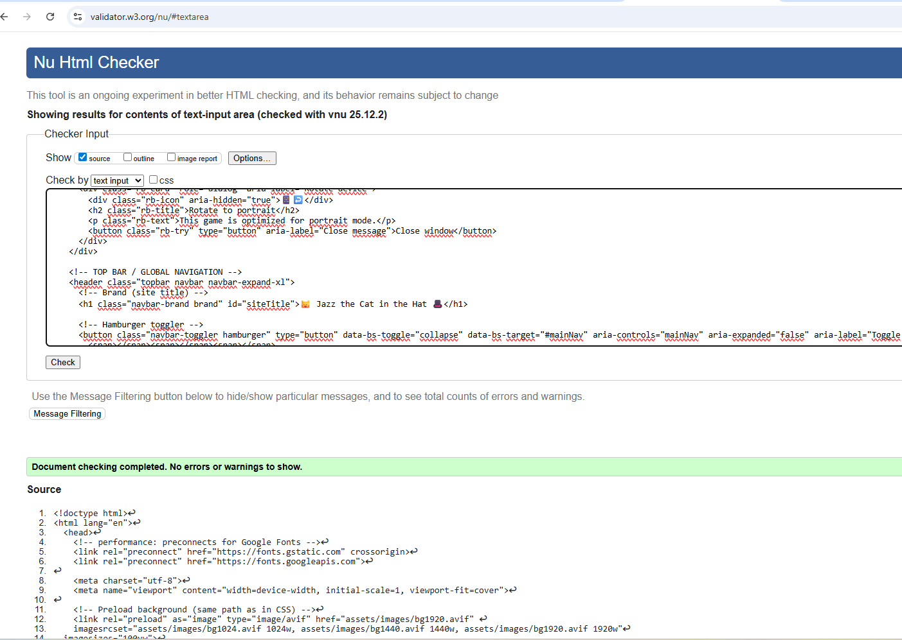  
*HTML validated using W3C Validator with no breaking errors.*

<strong>CSS validation screenshot</strong>

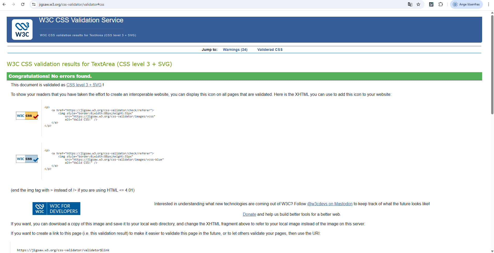  
*CSS validated with no critical issues; warnings relate to expected differences between browsers and vendor-specific rules.*

---

### JavaScript Validation (JSHint)

All JavaScript files were validated using **JSHint** (browser version at jshint.com).  
Each file was pasted and checked individually using the same configuration.

<strong>JSHint configuration screenshot</strong>

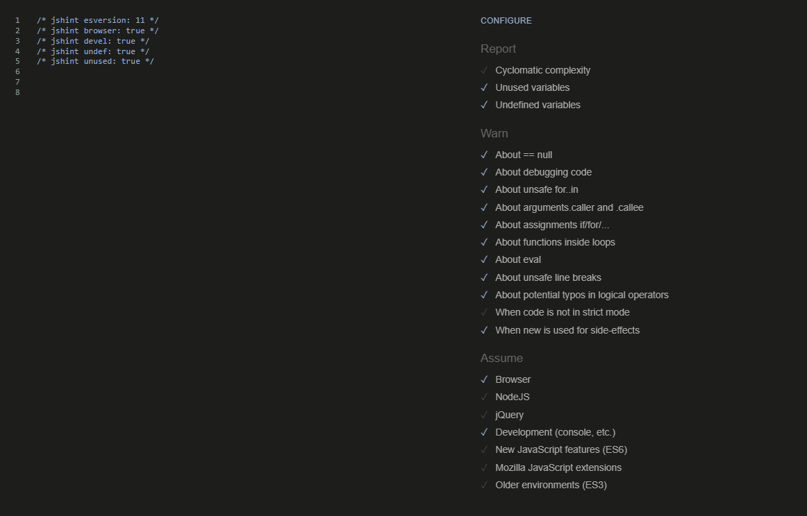
*JSHint browser configuration used for all JavaScript files.*

**Configure panel options**

In the **Configure** panel on jshint.com, the following options were used:

- ES version set to **ES2020 / esversion: 11**
- **Browser** environment enabled
- **Development** (allow `console` and debugging helpers)
- **Assume strict mode**
- Warn on **undefined variables** (`undef: true`)
- Warn on **unused variables** (`unused: true`)

These options were applied consistently for every file that was pasted into the JSHint browser tool.

**Per-file JSHint directives in the code**

In addition to the Configure panel, each JS module has inline JSHint directives at the top of the file:

/* jshint esversion: 11 */  
/* jshint browser: true */  
/* jshint devel: true */  
/* jshint strict: implied */  
/* jshint unused: true */

In ui.js there is one extra directive:  
/* global bootstrap */

ES module files use `export` / `import`, and JSHInt warnings related to ES module strict mode were treated as style-only.

---

### game.js

JSHint reports several “defined but never used” variables and functions inside game.js.  
These are not actual errors. They exist intentionally within the game architecture.

During development, cleanup attempts were made to remove them.  
However, removing these variables caused the game to break due to:

- internal module dependencies  
- event-driven hooks that JSHint cannot detect statically  
- functions used indirectly through custom events  
- setup functions that are intentionally defined for future levels and bonus features  

Because these functions participate in the game lifecycle (through events, DOM wiring, or shared state), but are not directly invoked in the same file, JSHint marks them as “unused”.

To avoid reintroducing functional bugs, these variables have been intentionally kept.

<strong>game.js validation</strong>

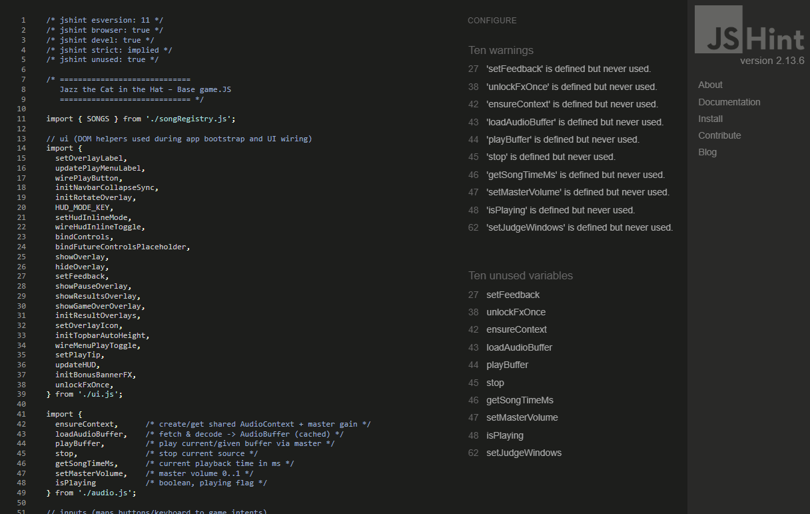  
*game.js passes JSHint with no errors and only intentional “defined but never used” style warnings (kept as event hooks and lifecycle helpers).*

---

### ui.js

ui.js owns most of the user interface wiring for the game: overlays (Play, Pause, Results, Game Over), HUD updates, hearts, judge flashes, the quick Play/Pause button, the settings panel, and the Bootstrap navbar collapse sync. It listens for custom game events, updates DOM state (attributes, classes and labels), and keeps the visual layer in sync with the underlying game state.

Two warnings appeared during validation:

- `'bootstrap' is not defined` – because the file calls `bootstrap.Collapse(...)` from the global Bootstrap bundle loaded via CDN.
- `'playBtn' is defined but never used` – a leftover reference to the overlay play button that was no longer used after refactoring.

To resolve these:

- A `/* global bootstrap */` directive was added alongside the JSHint options so that JSHint recognises `bootstrap` as an intentional global provided by the page.
- The unused `playBtn` constant was removed from the overlay controls block in ui.js, as all overlay wiring now uses a locally scoped button reference inside `wirePlayButton()` instead.

After these small cleanups, `ui.js` now passes JSHint with **no errors or warnings**.

<strong>ui.js – JSHint validation</strong>

  
*ui.js passes JSHint with no errors or warnings using the shared configuration. The Bootstrap global is declared explicitly and an unused overlay button reference has been removed.*

---

### scoring.js

scoring.js is the single source of truth for game state and judging. It owns the score, lives, level, combo and max combo, partial damage, bonus mode flags and internal counters. It also contains the timing windows, grading logic for hits, miss handling, and the hooks that notify the HUD (for example via `setFeedback` and bonus/extra-life events).

scoring.js was validated using the shared JSHint configuration. The only initial reports were “misleading line break before '?'” style warnings on a few ternary expressions in the bonus logic (selecting bonus mode and calculating the bonus goal). These expressions were rewritten to keep the `?` and `:` on clearer lines without changing the underlying behaviour. After this small readability refactor, scoring.js now passes JSHint with no errors or warnings.

<strong>scoring.js validation</strong>

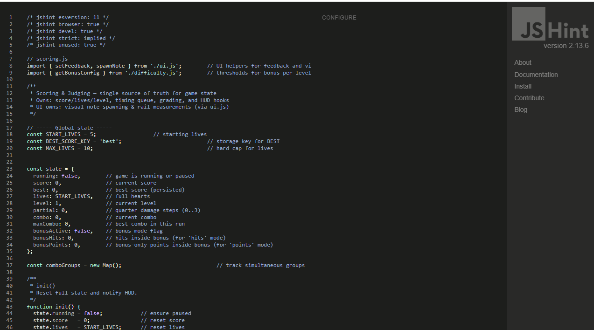  
*scoring.js passes JSHint with no errors or warnings using the shared configuration. Previous style warnings on ternary line breaks in the bonus logic were resolved by making the expressions more readable.*

---

### input.js

input.js connects all player input (keyboard arrows, WASD/space and on-screen DDR buttons) to the move and judge logic. It also handles mobile-friendly behaviour using pointerdown for instant response, filters out “ghost clicks”, and keeps keyboard and mouse controls working alongside touch.

input.js was validated using the global JSHint configuration. After removing an unused parameter from one click listener, the only remaining report is a single, intentional style warning on the line `dancer.offsetWidth;`.  

This expression is deliberately used to force a layout reflow so that re-adding a move class cleanly restarts the CSS animation. Removing it breaks the animation restart behaviour, so the warning is treated as non-blocking and the line is kept by design.

<strong>input.js validation</strong>

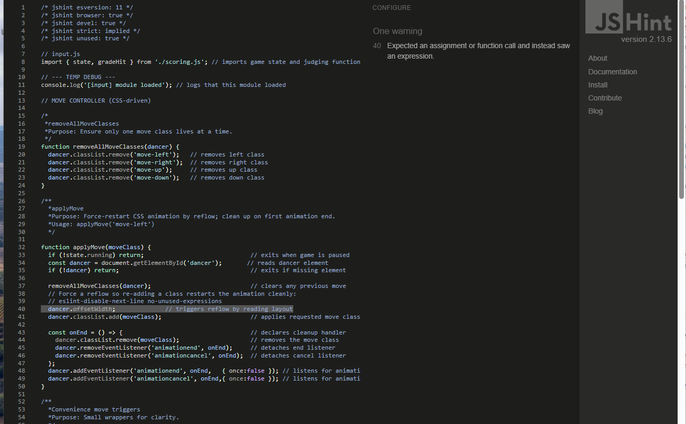  
*input.js the remaining warning on `dancer.offsetWidth;` is an intentional reflow trigger and treated as a non-blocking style warning.*

---

### difficulty.js

difficulty.js defines the difficulty levels and pacing rules for the game.  
It controls timing windows, `travelBeats`, `playbackRate`, maximum simultaneous notes and anti-simultaneous note rules for each level.

JSHint reported **no errors or warnings** for this file.

<strong>difficulty.js – JSHint validation</strong>

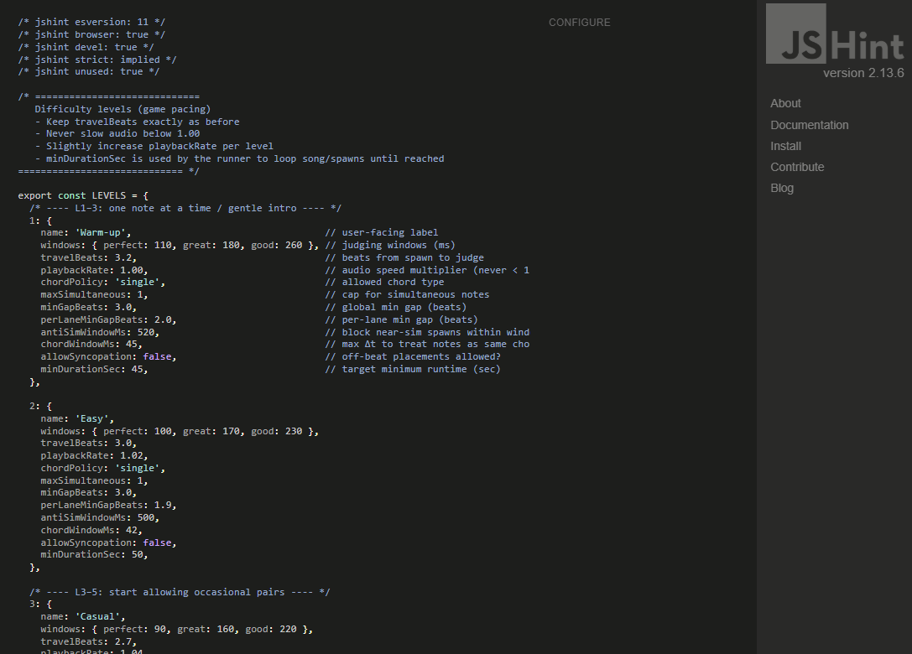  
*difficulty.js passes JSHint with no errors or warnings.*

---

### songPlayer.js

songPlayer.js controls the chart-driven playback system. It loads the selected song and chart, applies the current level’s difficulty (via `LEVELS`), derives timing values (`rate`, `travelBeatsEff`, `travelMs`), simplifies the chart for the level, injects random chords, and schedules all note spawns. It also handles looping to meet a minimum duration, manages cancellation during the countdown (`cancelPendingStart`), and emits the main lifecycle events: `song:ready`, `song:started`, `song:ended`, and `song:error`.

Initial reports were limited to style-only warnings: an unused destructured value (`msPerBeatEff`) in `startSongById` and an “Unexpected use of '|'” warning from a fast-floor pattern in `_pickRandomSubset`. These were resolved by removing the unused destructured variable and replacing the bitwise floor with a clearer `Math.floor(...)` expression, without changing the underlying timing or randomisation behaviour. After these small cleanups, `songPlayer.js` now passes JSHint with **no errors or warnings**.

<strong>songPlayer.js – JSHint validation</strong>

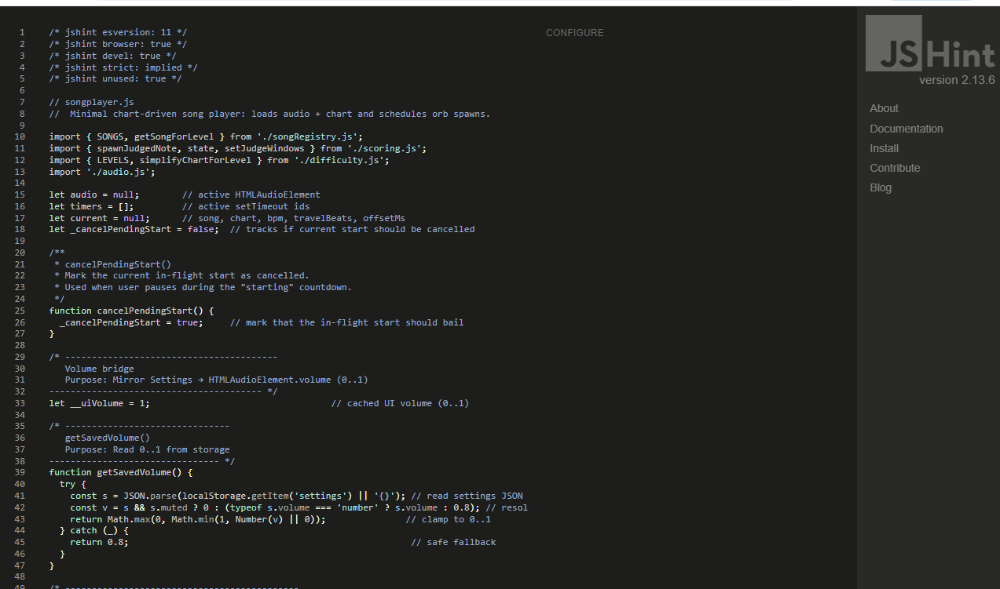  
*songPlayer.js passes JSHint with no errors or warnings using the shared configuration. Earlier style warnings were removed by simplifying destructuring and replacing a bitwise fast-floor with `Math.floor()`.*

---

### songRegistry.js

songRegistry.js provides a clean, read-only registry of all songs used in the game.  
Each entry is frozen with `Object.freeze()` to prevent accidental mutations during gameplay.  
The file only contains static metadata: `id`, display title, artist, and paths to the audio file and chart JSON.  
Because it has no logic or dynamic behaviour, it is one of the simplest files to validate.

During JSHint validation, the file passed with **zero errors and zero warnings**.  
There are no unused variables, no implicit expressions, and no syntax issues — the static structure aligns perfectly with the project’s JSHint configuration.

<strong>songRegistry.js – JSHint validation</strong>

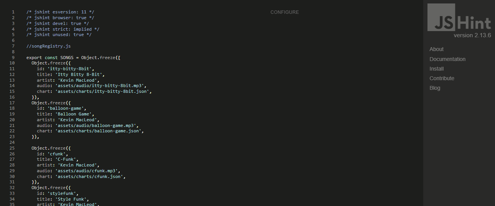  
*songRegistry.js passes JSHint with no errors or warnings using the shared configuration.*

---

### audio.js

audio.js was validated using the global JSHint configuration shown above.  
After a small refactor of the Web Audio constructor and using `strict: implied`, the file now passes JSHint with **no errors or warnings**.

A minor adjustment was made to replace the inline constructor pattern with a linter-friendly version (`AudioContextClass` + `new AudioContextClass()`), which keeps the same behaviour while removing the previous “Bad constructor” warning.

<strong>audio.js – JSHInt validation</strong>

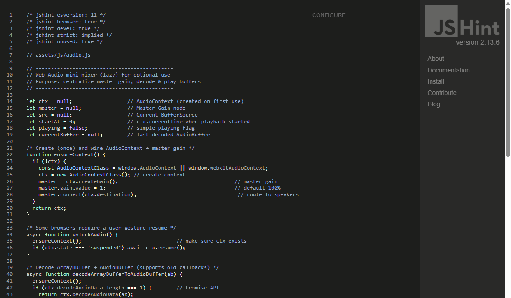  
*audio.js passes JSHint with no errors or warnings using the configuration above.*

---

## Responsiveness Testing

Responsiveness was tested using **Chrome DevTools device emulation** at several common viewport widths, by **resizing the browser window**, and on **real physical devices**.  
The goal was to ensure that:

- The HUD remains readable.  
- Rails, judge line and controls stay aligned.  
- Overlays remain centred and usable across devices.  

### Tested widths in DevTools

The following viewport widths were tested manually in DevTools, as they represent the most common responsive ranges:

- 320px  
- 375px  
- 425px  
- 768px  
- 1024px  
- 1920px  

### Screenshots

<strong>320px – small mobile screen</strong>

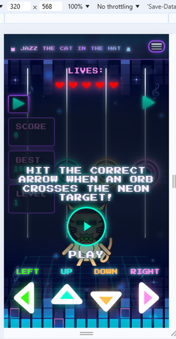  
*320px – small mobile screen.*

<strong>320px – landscape</strong>

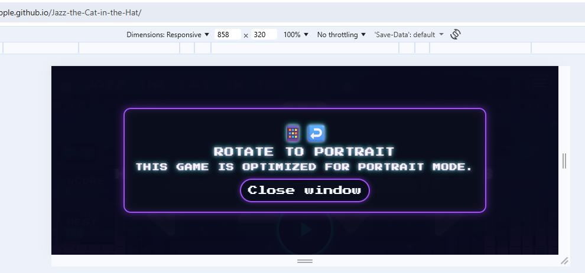  
*320px – small mobile in landscape.*

<strong>375px – medium mobile screen</strong>

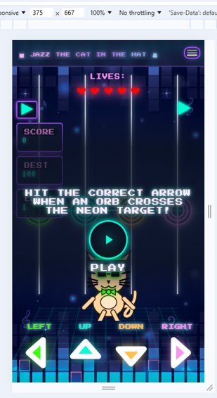  
*375px – medium mobile screen.*

<strong>375px – landscape</strong>

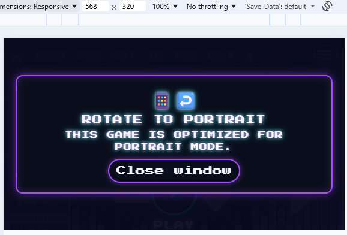  
*375px – medium mobile in landscape.*

<strong>425px – large mobile screen</strong>

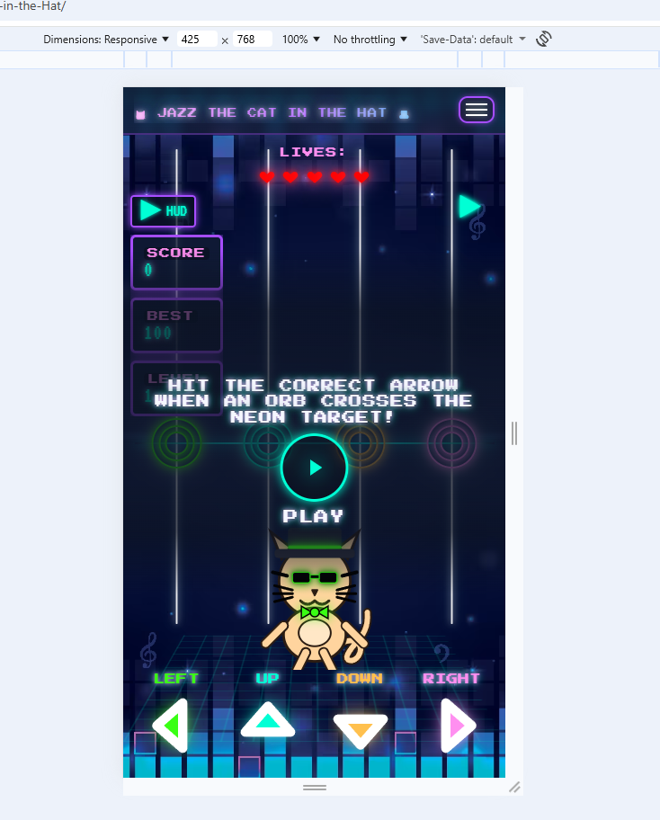  
*425px – large mobile screen.*

<strong>425px – landscape</strong>

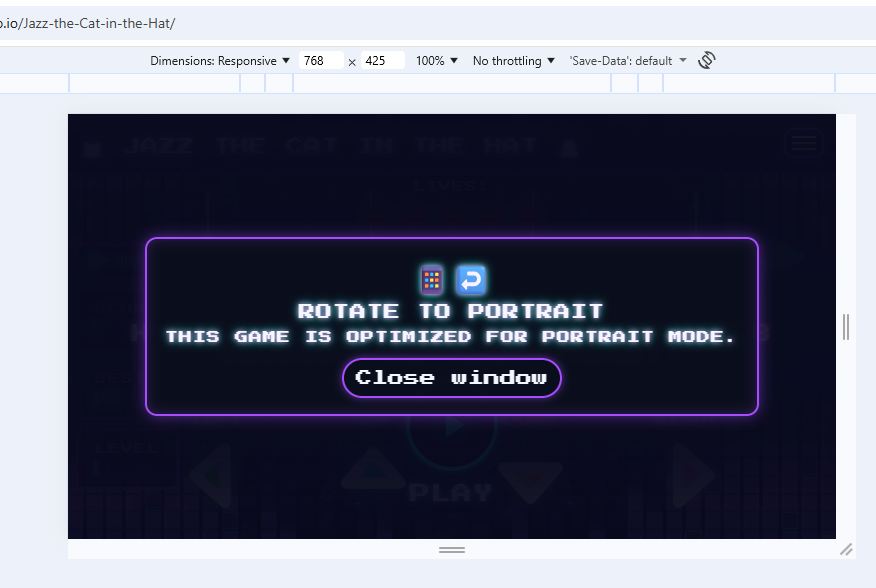  
*425px – large mobile in landscape.*

<strong>768px – tablet screen</strong>

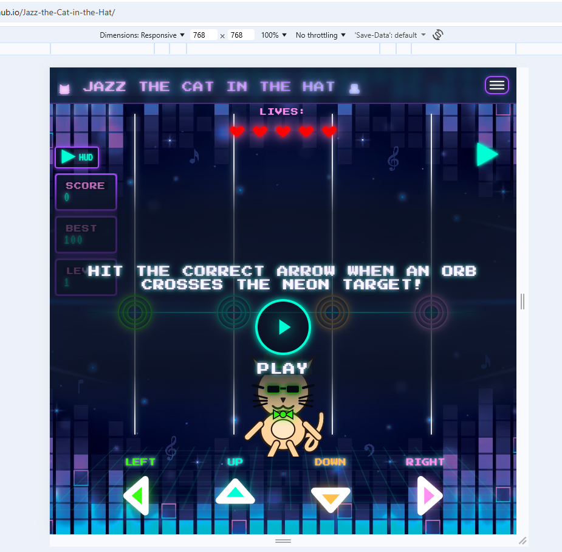  
*768px – tablet screen.*

<strong>1024px – laptop screen</strong>

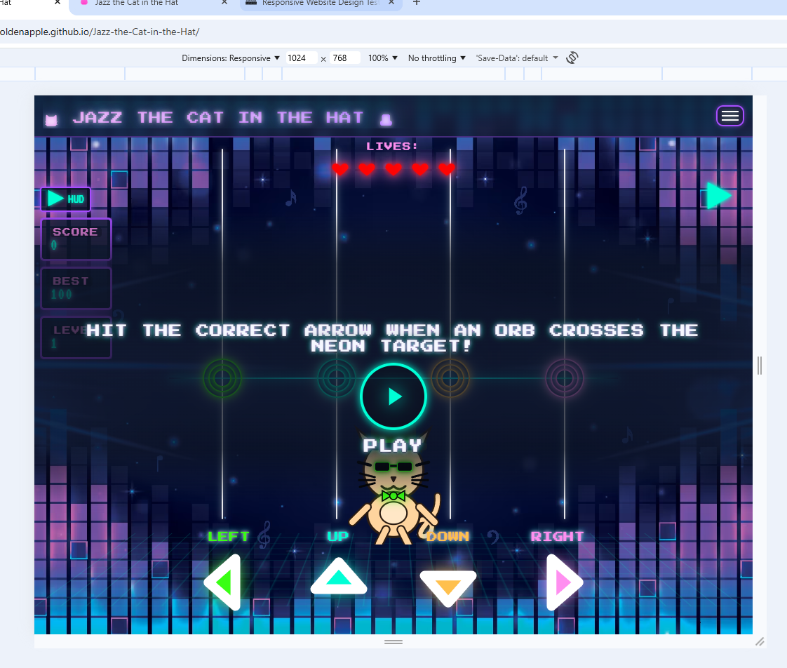  
*1024px – laptop screen.*

<strong>1920px – desktop screen</strong>

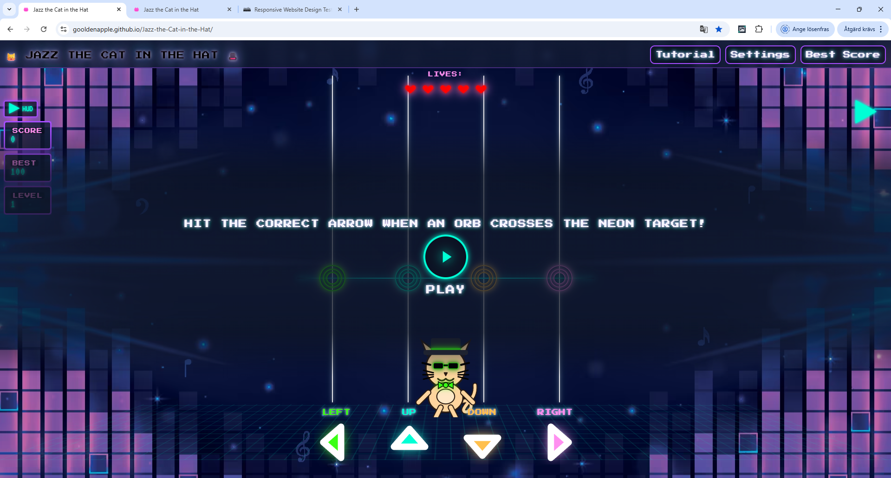  
*1920px – desktop screen.*

<strong>HUD behind Play overlay (cosmetic)</strong>

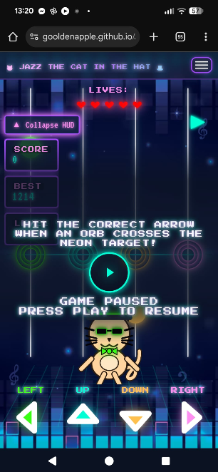  
*HUD sitting behind pause overlay text on some screens (cosmetic).*

**Real device testing**

In addition to DevTools, the game was tested on several **real devices**, including:

- iPhone models  
- Samsung Galaxy phones  
- Samsung Galaxy tablet
- Google Pixel phones  
- Huawei phones  
- MacBook laptop  
- Windows laptop & desktop  

On all of these physical devices, the layout remained centred and playable, and controls, HUD and overlays behaved as expected.

**Result:**  
No major layout issues were found. Controls and HUD elements remained readable and aligned across all tested breakpoints and real devices. The rotation overlay is shown on very small landscape layouts to guide the player back to portrait mode.

On some screens, the expanded HUD can sit visually behind the Pause overlay text.  
This does not affect gameplay or usability: the HUD is fully readable during gameplay, and the Pause/Play overlay remains clear and fully functional.

A few **uncommon DevTools presets** (for example certain “foldable” or tablet profiles with unusual viewport heights) can show the dancer and on-screen controls very close to, or slightly below, the bottom edge in portrait mode.  
On those specific emulated sizes the game would be difficult or impossible to play without adjustment, but rotating the preset or switching to a more standard viewport immediately restores the intended centred layout.  

So far this edge-case behaviour has **only appeared in DevTools emulation** and has **not been reproduced on the physical iOS/Android devices** used during testing. It is noted here as a potential limitation for very unusual aspect ratios and will be addressed in future improvements.

---

## Browser Compatibility

The live game was tested on multiple physical devices and platforms to confirm that core gameplay, overlays, audio and controls behave as expected across different environments.

### Tested Physical Devices & System Environments

The following real devices and operating systems were used during manual testing to ensure accurate behaviour across hardware types.

| Device / Type                         | Operating System | Browser(s) Tested        | Result |
|--------------------------------------|------------------|--------------------------|--------|
| **iPhone (multiple models)**         | iOS              | Safari, Chrome           | Pass   |
| **Samsung Android phones (various)** | Android          | Chrome                   | Pass   |
| **Samsung Android tablet**           | Android          | Chrome                   | Pass   |
| **Huawei Android phones (various)**  | Android          | Chrome                   | Pass   |
| **Google Pixel phones**              | Android          | Chrome                   | Pass   |
| **MacBook laptop**                   | macOS            | Chrome, Safari           | Pass   |
| **Windows desktop PC**               | Windows          | Chrome, Edge, Firefox    | Pass   |
| **Windows laptop**                   | Windows          | Chrome, Edge             | Pass   |

### Summary

Across all tested devices and browsers:

- Overlays (Play/Pause, Results, Game Over) rendered and behaved correctly.  
- HUD elements (hearts, score, combo, bonus indicators) updated as expected.  
- Keyboard, mouse and touch controls all worked as designed.  
- Audio (music, mute and volume logic) behaved consistently.  
- Layout, responsiveness and rotate overlay behaved correctly at tested screen sizes.

No browser-specific breaking issues were found during testing.

### Additional Testing (DevTools Emulation)

In addition to physical devices, **Chrome DevTools device emulation** was used to spot-check behaviour on a wider range of viewport sizes and device profiles (such as iPhone SE, Pixel 5, iPad, and generic responsive widths).  
These checks confirmed that:

- The game continued to render correctly at all emulated sizes  
- Rails, judge line and controls remained aligned  
- Overlays stayed centred  
- The rotate overlay appeared only on small landscape layouts  

This supports confidence that the game layout adapts correctly even beyond the set of physical devices available for testing.

---

## Known Limitations / Issues

### Rapid Play/Pause Clicking Immediately After Pausing
**Severity:** Low  

**Description:**  
After pausing the game there is a very short safety window (a few hundred milliseconds) where additional Play/Pause clicks are ignored. This prevents race conditions while the audio engine and timers settle.

**Steps to Reproduce:**
1. Start a level and press **Pause**.
2. Immediately spam-click the Play/Pause control several times.
3. Observe that some rapid clicks are ignored during a short safety window.

**Status:** Accepted design (won’t fix).  

**Reason:**  
The delay ensures stable internal state transitions and does not affect normal gameplay. It is only noticeable when rapidly spam-clicking Play/Pause, which is not a typical use case.

---

### Minor Lighthouse / Preload Warnings
**Severity:** Low  

**Description:**  
In some Lighthouse or DevTools audits, warnings such as “preload not used soon” can appear for the background image or fonts.

**Steps to Reproduce:**
1. Open Chrome DevTools.
2. Run a Lighthouse or Performance audit on the live site.
3. Review the audit report for resource preload hints.

**Status:** Accepted (non-blocking).  

**Reason:**  
These warnings do not affect gameplay or UX. They can be fine-tuned in future iterations by adjusting `fetchpriority` or removing preloads that do not show early benefit.

---

### Unusual Aspect Ratios in DevTools Emulation
**Severity:** Medium (emulation-only so far)

**Description:**  
On some unusual aspect ratios and custom sizes in Chrome DevTools emulation, the stage layout can become misaligned. In these profiles, the rails and/or on-screen controls may move partially out of view, making the game hard or impossible to play without rotating the device.

**Steps to Reproduce:**
1. Open the live site in Chrome.  
2. Open **DevTools → Device emulation** and test a series of non-standard viewport sizes and aspect ratios.  
3. Observe that on a few extreme combinations, the rails and controls no longer sit fully within the visible area.

**Workarounds / Mitigations:**
- Rotating the emulated device back to **portrait** usually restores a playable layout.  
- On physical iOS/Android devices used during testing, the layout remained playable in portrait orientation.

**Status:** Known limitation – planned for future improvement.  

**Reason:**  
So far this edge-case behaviour has **only appeared in DevTools emulation** and has **not been reproduced on the physical iOS/Android devices** used during testing. It is noted here as a potential limitation for very unusual aspect ratios and will be addressed in future improvements.

---

## Testing Summary

- All **user stories** from the README (**US01–US06**) are traced into this document, and each acceptance criterion within those stories is covered by one or more explicit tests (MTxx) and, where relevant, **screenshots**.  
  The mapping is documented in **User Story Testing (Traceability)** and cross-referenced with the **Manual Testing** table.

- **Manual testing** was carried out continuously during development and summarised in the **MT01–MT31** table.  
  These tests cover **overlays**, **controls** (keyboard, mouse and touch), **progression**, **rewards**, **settings**, **accessibility**, **layout behaviour**, and **navigation**.  
  For each feature described in the user stories, there is at least one **MT case** that confirms the **expected behaviour**.

- **Edge case and error-flow tests** confirm that the game **fails gracefully** in less common scenarios (for example audio issues, unusual countdown values, or reloads mid-run) without breaking core gameplay.

- **Regression testing** was performed after each major fix (**overlay/game flow**, **countdown logic**, **layout gap on the stage**, **accessibility toggles** and **404 page**).  
  The targeted regression checks in this document show that previously found **critical bugs have been resolved** and did not reappear.

- **HTML** and **CSS** were validated with the official **W3C validators**.  
  No **critical errors** remain; any **minor warnings** are non-blocking and relate to expected cross-browser differences.

- All **JavaScript modules** were validated using **JSHint** with a shared configuration.  
  Remaining **style-related warnings** are either resolved or **explicitly documented as intentional** (for example the deliberate `dancer.offsetWidth;` reflow in `input.js`).

- **Responsiveness testing** across common breakpoints (**320px–1920px**) shows that the game remains **readable and playable** on small mobile screens, tablets, laptops and large desktop displays.  
  **Rails, judge line, controls and HUD** stay aligned, and a **rotate overlay** guides players on very small landscape layouts.

- **Browser compatibility testing** on **Chrome**, **Edge**, **Firefox**, **Safari (macOS/iOS)** and **Android/iPhone** devices did not reveal any major **browser-specific issues**.  
  **Gameplay, overlays, audio and controls** behave consistently across the tested platforms.

- **Lighthouse audits** were run for both **mobile** and **desktop** to review **performance**, **best practices** and **accessibility**.  
  Any remaining **low-severity items** are documented under **Known Limitations** and are accepted for this version of the project.

This concludes the testing report for **Jazz the Cat in the Hat**.
