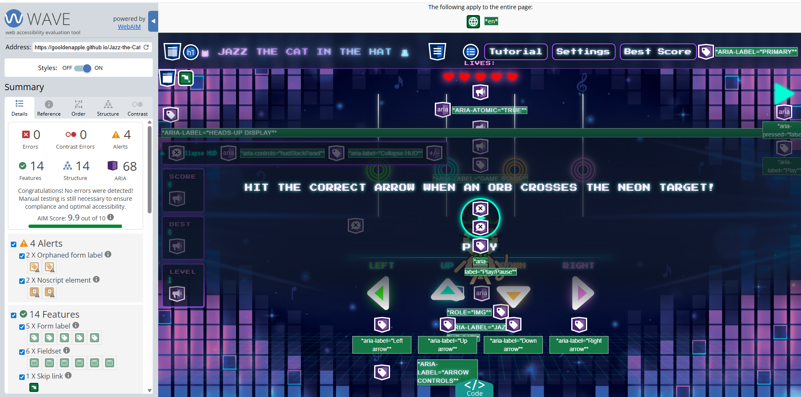
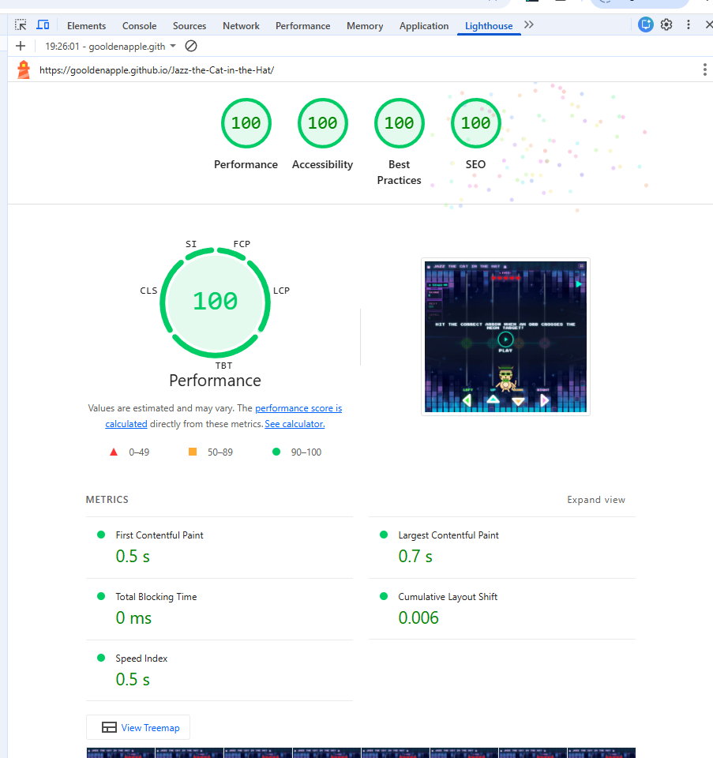
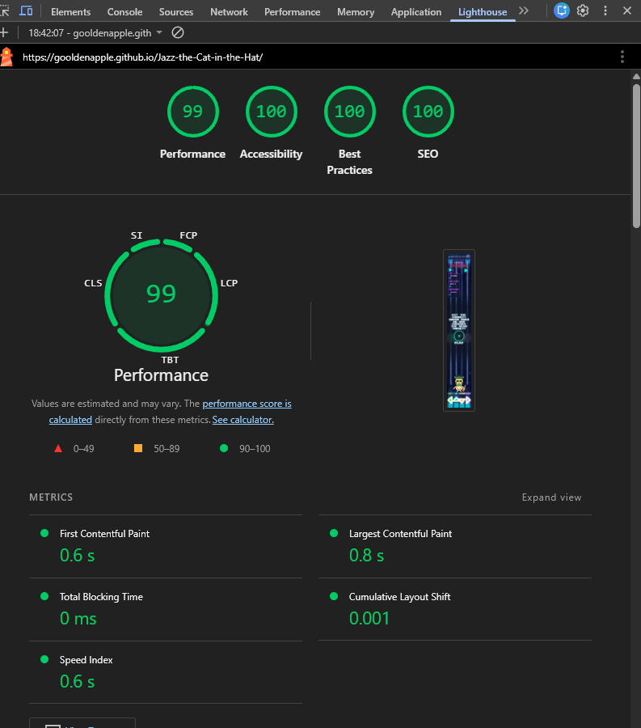

# Testing

This document contains the full testing report for **Jazz the Cat in the Hat**.  
It covers user story testing, manual testing, HTML/CSS validation, JavaScript validation (JSHint), responsiveness checks, browser compatibility, and known limitations.

Testing was carried out continuously during development using manual play sessions, Chrome DevTools, validation tools, and focused regression checks after bug fixes.

 

---

## Table of Contents

- [Testing Strategy - Overview](#testing-strategy---overview)
- [How to Run the Tests - Quick Start](#how-to-run-the-tests---quick-start)
- [Tools & Methods](#tools--methods)
- [Accessibility Testing](#accessibility-testing)
- [Manual Testing](#manual-testing)
- [User Story Testing - Traceability](#user-story-testing---traceability)
- [Developer Console Sanity Tests](#developer-console-sanity-tests)
- [Edge Case & Error Flow Tests](#edge-case--error-flow-tests)
- [Regression Tests - Recent Fixes](#regression-tests---recent-fixes)
- [Validation](#validation)
  - [HTML & CSS Validation](#html--css-validation)
  - [JavaScript Validation (JSHint)](#javascript-validation-jshint)
- [Responsiveness Testing](#responsiveness-testing)
- [Browser Compatibility](#browser-compatibility)
- [Lighthouse Testing](#lighthouse-testing)
- [Known Limitations / Issues](#known-limitations--issues)
- [Testing Summary](#testing-summary)

 

---

## Testing Strategy - Overview

Testing for this project combined several complementary approaches:

- Manual UX checks by playing levels and then using short pauses between runs to inspect overlays, HUD behaviour and settings.  
- HTML/CSS validation using the official W3C tools.  
- JavaScript validation with JSHint using a shared configuration across all modules.  
- Lighthouse audits for performance, accessibility, best practices and SEO.  
- Accessibility checks using WAVE, WebAIM Contrast Checker and the NVDA screen reader.  
- Targeted console sanity tests for lifecycle events, scoring and note behaviour.  
- Regression checks after fixing critical bugs (overlay/game flow, countdown logic, layout, accessibility toggles and 404 page).

Because this is an interactive, timing-sensitive reaction game, a large part of the testing also came from simply playing it a lot on different devices and screen sizes, especially around the early “safe” levels and bonus-mode progression.

 

---

## How to Run the Tests - Quick Start

1. Open the live game in your browser.  
   **Live Site:** <https://gooldenapple.github.io/Jazz-the-Cat-in-the-Hat/>

2. Open **DevTools → Console** in the browser you are testing.

3. (Optional) Set a shorter countdown while testing:
   - Open the **Settings** panel.
   - Change the **Countdown** option to `0` (settings are saved automatically).
   - This makes it faster to iterate on manual and console tests.

4. Use the **Manual Testing** table (MT01–MT31) as a checklist while playing on different breakpoints (mobile / tablet / desktop).

5. Use the **Developer Console Sanity Tests** section to quickly verify critical flows after changes or new deployments (overlay, state flags, note spawn/clear behaviour, lifecycle events).

6. Re-run **HTML, CSS and JS validation** if you make structural changes to:
   - index.html  
   - assets/css/style.css  
   - any file in assets/js/

 

---

## Tools & Methods

- **Browsers & devices**
  - Chrome (desktop & mobile)
  - Edge
  - Firefox
  - Safari (macOS / iOS)
  - Android phones & tablet
  - iPhone

- **Validation tools**
  - W3C HTML Validator
  - W3C Jigsaw CSS Validator
  - JSHint for JavaScript (browser version at jshint.com)

- **Audits (Lighthouse)**
  - Lighthouse (Performance, Accessibility, Best Practices, SEO) in Chrome DevTools.  
    Any remaining minor items are documented under *Known Limitations*.

- **Accessibility tools**
  - WAVE Web Accessibility Evaluation Tool (WebAIM)
  - WebAIM Contrast Checker for key text/foreground pairs
  - NVDA screen reader on Windows with Chrome for keyboard and announcement checks

- **Developer console tests**
  - Small helper snippets (see **Developer Console Sanity Tests**) were used to verify:
    - Overlay and countdown behaviour
    - State flags such as `data-paused`
    - HUD hearts rendering and updates
    - Note spawn/clear behaviour
    - Lifecycle events from `songPlayer.js`

 

---

## Accessibility Testing

Accessibility testing was carried out using automated tools, manual checks, and assistive technology.  
The goal was to ensure the game remains **perceivable**, **operable**, and **understandable** for as many users as possible.

 

---

### Keyboard Navigation

- All key interactive elements (Play/Pause overlay, navbar, settings, HUD toggle, on-screen controls) are reachable using the keyboard.
- Focus order follows the visual structure of the page.
- Focus outlines remain clearly visible against the neon background.
- Keyboard-only users can fully start, pause, resume gameplay, and navigate settings.

 

---

### Reduce Motion & No Flash

The game provides two comfort settings:

- **Reduce Motion**  
  Reduces or disables non-essential animations such as dancer movement and rail ticks.
  
- **No Flash**  
  Disables strong glow/flash effects including rail flash and heart glow.

Both settings are saved through `localStorage`, so preferences persist between visits.  
Visual evidence for these settings is included in Manual Testing **MT16–MT17**.

 

---

### Automated Accessibility Audits (WAVE WebAIM)

- The full page was tested using the **WAVE Web Accessibility Evaluation Tool**.
- **No errors** and **no contrast errors** were reported.
- A total of **4 alerts** appeared:
  - 2 × “orphaned form label” alerts on the **Reduce Motion** and **Disable screen glow and flashes** toggles.
  - 2 × alerts related to the `<noscript>` fallback message.

These label alerts are acceptable for this version because the toggles are already clearly labelled in text and fully operable with mouse and keyboard.  
A future enhancement will refactor these controls into fully semantic buttons/switches so the alerts disappear entirely.

WAVE screenshots

  
*WAVE summary – 0 Errors, 0 Contrast Errors, 4 Alerts.*

  
*Alerts on the Reduce Motion and Disable screen glow and flashes controls.*

 

---

### Screen Reader Testing (NVDA)

Screen reader testing was performed using **NVDA on Windows with Chrome**.  
The goal was to confirm a logical reading order, clear landmarks, and accessible controls.

**Checked and verified:**

- Page title and main heading announce correctly.
- **Skip link** (“Skip to game”) moves focus to `<main>` and is announced properly.
- `<main>` landmark and the `gameHelp` description are announced when entering the game area.
- Navbar items (Tutorial, Settings, Best Score, Play/Pause) are announced as clickable buttons.
- Play/Pause overlay, Results, and Game Over dialogs are announced with titles and summaries.
- The Settings panel tabs (Audio, Accessibility, Best Score, Tutorial) are announced as a **tablist** with the correct active tab.

#### HUD – improved accessibility

Initially, NVDA read only the HUD container but not the individual values.  
To address this, the following attributes were added:

- `#score`, `#best`, `#level` now have  
  `aria-live="polite"` + `aria-labelledby="labelId"`
- `#lives` now uses  
  `aria-live="polite"` + `aria-labelledby="livesLabel"`

**Result:**  
NVDA now announces updates such as **“Score 1200”**, **“Best 2500”**, **“Level 3”**, and **“Lives 2”** both when focus passes the HUD and when values change during gameplay.

#### Future improvement

Real-time feedback messages (“Perfect!”, “Miss!”, “Bonus Mode!”) are primarily visual.  
A future enhancement could route selected feedback into the `#srLive` region for players who rely more heavily on screen readers without altering the visual rhythm gameplay.

 

---

## Manual Testing

The game was manually tested using an **Expected vs Actual** approach.  
Each test case has a unique ID (**MTxx**) so it can be referenced from User Story Traceability and other sections.

> **MT = Manual Test case ID**

 

---

### Manual Test Table (MT01–MT31)

| ID | Related Story | Feature | Steps | Expected Result | Evidence / Reference | Result |
|----|---------------|---------|-------|-----------------|----------------------|--------|
| MT01 | Child Player | Play (Overlay) | Click **Play** on the overlay | Overlay visible with label “Play”; countdown starts | [Play/Pause overlay](assets/images/testing/pause-overlay.png) · [Countdown](assets/images/testing/countdown-5.png) | Pass |
| MT02 | Child Player | Countdown | Start game with default settings | Countdown shows 3 → 2 → 1 → GO, then song starts | [Countdown 3](assets/images/testing/countdown-3.png) · [Gameplay started](assets/images/testing/gameplay-started.png) | Pass |
| MT03 | Child Player / Accessibility | Countdown = 0 | Set countdown to 0 in settings, then start game | No countdown; game starts immediately | [Countdown settings](assets/images/testing/countdown-menu.png) | Pass |
| MT04 | Child Player / Desktop | Pause | Click **Pause** during gameplay | Gameplay pauses, overlay appears, `data-paused="true"` | [Pause overlay](assets/images/testing/pause-over.png) | Pass |
| MT05 | Child Player | Resume | Click **Play** while paused | Gameplay resumes smoothly | [Gameplay](assets/images/testing/gameplay-started.png) | Pass |
| MT06 | Child Player | Quick Play/Pause | Use the quick PP button | Toggles state correctly | [Quick PP](assets/images/testing/quickplay.png) · [Quick Pause](assets/images/testing/quickp.png) | Pass |
| MT07 | Child Player | Menu Play/Pause | Use Play/Pause via navbar | Toggles correctly and label stays synced | [Navbar PP open](assets/images/testing/mob-hud-nav.png) · [Navbar closed](assets/images/testing/nav-closed-mob.png) | Pass |
| MT08 | Desktop Player | Keyboard controls | Press arrow keys | Matching lane input triggers | [Desktop controls](assets/images/testing/controls-desk.png) | Pass |
| MT09 | Mobile Player | Touch controls | Tap on-screen arrows | Matching lane input triggers | [Mobile controls](assets/images/testing/controls-mob.png) · [Arrows](assets/images/arrows.png) | Pass |
| MT10 | Mobile Player | Touch responsiveness | Rapid tap arrows | Inputs remain responsive and playable | [Mobile controls](assets/images/testing/controls-mob.png) | Pass |
| MT11 | Mobile Player | Ghost click protection | Tap repeatedly in same lane | No accidental double inputs | [Mobile controls](assets/images/testing/controls-mob.png) | Pass |
| MT12 | Mobile Player | Alignment on small screens | Test at 320px + 375px | Controls remain aligned | [320px](assets/images/testing/small-mob-res.png) · [375px](assets/images/testing/med-mob-res.png) | Pass |
| MT13 | Accessibility | Open/close settings | Open and close settings during a run | Panel opens over paused game; closes cleanly | [Audio settings](assets/images/testing/audio-menu.png) · [Accessibility](assets/images/testing/acc-menu.png) | Pass |
| MT14 | Accessibility | Volume slider | Adjust volume mid-run | Volume updates correctly | [Audio slider](assets/images/testing/audio-slide.png) | Pass |
| MT15 | Accessibility | Mute | Enable mute | Gameplay resumes muted | [Audio menu](assets/images/testing/audio-menu.png) | Pass |
| MT16 | Accessibility | Reduce Motion | Enable Reduce Motion | Key animations reduced/disabled | [Before](assets/images/testing/accessibility-before.png) · [After](assets/images/testing/less-motion.png) | Pass |
| MT17 | Accessibility | No Flash | Enable No Flash | Flash + glow fully disabled | [No Flash](assets/images/testing/no-mo-flash.png) | Pass |
| MT18 | Accessibility | Countdown persistence | Change countdown + reload | Selected value persists | [Countdown settings](assets/images/testing/countdown-menu.png) | Pass |
| MT19 | Progression | Level 1 safety | Miss intentionally | Level 1 never reduces hearts | [Full hearts](assets/images/testing/level1-full-hearts.png) | Pass |
| MT20 | Progression | Level 2+ life loss | Miss intentionally | Hearts reduce according to miss rules | [Heart loss](assets/images/testing/level2-heart-loss.png) | Pass |
| MT21 | Rewards | Bonus Mode trigger | Reach streak threshold | Bonus Mode activates + banner shown | [Bonus banner](assets/images/testing/bonus-mode.png) | Pass |
| MT22 | Rewards | Bonus scoring | Hit during Bonus Mode | Shows +10 for every hit | [GOOD](assets/images/testing/bonus-good.png) · [GREAT](assets/images/testing/bonus-great.png) · [PERFECT](assets/images/testing/bonus-perfect.png) · [Summary](assets/images/testing/bo-plus.png) | Pass |
| MT23 | Rewards | Bonus Mode end | Miss once | Bonus Mode ends immediately | [Bonus ended](assets/images/testing/bo-end.png) | Pass |
| MT24 | Rewards | Extra life (Level 4+) | Hit bonus goal | Extra life awarded | [Extra life](assets/images/testing/bo-extra.png) | Pass |
| MT25 | Progression | Results overlay | Clear a level | Results overlay appears | [Results overlay](assets/images/testing/results-overlay.png) | Pass |
| MT26 | Progression | Game Over overlay | Lose all hearts | Game Over appears | [Game Over](assets/images/testing/game-over.png) | Pass |
| MT27 | Layout | Rotate overlay | Rotate to landscape on small screens | Rotate overlay appears | [Rotate small](assets/images/testing/rotate-small-mobile.png) | Pass |
| MT28 | Layout | HUD hearts on load | Load game | Hearts render in HUD | [HUD](assets/images/testing/hud.png) | Pass |
| MT29 | Layout | HUD hearts on damage | Take damage | Hearts update visually | [Heart loss](assets/images/testing/level2-heart-loss.png) | Pass |
| MT30 | Navigation | Navbar open/close | Toggle navbar | `data-nav-open` syncs + Quick PP hides when open | [Navbar open](assets/images/testing/navbar-open-mobile.png) | Pass |
| MT31 | Visitor | 404 page | Visit wrong URL | Custom 404 appears with working link | [404 page](assets/images/testing/404-page.png) | Pass |

*All visual evidence for manual testing is linked directly in the **Evidence / Reference** column of the table above.*

 

---

## User Story Testing - Traceability

Each user story from the README has been mapped to one or more concrete manual test cases (MTxx).  
This ensures that every acceptance criterion was explicitly verified through testing.

For the full user story descriptions, see **[README – UX → User Stories](README.md#user-stories)**.
  
The table below shows how each story was verified through testing and how all parts of each story’s acceptance criteria were covered.*

 

---

### Traceability Table

| Story | Acceptance Criteria (summary) | How Verified | Evidence | Status |
|------|-------------------------------|--------------|----------|--------|
| Child Player / first-time player | Play button visible, countdown (3s / 5s), countdown = 0 option, clear hit/miss feedback, touch + keyboard support, Level 1 safety (no life loss) | Manual tests **MT01–MT07, MT08–MT09, MT18–MT19** | [Play/Pause overlay](assets/images/testing/pause-overlay.png) · [Countdown](assets/images/testing/countdown-3.png) · [Gameplay](assets/images/testing/gameplay-started.png) · [PERFECT](assets/images/testing/feedback-perfect.png) · [MISS](assets/images/testing/miss.png) · [Level 1 hearts](assets/images/testing/level1-full-hearts.png) · [HUD](assets/images/testing/hud.png) | Pass |
| Mobile Player | Responsive touch controls, no ghost taps, alignment on 320px–375px devices | Manual tests **MT09–MT12** | [Mobile controls](assets/images/testing/controls-mob.png) · [Arrows](assets/images/arrows.png) · [320px](assets/images/testing/small-mob-res.png) · [375px](assets/images/testing/med-mob-res.png) | Pass |
| Desktop Player | Keyboard lanes map correctly, input feels consistent, pause/resume works | Manual tests **MT04–MT08** | [Desktop controls](assets/images/testing/controls-desk.png) · [Pause overlay](assets/images/testing/pause-over.png) · [Desktop layout](assets/images/testing/desktop-res.png) | Pass |
| Player (Progression) | Level 1 safe; Level 2+ reduces lives; Results and Game Over overlays behave correctly | Manual tests **MT19–MT20, MT25–MT26** | [Level 1 hearts](assets/images/testing/level1-full-hearts.png) · [Heart loss](assets/images/testing/level2-heart-loss.png) · [Results overlay](assets/images/testing/results-overlay.png) · [Game Over](assets/images/testing/game-over.png) | Pass |
| Rewards Player | Bonus Mode on streak, +10 points, ends on miss, extra life on Level 4+ | Manual tests **MT21–MT24** | [Bonus banner](assets/images/testing/bonus-mode.png) · [GOOD +10](assets/images/testing/bonus-good.png) · [GREAT +10](assets/images/testing/bonus-great.png) · [PERFECT +10](assets/images/testing/bonus-perfect.png) · [Summary](assets/images/testing/bo-plus.png) · [Bonus ended](assets/images/testing/bo-end.png) · [Extra life](assets/images/testing/bo-extra.png) | Pass |
| Accessibility User | Reduce Motion, No Flash, volume/mute, countdown persistence, settings open/close | Manual tests **MT13–MT18** | [Audio menu](assets/images/testing/audio-menu.png) · [Accessibility menu](assets/images/testing/acc-menu.png) · [Before/After motion](assets/images/testing/accessibility-before.png) · [Less motion](assets/images/testing/less-motion.png) · [No Flash](assets/images/testing/no-mo-flash.png) · [Countdown](assets/images/testing/countdown-menu.png) | Pass |

 

---

## Developer Console Sanity Tests

These snippets can be run in the browser console to quickly verify critical flows after code changes or new deployments.

### Overlay & State Flags

- Overlay exists on boot:

  !!document.getElementById('overlay');  <!-- should be true -->

- Game is paused while the overlay is up:

  document.body.hasAttribute('data-paused');  <!-- true before first start -->

### HUD Render - Hearts

- Hearts present in HUD after the game has initialised:

  document.querySelectorAll('#lives .svg-heart').length >= 1;  <!-- should be true -->

### Notes Present

- Count active notes on rails during gameplay:

  document.querySelectorAll('.rail .note').length;  <!-- number varies -->

### Lifecycle Events

Attach temporary listeners to confirm song lifecycle events:

  window.addEventListener('song:ready',   (e) => console.log('ready', e.detail));
  window.addEventListener('song:started', (e) => console.log('started', e.detail));
  window.addEventListener('song:ended',   (e) => console.log('ended', e.detail));
  window.addEventListener('song:error',   (e) => console.error('error', e.detail));

Then start a run and watch the console.

### Countdown = 0 (Skip Test)

Force countdown = 0 in stored settings, then reload once:

  const s = JSON.parse(localStorage.getItem('settings') || '{}');
  s.countdown = 0;
  localStorage.setItem('settings', JSON.stringify(s));
  location.reload();

After reload, pressing Play should start the game with no visible countdown.

### Menu Label Sync

Check that the Play/Pause label in the navbar reflects the current state:

  document.querySelector('#menuPlayToggle')?.textContent.trim();

 

---

## Edge Case & Error Flow Tests

In addition to the main manual test suite, several edge cases and non-standard scenarios were tested to ensure the game behaves safely even under unexpected conditions.  
These checks confirm that Jazz the Cat in the Hat fails **gracefully**, without producing console errors or breaking the gameplay loop.
 

---

- **Audio fails to start (muted / blocked):**  
  - Steps: Start the game with the browser tab muted or system sound very low.  
  - Expected: Gameplay, overlays and scoring still function; only sound feedback is affected.

- **Countdown set to an unexpected value:**  
  - Steps: Open DevTools → Console and temporarily store an invalid countdown value inside the saved settings object (for example a very large number such as 999 or a negative number), then reload the page.  
  - Expected: The game ignores invalid countdown values and falls back to a valid option (0s, 3s or 5s) without breaking play.

- **Refresh during gameplay:**  
  - Steps: Start a level and reload the page mid-run.  
  - Expected: Game state resets cleanly to the initial overlay with no console errors.

These edge cases do not reveal additional breaking issues and confirm that the game fails gracefully in non-standard situations.

 

---

## Regression Tests - Recent Fixes

These tests verify that previously identified bugs remain fixed and did not reappear after refactoring, cleanup, or deployment changes.

---

### 1. Broken overlay & missing hearts after JS cleanup

**Root cause:**  
`game.js` imported `setPlayTip`, `setOverlayIcon`, and `initTopbarAutoHeight` that were not exported from `ui.js`, causing the module to fail during load.

**Fix:**  
Added the missing exports in `ui.js`.

**Regression checks:**  
- No console errors such as “does not provide an export named …”.  
- On initial load: overlay is visible and HUD hearts render correctly.  
- Pressing **Play** triggers the countdown, and the game starts normally.

---

### 2. Countdown value “0 seconds” ignored

**Root cause:**  
`countdownSec || 3` treated `0` as falsy and incorrectly defaulted back to 3 seconds.

**Fix:**  
Updated the logic so `0` is passed correctly to `runOverlayCountdown`.

**Regression checks:**  
- Setting countdown to `0` (via settings or localStorage) starts the game immediately with no countdown.  
- Game flow and overlays remain stable.

---

### 3. Layout gap on the stage

**Root cause:**  
`body { display: grid; }` introduced an unintended extra row, creating a vertical gap between game sections.

**Fix:**  
Replaced with `body { display: block; }` and ensured  
`main.game { min-block-size: calc(100svh - 4rem); }`.

**Regression checks:**  
- No visible vertical gap across mobile, tablet, and desktop.  
- Rails, judge line, HUD, and controls remain correctly aligned.

---

### 4. Accessibility toggles (Reduce Motion / No Flash)

**Root cause:**  
Some animations and glow effects remained active when toggles were enabled.

**Fix:**  
Extended CSS/JS hooks so that dancer animations, rail ticks, and heart glow fully respect accessibility modes.

**Regression checks:**  
- **Reduce Motion:** dancer and rail animations reduced/disabled as intended.  
- **No Flash:** rail flash and heart glow fully disabled.  
- Both settings persist between sessions via `localStorage`.

---

### 5. 404 page routing

**Root cause:**  
GitHub Pages served the default 404 page, which had no way to return to the game.

**Fix:**  
Added a custom `404.html` with a “Back to Home” button and a visible homepage link.

**Regression checks:**  
- Visiting a non-existent route (e.g. `/this-page-does-not-exist`) loads the custom 404 page.  
- The “Back to Home” button and homepage link both work as expected.

---

## Validation

Validation covers HTML, CSS and JavaScript.  
HTML/CSS were validated with W3C tools, and JavaScript files were validated using JSHint in the browser.

 

---

### HTML & CSS Validation

HTML and CSS were validated using the official W3C tools:

- **HTML:** W3C Markup Validation Service  
- **CSS:** W3C Jigsaw CSS Validator  

<strong>HTML validation screenshot</strong>

  
*HTML validated using the W3C Validator with no breaking errors.*

<strong>CSS validation screenshot</strong>

  
*CSS validated with no critical issues; remaining warnings relate to expected differences between browsers and vendor-specific rules.*

 

---

### JavaScript Validation (JSHint)

All JavaScript files were validated using **JSHint** (browser version at jshint.com).  
Each file was pasted and checked individually using the same configuration.

<strong>JSHint configuration screenshot</strong>

  
*JSHint browser configuration used for all JavaScript files.*

**Configure panel options**

In the **Configure** panel on jshint.com, the following options were used:

- ES version set to **ES2020 / esversion: 11**
- **Browser** environment enabled
- **Development** (allow `console` and debugging helpers)
- **Assume strict mode**
- Warn on **undefined variables** (`undef: true`)
- Warn on **unused variables** (`unused: true`)

These options were applied consistently for every file that was pasted into the JSHint browser tool.

**Per-file JSHint directives in the code**

In addition to the Configure panel, each JS module has inline JSHint directives at the top of the file:

- `/* jshint esversion: 11 */`  
- `/* jshint browser: true */`  
- `/* jshint devel: true */`  
- `/* jshint strict: implied */`  
- `/* jshint unused: true */`

In `ui.js` there is one extra directive to declare the Bootstrap global:

- `/* global bootstrap */`

ES module files use `export` / `import`, and any JSHint comments related to ES module strict mode are treated as style-only.

 

---

### game.js

`game.js` wires up the main game lifecycle, connects UI events to logic, and controls the core state flags (`data-paused`, `data-starting`, etc).

JSHint reports several “defined but never used” variables and functions in `game.js`.  
These are not actual errors: they exist intentionally within the game architecture.

During development, cleanup attempts were made to remove them.  
However, removing these variables caused the game to break due to:

- internal module dependencies  
- event-driven hooks that JSHint cannot detect statically  
- functions used indirectly through custom events  
- setup functions that are intentionally defined for future levels and bonus features  

Because these functions participate in the game lifecycle (through events, DOM wiring, or shared state), but are not directly invoked in the same file, JSHint marks them as “unused”.

To avoid reintroducing functional bugs, these variables and functions have been intentionally kept.

<strong>game.js validation</strong>

  
*game.js passes JSHint with no errors and only intentional “defined but never used” style warnings (kept as event hooks and lifecycle helpers).*

 

---

### ui.js

`ui.js` owns most of the user interface wiring for the game: overlays (Play, Pause, Results, Game Over), HUD updates, hearts, judge flashes, the quick Play/Pause button, the settings panel, and the Bootstrap navbar collapse sync. It listens for custom game events, updates DOM state (attributes, classes and labels), and keeps the visual layer in sync with the underlying game state.

Two warnings appeared during validation:

- `'bootstrap' is not defined` – because the file calls `bootstrap.Collapse(...)` from the global Bootstrap bundle loaded via CDN.  
- `'playBtn' is defined but never used` – a leftover reference to the overlay play button that was no longer used after refactoring.

To resolve these:

- A `/* global bootstrap */` directive was added alongside the JSHint options so that JSHint recognises `bootstrap` as an intentional global provided by the page.  
- The unused `playBtn` constant was removed from the overlay controls block in `ui.js`, as all overlay wiring now uses a locally scoped button reference inside `wirePlayButton()` instead.

After these small cleanups, `ui.js` now passes JSHint with **no errors or warnings**.

<strong>ui.js – JSHint validation</strong>

  
*ui.js passes JSHint with no errors or warnings using the shared configuration. The Bootstrap global is declared explicitly and an unused overlay button reference has been removed.*

 

---

### scoring.js

`scoring.js` is the single source of truth for game state and judging. It owns the score, lives, level, combo and max combo, partial damage, bonus mode flags and internal counters. It also contains the timing windows, grading logic for hits, miss handling, and the hooks that notify the HUD (for example via `setFeedback` and bonus/extra-life events).

`scoring.js` was validated using the shared JSHint configuration.  
The only initial reports were “misleading line break before '?'” style warnings on a few ternary expressions in the bonus logic (selecting bonus mode and calculating the bonus goal). These expressions were rewritten to keep the `?` and `:` on clearer lines without changing the underlying behaviour.

After this small readability refactor, `scoring.js` now passes JSHint with **no errors or warnings**.

<strong>scoring.js validation</strong>

  
*scoring.js passes JSHint with no errors or warnings using the shared configuration. Previous style warnings on ternary line breaks in the bonus logic were resolved by making the expressions more readable.*

 

---

### input.js

`input.js` connects all player input (keyboard arrows, WASD/space and on-screen DDR buttons) to the move and judge logic. It also handles mobile-friendly behaviour using `pointerdown` for instant response, filters out “ghost clicks”, and keeps keyboard and mouse controls working alongside touch.

`input.js` was validated using the global JSHint configuration.  
After removing an unused parameter from one click listener, the only remaining report is a single, intentional style warning on the line `dancer.offsetWidth;`.

This expression is deliberately used to force a layout reflow so that re-adding a move class cleanly restarts the CSS animation. Removing it breaks the animation restart behaviour, so the warning is treated as non-blocking and the line is kept by design.

<strong>input.js validation</strong>

  
*In input.js the remaining warning on `dancer.offsetWidth;` is an intentional reflow trigger and treated as a non-blocking style warning.*

 

---

### difficulty.js

`difficulty.js` defines the difficulty levels and pacing rules for the game.  
It controls timing windows, `travelBeats`, `playbackRate`, maximum simultaneous notes and anti-simultaneous note rules for each level.

JSHint reported **no errors or warnings** for this file.

<strong>difficulty.js – JSHint validation</strong>

  
*difficulty.js passes JSHint with no errors or warnings.*

 

---

### songPlayer.js

`songPlayer.js` controls the chart-driven playback system. It loads the selected song and chart, applies the current level’s difficulty (via `LEVELS`), derives timing values (`rate`, `travelBeatsEff`, `travelMs`), simplifies the chart for the level, injects random chords, and schedules all note spawns. It also handles looping to meet a minimum duration, manages cancellation during the countdown (`cancelPendingStart`), and emits the main lifecycle events: `song:ready`, `song:started`, `song:ended`, and `song:error`.

Initial JSHint reports were limited to style-only warnings: an unused destructured value (`msPerBeatEff`) in `startSongById` and an “Unexpected use of '|'” warning from a fast-floor pattern in `_pickRandomSubset`. These were resolved by removing the unused destructured variable and replacing the bitwise floor with a clearer `Math.floor(...)` expression, without changing the underlying timing or randomisation behaviour.

After these small cleanups, `songPlayer.js` now passes JSHint with **no errors or warnings**.

<strong>songPlayer.js – JSHint validation</strong>

  
*songPlayer.js passes JSHint with no errors or warnings using the shared configuration. Earlier style warnings were removed by simplifying destructuring and replacing a bitwise fast-floor with `Math.floor()`.*

 

---

### songRegistry.js

`songRegistry.js` provides a clean, read-only registry of all songs used in the game.  
Each entry is frozen with `Object.freeze()` to prevent accidental mutations during gameplay.  
The file only contains static metadata: `id`, display title, artist, and paths to the audio file and chart JSON.  
Because it has no logic or dynamic behaviour, it is one of the simplest files to validate.

During JSHint validation, the file passed with **zero errors and zero warnings**.  
There are no unused variables, no implicit expressions, and no syntax issues — the static structure aligns with the project’s JSHint configuration.

<strong>songRegistry.js – JSHint validation</strong>

  
*songRegistry.js passes JSHint with no errors or warnings using the shared configuration.*

 

---

### audio.js

`audio.js` was validated using the global JSHint configuration described above.  
After a small refactor of the Web Audio constructor setup and using `strict: implied`, the file now passes JSHint with **no errors or warnings**.

A minor adjustment was made to replace the inline constructor pattern with a linter-friendly version (`AudioContextClass` + `new AudioContextClass()`), which keeps the same behaviour while removing the previous “Bad constructor” warning.

<strong>audio.js JSHint validation</strong>

  
*audio.js passes JSHint with no errors or warnings using the shared configuration.*

 

---

## Responsiveness Testing

Responsiveness was tested using **Chrome DevTools device emulation**, **manual window resizing**, and **real physical devices**.  
The goals were to ensure that:

- The HUD remains readable  
- Rails, judge line and controls stay aligned  
- Overlays remain centred and usable  
- The game stays playable on common mobile/tablet/desktop breakpoints  

 

---

### Tested widths in DevTools

The following viewport widths were tested as they represent common responsive ranges:

- **320px**  
- **375px**  
- **425px**  
- **768px**  
- **1024px**  
- **1920px**

 

---

### Screenshots

<strong>320px – small mobile screen</strong>

  
*320px – small mobile screen.*

<strong>320px – landscape</strong>

  
*320px – small mobile in landscape.*

<strong>375px – medium mobile screen</strong>

  
*375px – medium mobile screen.*

<strong>375px – landscape</strong>

  
*375px – medium mobile in landscape.*

<strong>425px – large mobile screen</strong>

  
*425px – large mobile screen.*

<strong>425px – landscape</strong>

  
*425px – large mobile in landscape.*

<strong>768px – tablet screen</strong>

  
*768px – tablet screen.*

<strong>1024px – laptop screen</strong>

  
*1024px – laptop screen.*

<strong>1920px – desktop screen</strong>

  
*1920px – desktop screen.*

<strong>HUD behind Play overlay (cosmetic)</strong>

  
*HUD sitting behind pause overlay text on some screens (cosmetic only).*

 

---

### Real device testing

The game was tested on several **physical devices**, including:

- iPhone models  
- Samsung Galaxy phones  
- Google Pixel phones  
- Huawei phones  
- Samsung Android tablet  
- MacBook laptop  
- Windows laptop & desktop  

Across all tested devices:

- Layout remained centred and playable  
- Controls and HUD behaved consistently  
- Overlays worked as expected  
- Rotate overlay appeared correctly on very small landscape layouts  

 

---

### Notes & Findings

- No major layout issues were found.  
- Rails, judge line and on-screen controls stayed aligned across breakpoints.  
- HUD remained readable during gameplay.  
- On a few uncommon **DevTools-only** aspect ratios (especially extreme/tall/short presets), the dancer and controls could drift toward the bottom edge.  
  - This behaviour **did not appear on any real devices** tested.  
  - Rotating the emulated preset or switching to a standard viewport immediately restored the centred layout.

This behaviour is noted as a *potential future improvement* for very unusual aspect ratios.

 

---

## Browser Compatibility

The live game was tested on multiple physical devices and platforms to confirm that core gameplay, overlays, audio and controls behave as expected across different environments.

 

---

### Tested Physical Devices & System Environments

The following real devices and operating systems were used during manual testing to ensure accurate behaviour across hardware types.

| Device / Type                         | Operating System | Browser(s) Tested        | Result |
|--------------------------------------|------------------|--------------------------|--------|
| **iPhone (multiple models)**         | iOS              | Safari, Chrome           | Pass   |
| **Samsung Android phones (various)** | Android          | Chrome                   | Pass   |
| **Samsung Android tablet**           | Android          | Chrome                   | Pass   |
| **Huawei Android phones (various)**  | Android          | Chrome                   | Pass   |
| **Google Pixel phones**              | Android          | Chrome                   | Pass   |
| **MacBook laptop**                   | macOS            | Chrome, Safari           | Pass   |
| **Windows desktop PC**               | Windows          | Chrome, Edge, Firefox    | Pass   |
| **Windows laptop**                   | Windows          | Chrome, Edge             | Pass   |

 

---

### Summary

Across all tested devices and browsers:

- Overlays (Play/Pause, Results, Game Over) rendered and behaved correctly.  
- HUD elements (hearts, score, combo, bonus indicators) updated as expected.  
- Keyboard, mouse and touch controls all worked as designed.  
- Audio (music, mute and volume logic) behaved consistently.  
- Layout, responsiveness and rotate overlay behaved correctly at tested screen sizes.

No browser-specific breaking issues were found during testing.

 

---

### Additional Testing (DevTools Emulation)

In addition to physical devices, **Chrome DevTools device emulation** was used to spot-check behaviour on a wider range of viewport sizes and device profiles (such as iPhone SE, Pixel 5, iPad, and generic responsive widths).

These checks confirmed that:

- The game continued to render correctly at all emulated sizes  
- Rails, judge line and controls remained aligned  
- Overlays stayed centred  
- The rotate overlay appeared only on small landscape layouts  

This supports confidence that the game layout adapts correctly even beyond the set of physical devices available for testing.

 

---

## Lighthouse Testing

Lighthouse was used in Chrome DevTools to audit **Performance**, **Accessibility**, **Best Practices**, and **SEO** for both mobile and desktop views.  
Each audit was run multiple times, and some natural variation occurred due to Lighthouse’s simulated network/CPU throttling.

 

---

### Overall Results

Across repeated tests, the game achieved **consistently high scores**:

#### **Desktop**
- Performance: typically **95–100**
- Accessibility: **100**
- Best Practices: **100**
- SEO: **100**
- CLS remained extremely low (≈ **0.006–0.02**)

#### **Mobile**
- Performance: typically **94–98**
- Accessibility: **100**
- Best Practices: **100**
- SEO: **100**
- CLS remained in the green range (≈ **0.02–0.03**)

A perfect desktop audit achieved:

- **Performance:** 100  
- **Accessibility:** 100  
- **Best Practices:** 100  
- **SEO:** 100  
- **FCP:** 0.5 s  
- **LCP:** 0.7 s  
- **CLS:** 0.006  

These results confirm that the game loads quickly, remains visually stable, and follows recommended web best practices.

 

---

### Score Variation and CLS Notes

Occasionally, Lighthouse reported a **lower Performance score (84–86)**, mainly caused by a single run showing higher **CLS**.  
This is expected behaviour:

- Lighthouse throttles CPU, network and rendering → small layout shifts can be exaggerated.  
- These variations did **not** appear during real-device testing.  
- Re-running the audit immediately restored scores to the typical high range (94–100).

For this project, the goals were:

- stable gameplay  
- low input latency  
- minimal layout shift  
- high accessibility scores  

All of these were consistently met across repeated audits.

 

---

### Screenshots

<strong>Desktop – 100 Performance audit</strong>

  
*Desktop Lighthouse showing 100 in all categories.*

<strong>Mobile – High Performance audit</strong>

  
*Mobile Lighthouse showing high Performance with 100 Accessibility, Best Practices and SEO.*

 

---

## Known Limitations / Issues

### Rapid Play/Pause Clicking Immediately After Pausing
**Severity:** Low  

**Description:**  
After pausing the game there is a very short safety window (a few hundred milliseconds) where additional Play/Pause clicks are ignored. This prevents race conditions while the audio engine and timers settle.

**Steps to Reproduce:**
1. Start a level and press **Pause**.
2. Immediately spam-click the Play/Pause control several times.
3. Observe that some rapid clicks are ignored during a short safety window.

**Status:** Accepted design (won’t fix).  

**Reason:**  
The delay ensures stable internal state transitions and does not affect normal gameplay. It is only noticeable when rapidly spam-clicking Play/Pause, which is not a typical use case.

 

---

### Unusual Aspect Ratios in DevTools Emulation
**Severity:** Medium (emulation-only so far)

**Description:**  
On some unusual aspect ratios and custom sizes in Chrome DevTools emulation, the stage layout can become misaligned. In these profiles, the rails and/or on-screen controls may move partially out of view, making the game hard or impossible to play without rotating the device.

**Steps to Reproduce:**
1. Open the live site in Chrome.  
2. Open **DevTools → Device emulation** and test a series of non-standard viewport sizes and aspect ratios.  
3. Observe that on a few extreme combinations, the rails and controls no longer sit fully within the visible area.

**Workarounds / Mitigations:**
- Rotating the emulated device back to **portrait** usually restores a playable layout.  
- On physical iOS/Android devices used during testing, the layout remained playable in portrait orientation.

**Status:** Known limitation – planned for future improvement.  

**Reason:**  
So far this edge-case behaviour has **only appeared in DevTools emulation** and has **not been reproduced on the physical iOS/Android devices** used during testing. It is noted here as a potential limitation for very unusual aspect ratios and will be addressed in future improvements.

 

---

## Testing Summary

- All **user stories** from the README (**US01–US06**) are traced into this document, and each acceptance criterion within those stories is covered by one or more explicit tests (MTxx) and, where relevant, **screenshots**.  
  The mapping is documented in **User Story Testing (Traceability)** and cross-referenced with the **Manual Testing** table.

- **Manual testing** was carried out continuously during development and summarised in the **MT01–MT31** table.  
  These tests cover **overlays**, **controls** (keyboard, mouse and touch), **progression**, **rewards**, **settings**, **accessibility**, **layout behaviour**, and **navigation**.  
  For each feature described in the user stories, there is at least one **MT case** that confirms the **expected behaviour**.

- **Edge case and error-flow tests** confirm that the game **fails gracefully** in less common scenarios (for example audio issues, unusual countdown values, or reloads mid-run) without breaking core gameplay.

- **Regression testing** was performed after each major fix (**overlay/game flow**, **countdown logic**, **layout gap on the stage**, **accessibility toggles** and **404 page**).  
  The targeted regression checks in this document show that previously found **critical bugs have been resolved** and did not reappear.

- **HTML** and **CSS** were validated with the official **W3C validators**.  
  No **critical errors** remain; any **minor warnings** are non-blocking and relate to expected cross-browser differences.

- All **JavaScript modules** were validated using **JSHint** with a shared configuration.  
  Remaining **style-related warnings** are either resolved or **explicitly documented as intentional** (for example the deliberate `dancer.offsetWidth;` reflow in `input.js`).

- **Responsiveness testing** across common breakpoints shows that the game remains **readable and playable** on small mobile screens, tablets, laptops and large desktop displays.  
  **Rails, judge line, controls and HUD** stay aligned, and a **rotate overlay** guides players on very small landscape layouts.

- **Browser compatibility testing** on **Chrome**, **Edge**, **Firefox**, **Safari (macOS/iOS)** and **Android/iPhone** devices did not reveal any major **browser-specific issues**.  
  **Gameplay, overlays, audio and controls** behave consistently across the tested platforms.

- **Lighthouse audits** were run for both **mobile** and **desktop** to review **performance**, **accessibility**, **best practices** and **SEO**.  
  Any remaining **low-severity items** are documented under **Known Limitations** and are accepted for this version of the project.

This concludes the testing report for **Jazz the Cat in the Hat**.

 

---
